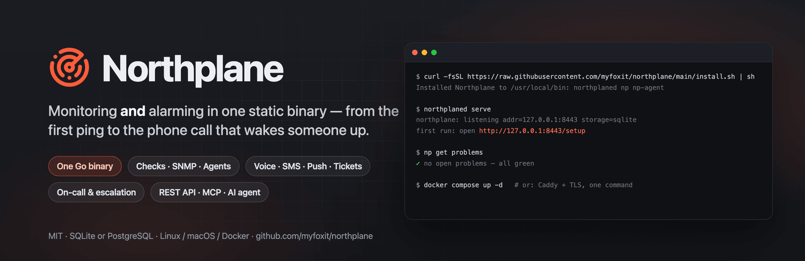
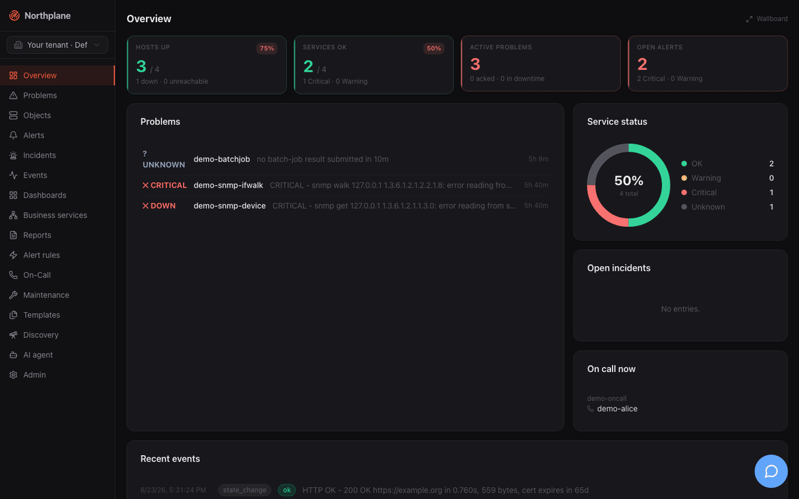
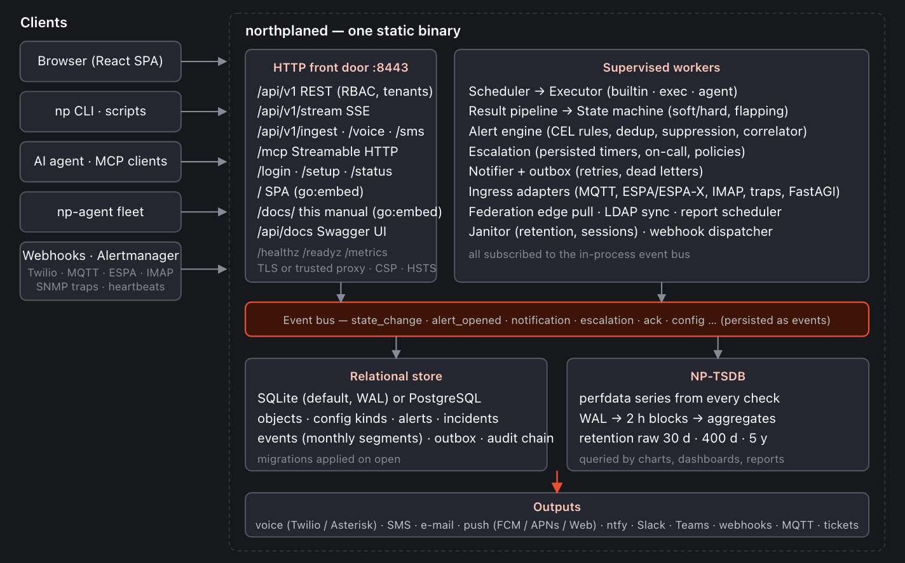
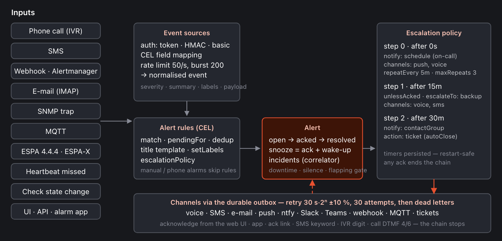

<p align="center">
  <a href="https://doktrace.com/docs/"></a>
</p>

<p align="center">
  <a href="https://github.com/myfoxit/northplane/actions/workflows/ci.yml"></a>
  <a href="https://github.com/myfoxit/northplane/releases/latest"></a>
  <a href="https://github.com/myfoxit/northplane/pkgs/container/northplane"></a>
  <a href="https://doktrace.com/docs/"></a>
  <a href="go.mod"></a>
  <a href="LICENSE"></a>
</p>

<p align="center">
  <a href="https://doktrace.com/docs/getting-started/quickstart/"><b>Quickstart</b></a> ·
  <a href="https://doktrace.com/docs/">Documentation</a> ·
  <a href="#what-you-get">Features</a> ·
  <a href="https://doktrace.com/docs/deployment/overview/">Deploy</a> ·
  <a href="https://doktrace.com/docs/reference/api-overview/">API</a> ·
  <a href="https://doktrace.com/docs/project/roadmap-and-known-issues/">Roadmap</a>
</p>

**Northplane** is a monitoring **and** alarming server in one static Go binary. It polls hosts and services (17 built-in checks, Nagios plugins, SNMP, an optional agent), turns state changes and external events — webhooks, Alertmanager, e-mail, SNMP traps, MQTT, ESPA, phone calls, SMS — into alerts, and escalates them to the people on call over **voice calls with IVR acknowledgement**, SMS, mobile push, e-mail, chat and ticket systems. Every capability is a REST endpoint; the web UI, the `np` CLI, the AI agent chat and the MCP server are clients of the same API with the same roles and permissions.

No external database, queue or web server: SQLite (or PostgreSQL), an embedded time-series store, the React UI, the Swagger UI, the MCP server and the full manual all live inside `northplaned`.

<p align="center">
  
</p>

## Why Northplane

- **One binary, zero ops.** `northplaned` embeds everything — UI, API, docs, time-series store, MCP server. SQLite by default, PostgreSQL when you want it. Static build, distroless image, runs on a Raspberry Pi or a 96-core box.
- **Alarming, not just alerting.** Escalation policies with on-call schedules, repeats and backups; durable outbox with retries and dead letters; acknowledge from the web, the app, an SMS keyword, a keypad digit on the call or an ack link — every path stops the chain.
- **Phone-grade inputs and outputs, on-prem if you want.** Twilio *or* your own Asterisk/FreePBX (FastAGI + AMI), ESPA 4.4.4 / ESPA-X, MQTT, IMAP, SNMP traps in; voice, SMS, FCM/APNs push, ntfy, Slack, Teams, MQTT, ServiceNow / Jira / Zendesk out.
- **Nagios-compatible, API-first, AI-ready.** Run your `check_*` plugins and import your Nagios config; drive everything through REST with RFC 9457 errors, `If-Match` versioning, YAML config bundles and SSE; let an AI agent operate it under your RBAC — through the built-in chat or any MCP client.

## Quick start

**One-line installer** (Linux/macOS, amd64/arm64 — verified checksums, `sudo` only if needed):

```bash
curl -fsSL https://raw.githubusercontent.com/myfoxit/northplane/main/install.sh | sh
northplaned serve            # open http://127.0.0.1:8443/setup and create your admin
```

**Docker Compose** with automatic TLS (Caddy in front, Let's Encrypt as soon as `DOMAIN` resolves to the host):

```bash
git clone https://github.com/myfoxit/northplane.git && cd northplane
docker compose up -d         # open https://localhost  (DOMAIN=monitoring.example.net for a real cert)
```

**Plain Docker** (you bring TLS or a proxy; `NORTHPLANE_TLS_INSECURE` is for a local trial only):

```bash
docker run -d --name northplane -p 8443:8443 -v northplane-data:/var/lib/northplane \
  -e NORTHPLANE_TLS_INSECURE=true -e NP_DEFAULT_ADMIN_DISABLED=1 ghcr.io/myfoxit/northplane:latest
```

**As a service** (Linux, systemd — creates the `northplane` user, config, secret key and unit):

```bash
sudo northplaned init && sudo systemctl enable --now northplaned
```

Want something to look at right away? `northplaned serve --demo` seeds hosts, services, alerts, an on-call schedule, a dashboard and two demo users (`operator@demo.local` / `operator-demo-2026!`). Then continue with [First steps](https://doktrace.com/docs/getting-started/first-steps/) — templates, a channel, a contact, an escalation policy and your first real alarm in ten minutes.

## What you get

| | |
|---|---|
| **Monitoring** | Hosts & services with folders, labels, templates and effective config · 17 in-process checks (ICMP, TCP, HTTP/S, TLS expiry, DNS, SMTP, IMAP, NTP, SSH, SNMP get/walk, NRPE, HTTP flows, agent …) · any Nagios plugin · `np-agent` (push, pull, listener) · SNMP traps · heartbeats · network discovery · soft/hard states, flapping, dependencies, downtimes & silences · NP-TSDB metrics with dashboards, wallboards, business-service trees with SLAs, scheduled reports |
| **Alarming** | Event sources for webhooks, Alertmanager, IMAP, SNMP traps, MQTT, ESPA 4.4.4 / ESPA-X, Twilio voice & SMS, Asterisk FastAGI · CEL alert rules with dedup, pending-for and auto-close · incidents & correlation · escalation policies, on-call schedules (layers, overrides, ICS), contacts with per-period preferences · IVR menus · 13 channel types · outbox with exponential retries and dead-letter replay · tamper-evident audit chain |
| **Platform** | REST API with OpenAPI 3.1 & Swagger UI · RBAC, multi-tenancy, API tokens · local users, OIDC (PKCE), LDAP/AD sync · YAML config bundles (`np apply`) · federation (edge sites pulling config from a main instance) · SQLite or PostgreSQL · `/metrics`, `/healthz`, `/readyz` · structured logs · backup command |
| **AI** | Agent chat over 10 LLM providers (Anthropic, OpenAI, Google, Mistral, Groq, Ollama …) with a tool policy and human approval for mutations · MCP server (stdio + Streamable HTTP) for Claude, Cursor, VS Code, Windsurf and friends — same permissions as the API |

## Architecture

<p align="center"></p>

One process, one data directory. Checks flow scheduler → executor → state machine → events; events flow through CEL rules into alerts, escalation and the notification outbox; every worker is supervised and restart-safe (escalation timers and deliveries are persisted). Details: [Architecture](https://doktrace.com/docs/concepts/architecture/) · [Alarming pipeline](https://doktrace.com/docs/alarming/overview/).

<details>
<summary><b>The alarming pipeline</b></summary>
<p align="center"></p>
</details>

## Run it for real

| Variant | Read |
|---|---|
| Docker Compose + bundled Caddy on one box (Let's Encrypt or internal cert) | [Docker Compose](https://doktrace.com/docs/deployment/docker-compose/) |
| VM behind your own reverse proxy / edge TLS (`NORTHPLANE_TRUST_PROXY=true`) | [Proxmox VM behind a central Caddy](https://doktrace.com/docs/deployment/proxmox-vm/) |
| Binary + systemd with your certificate pair | [Installation](https://doktrace.com/docs/getting-started/installation/) |
| Push-to-deploy pipeline (GitHub Actions → GHCR → SSH rollout with verify & rollback) | [CI/CD](https://doktrace.com/docs/deployment/ci-cd/) |

Configuration is deliberately small (`config.yaml` or `NORTHPLANE_*` env vars: listen address, TLS or trusted proxy, data dir, storage DSN, OIDC/LDAP, federation) — everything else is managed through the API, the UI or bundles. See the [configuration reference](https://doktrace.com/docs/administration/configuration/) and the [security hardening checklist](https://doktrace.com/docs/administration/security/).

## Plays well with

Nagios / Icinga plugins and configs · Prometheus Alertmanager · Twilio · Asterisk / FreePBX · MQTT brokers · ESPA pagers and nurse-call systems · IMAP mailboxes · SNMP v1/v2c/v3 devices · ntfy · Slack · Microsoft Teams · ServiceNow · Jira · Zendesk · FCM / APNs (the [Northplane alarm app](https://github.com/myfoxit/northplane-alarm)) · OIDC providers · LDAP / Active Directory · Claude, Cursor, VS Code, Windsurf, Codex and Gemini via MCP.

## Documentation

The manual ships inside every binary at `/docs/` and is published from the latest build at **[doktrace.com/docs](https://doktrace.com/docs/)**: [Getting started](https://doktrace.com/docs/getting-started/introduction/) · [Concepts](https://doktrace.com/docs/concepts/architecture/) · [Monitoring](https://doktrace.com/docs/monitoring/hosts-and-services/) · [Alarming](https://doktrace.com/docs/alarming/overview/) · [AI & MCP](https://doktrace.com/docs/ai/agent-chat/) · [UI guide](https://doktrace.com/docs/ui/navigation/) · [Administration](https://doktrace.com/docs/administration/configuration/) · [Deployment](https://doktrace.com/docs/deployment/overview/) · [CLI & API reference](https://doktrace.com/docs/reference/api-overview/) (plus the generated [REST reference](https://doktrace.com/docs/reference/api/)) · [Development](https://doktrace.com/docs/development/setup/). Machine-readable: [`llms.txt`](https://doktrace.com/docs/llms.txt).

## Development

```bash
git clone https://github.com/myfoxit/northplane.git && cd northplane
make dev            # Vite HMR on :5173 + auto-rebuilt Go backend on 127.0.0.1:8443, demo data seeded
make test           # go vet + go test          (CI also runs -race, golangci-lint, vitest, Playwright e2e)
make all            # UI + docs + binaries into ./bin
```

Go 1.25 and Node 22. The backend is in `internal/` (one package per subsystem), the UI in `web/` (React 19, TanStack, Tailwind, shadcn), the docs in `docs/` (Astro Starlight). The OpenAPI spec is generated from the Go route registry and drift-checked against the TypeScript client types and the docs. Read the [development guide](https://doktrace.com/docs/development/setup/) and [CONTRIBUTING.md](CONTRIBUTING.md).

## Status

Northplane runs in production and is under active development. Known gaps and the backlog are listed honestly on the [roadmap and known issues](https://doktrace.com/docs/project/roadmap-and-known-issues/) page. Found a bug or want a feature? [Open an issue](https://github.com/myfoxit/northplane/issues/new/choose). Security reports: see [SECURITY.md](SECURITY.md).

## License

[MIT](LICENSE) © 2026 Alexander Hoehne and the Northplane contributors.
