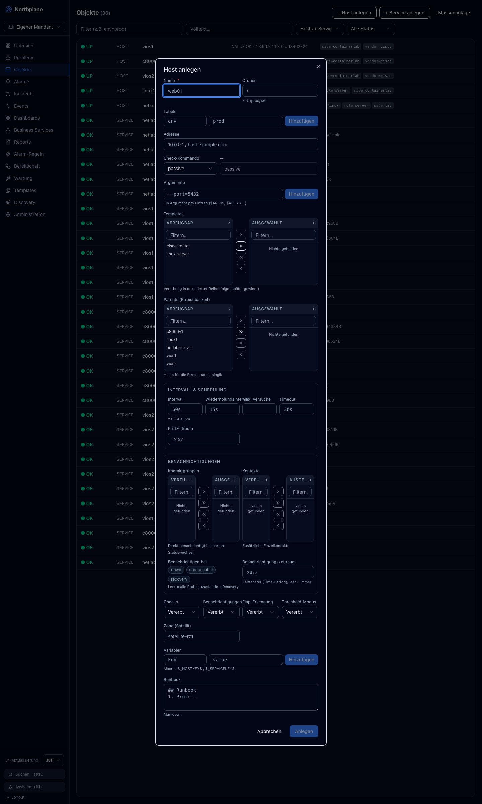
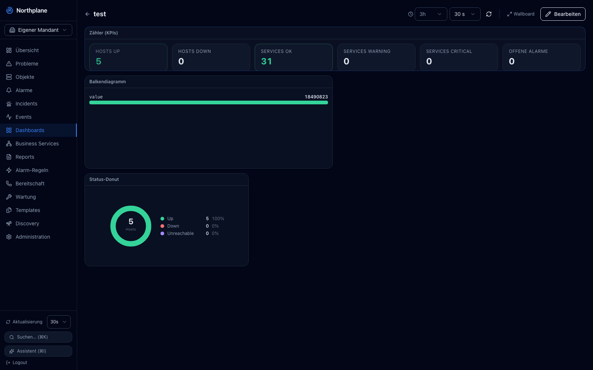
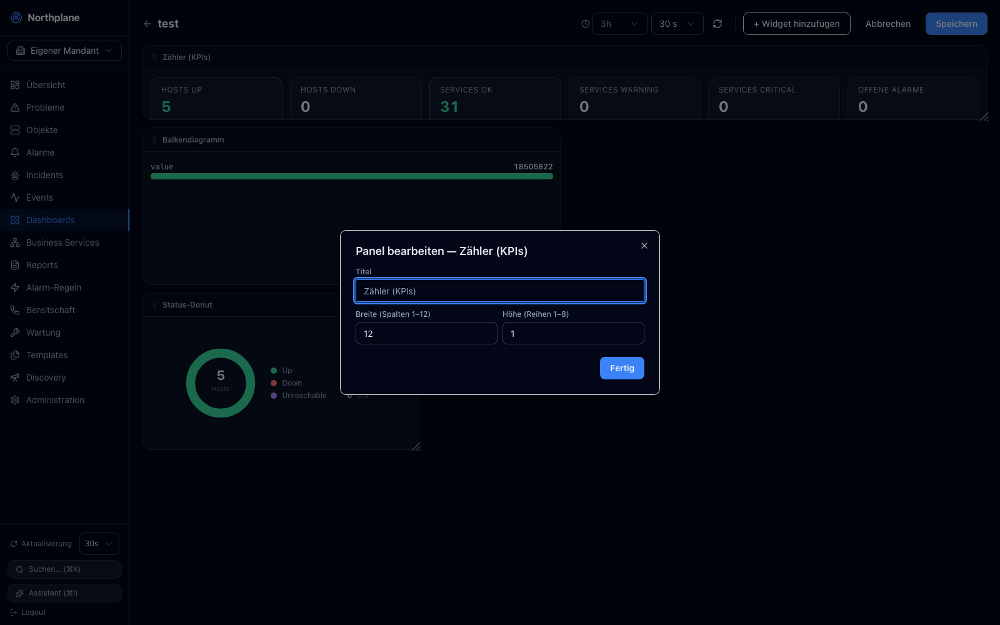
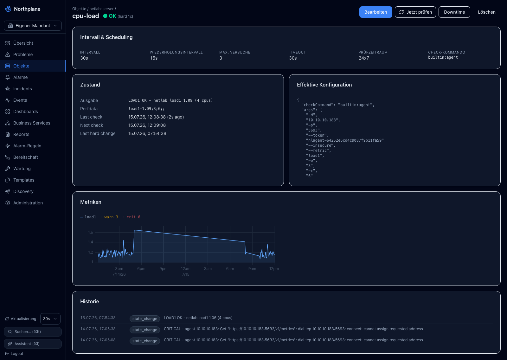
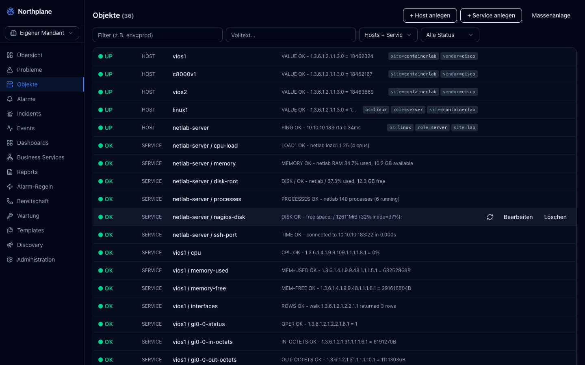

# Northplane — UI/UX Backlog

Produced from a live audit of the running app (`doktrace.com`) on 2026-07-15,
German locale, logged in as admin. Screenshots referenced below live in
[`ux-audit/`](./ux-audit/).

**Legend** — Severity: `High` / `Medium` / `Low` · Type: `Bug` / `UX` /
`Enhancement` · Effort: `S` / `M` / `L`.

## Priorities at a glance

| ID | Item | Sev | Type | Effort |
|----|------|-----|------|--------|
| FORM-1 | Create/edit form is one ~2400px single-column scroll | High | UX | L |
| FORM-2 | Dual-list pickers unusable when placed two-up | High | UX | M |
| FORM-3 | No progressive disclosure — all optional fields shown | High | UX | M |
| FORM-4 | Label collision in the interval grid | Medium | Bug | S |
| FORM-5 | Long modal has no sticky header/footer | Medium | UX | S |
| FORM-6 | `passive` check-command shows a redundant `—` field | Low | UX | S |
| DASH-1 | Widgets have no data-source configuration | High | Enh | L |
| DASH-2 | Bar-chart widget renders a raw counter as a full bar | High | Bug | M |
| DASH-3 | Add-widget is a blind two-step flow | Medium | UX | M |
| DASH-4 | Grid leaves large dead space; widgets don't pack | Medium | UX | M |
| DASH-5 | KPI-tiles widget duplicates the Overview | Low | UX | S |
| DASH-6 | Polish: generic titles, "3 Widget" grammar, no previews | Low | UX | S |
| DETAIL-1 | Effective-config leaks the agent token in plaintext | High | Bug | S |
| DETAIL-2 | Metrics buried under a generic card stack | Medium | UX | M |
| DETAIL-3 | Effective config is a raw JSON dump | Medium | UX | M |
| DETAIL-4 | No host/sibling navigation from a service detail | Medium | UX | S |
| DETAIL-5 | Low density: raw perfdata, whitespace, plain history | Low | UX | M |
| LIST-1 | Objects list is a flat host/service mix, no folders | Medium | UX | L |
| LIST-2 | Two ambiguous search boxes | Medium | UX | S |
| NAV-1 | Admin tab bar overflows and clips its last tabs | Medium | UX | S |
| OVW-1 | Overview underuses the screen | Low | Enh | M |

## Suggested sequence

1. **Quick wins:** DETAIL-1 (redact token), FORM-4 (label bug), NAV-1 (admin
   tabs), DASH-6 (plural/grammar), FORM-6 (passive field).
2. **Big rock #1 — create/edit form:** FORM-1/2/3/5 together (tabbed +
   progressively-disclosed form, compact pickers, sticky footer).
3. **Big rock #2 — dashboards:** DASH-1 (data binding + preview), then DASH-2/4.
4. **Then:** detail-view restructure (DETAIL-2/3/4/5), objects list & folders
   (LIST-1/2), richer overview (OVW-1), remaining dashboard polish.

> Note: FORM-1/2 trace back to the dual-list transfer picker shipped in
> `web/src/components/DualListPicker.tsx` — great full-width, wrong two-up.

---

## 1. Create & edit forms (host / service)

### FORM-1 — Form is one ~2400px single-column scroll · High · UX · L
**Problem:** The *Host anlegen* / *Service anlegen* modal stacks everything in
one flat column: Name, Ordner, Labels, Adresse, Check-Kommando, Argumente,
Templates, Parents, Intervall & Scheduling, Benachrichtigungen, Checks/Flap/
Threshold toggles, Zone, Variablen, Runbook. On a normal screen the primary
action (*Anlegen*) is far below the fold and the whole thing reads as
intimidating and crowded.
**Recommendation:** Break into **tabs** (or a light wizard): *Basis* (Name,
Ordner, Labels, Adresse, Host) · *Prüfung* (Check-Kommando, Argumente,
Templates, Intervall/Scheduling) · *Benachrichtigungen* (Kontakte, Gruppen,
notifyOn, Zeitraum) · *Erweitert* (Flap, Staleness, Zone, Variablen, Runbook).
Default to *Basis* so creating a host is a 3-field job. Sticky footer with
Abbrechen/Anlegen.
_Screens: 04-add-host, 05-add-service_

### FORM-2 — Dual-list pickers unusable when placed two-up · High · UX · M
**Problem:** In the Benachrichtigungen block, *Kontaktgruppen* and *Kontakte*
each render a full two-pane dual-list, so four panes + two button columns share
half the modal width. Each pane collapses to ~130px: headers truncate to
`VERFÜ…/AUSGE…`, filter boxes to `Filtern.`, and the lists are too small to use.
(This is the transfer picker just added — great full-width, wrong two-up.)
**Recommendation:** Don't put two dual-lists in one row. Inside a form use a
**compact multi-select combobox** (chips + typeahead dropdown) for
contacts/groups/templates/parents; reserve the full `‹ « » ›` dual-list for a
dedicated wide surface. Alternatively stack the two pickers full-width.
_Screens: 04-add-host, 05-add-service_

### FORM-3 — No progressive disclosure · High · UX · M
**Problem:** Almost all fields are optional/inheritable (templates supply most
config), yet the form shows 20+ controls at once — flap thresholds, staleness
text, zone, vars, a runbook editor — for what is usually "add a host by name +
address."
**Recommendation:** Show essentials only by default (Name, Adresse,
Check-Kommando; + Host for services); tuck the rest behind the tabs above or
"Erweiterte Optionen" expanders. Rely on template inheritance + sane defaults.
_Screen: 04-add-host_

### FORM-4 — Label collision in the interval grid · Medium · Bug · S
**Problem:** The 4-column interval row is too narrow for "Wiederholungsintervall",
which overlaps the next label and renders as `WiederholungsintervalMax. Versuche`.
**Recommendation:** Drop to 2 columns on narrow widths, wrap labels, or shorten
("Retry-Intervall"). Add min-width + wrapping so labels never collide.
_Screen: 05-add-service_

### FORM-5 — Long modal has no sticky header/footer · Medium · UX · S
**Problem:** On the tall modal the title and Abbrechen/Anlegen bar scroll out of
view, so mid-form you lose context and the primary action.
**Recommendation:** Pin the dialog header and a footer action bar; body scrolls
between them. Pairs with FORM-1.
_Screen: 04-add-host_

### FORM-6 — `passive` shows a redundant disabled field · Low · UX · S
**Problem:** When Check-Kommando = passive, a second field repeats "passive"
(disabled) under a bare `—` label, which looks unfinished.
**Recommendation:** Hide the second field for passive (or replace with a one-line
helper). Clean up the `—` label.
_Screen: 04-add-host_

## 2. Dashboards & widgets

### DASH-1 — Widgets have no data-source configuration · High · Enhancement · L
**Problem:** The *Panel bearbeiten* dialog exposes only Titel, Breite
(Spalten 1–12) and Höhe (Reihen 1–8). There is **no way to choose which
object/service/metric or query** a widget visualizes, so chart widgets render
fixed/demo data and users cannot build a meaningful, tailored dashboard.
**Recommendation:** Add a data-source step: pick object(s)/selector, metric(s),
aggregation and time range; a metric/query picker for charts (reuse the object
metric list). Live preview in the editor. **Single highest-value dashboard fix.**
_Screen: 25-widget-config_

### DASH-2 — Bar chart renders a raw counter as a 100%-full bar · High · Bug · M
**Problem:** The *Balkendiagramm* shows one series `value = 18490823` as a solid
bar filled to 100% — no axis, scale, unit or categories, and the number is an
unformatted raw SNMP counter. Conveys nothing; reads as broken.
**Recommendation:** Bar charts need categories/multiple bars, an axis with scale,
and humanized numbers (18.49 M). For a single scalar use a gauge/stat with
thresholds. Gate chart types by whether the bound data suits them (needs DASH-1).
_Screen: 20-dashboard-view_

### DASH-3 — Add-widget is a blind two-step flow · Medium · UX · M
**Problem:** *Widget hinzufügen* asks only for Typ + optional Titel — no preview,
no idea what each type looks like or shows. You add a blank widget, then open a
separate *Konfigurieren* that also can't bind data.
**Recommendation:** Widget gallery (thumbnail per type) + a single
add-and-configure flow that includes data binding and a live preview.
_Screen: 22-widget-add_

### DASH-4 — Grid leaves large dead space; widgets don't pack · Medium · UX · M
**Problem:** The three widgets sit in an unbalanced column and ~40% of the canvas
is empty; the bar-chart panel is tall but mostly blank. Free layout reads messy.
**Recommendation:** Auto-pack/compact, snap-to-grid with sensible default sizes
per widget type, and a "tidy layout" action. Sensible min heights; let content
fill the panel.
_Screen: 20-dashboard-view_

### DASH-5 — KPI-tiles widget duplicates the Overview · Low · UX · S
**Problem:** The *Zähler (KPIs)* widget is the exact same 6 tiles as the Übersicht
page, so it adds no new information.
**Recommendation:** Make it scoped (folder/selector/label) for subset counts, and
expand the widget library (time-series, top-N, table, heatmap, single-stat with
sparkline, alert list).
_Screen: 20-dashboard-view_

### DASH-6 — Polish: titles, grammar, previews · Low · UX · S
**Problem:** Panels default to type names ("Balkendiagramm", "Status-Donut"); the
card reads "3 Widget" (should be "3 Widgets"); the type dropdown is text-only.
**Recommendation:** Prompt for a meaningful title on add; fix the plural; show
type icons/previews in the picker.
_Screens: 09-dashboards, 20-dashboard-view_

## 3. Object detail view

### DETAIL-1 — Effective-config leaks the agent token in plaintext · High · Bug · S
**Problem:** The *Effektive Konfiguration* JSON prints check args verbatim,
including the agent credential: `"--token", "nlagent-64252e6cd4c9087f9b11fa59"`.
Any viewer of the object sees the token.
**Recommendation:** Redact known secret-bearing args (token/password/secret/
apikey) to `•••` wherever args are rendered. Consider a secret-ref mechanism so
tokens never appear inline.
_Screen: 24-service-detail_

### DETAIL-2 — Metrics buried under a generic card stack · Medium · UX · M
**Problem:** The page is a long vertical stack (Intervall & Scheduling → Zustand +
Effektive Konfiguration → Metriken → Historie). For a service the metric chart is
the point but sits third, behind config; lots of scrolling; low-density cards.
**Recommendation:** Lead with State + Metrics; move raw config lower or into tabs
(Übersicht · Metriken · Historie · Konfiguration). Tighten the Intervall/Zustand
cards into compact strips.
_Screens: 24-service-detail, 06-object-detail_

### DETAIL-3 — Effective config is a raw JSON dump · Medium · UX · M
**Problem:** Effective config is a monospaced JSON blob; hard to scan and doesn't
show where each value came from in the template chain.
**Recommendation:** Formatted key/value table grouped by section, annotate each
value's origin (own vs template-name), keep a "Raw JSON" toggle.
_Screen: 24-service-detail_

### DETAIL-4 — No host/sibling navigation from a service detail · Medium · UX · S
**Problem:** The breadcrumb `Objekte / netlab-server /` hints at the host but
there's no way to jump to the host or see its other services.
**Recommendation:** Make the host in the breadcrumb a link, add a `Host: …` chip,
and show sibling services (mirror of the new host→services card).
_Screen: 24-service-detail_

### DETAIL-5 — Low density: perfdata, whitespace, history · Low · UX · M
**Problem:** Perfdata is a raw string (`load1=1.09;3;6;;`); Intervall/Zustand
cards carry lots of empty space; Historie rows are plain text with no cue for
CRITICAL vs OK transitions.
**Recommendation:** Parse perfdata into small gauges (value vs warn/crit bands);
tighten padding; color/icon history transitions; align two-up cards to equal
height.
_Screen: 24-service-detail_

## 4. Objects list & navigation

### LIST-1 — Flat host/service mix, no folders · Medium · UX · L
**Problem:** Hosts and their services are indistinguishable rows in one flat list;
the only cue is the "host / service" name prefix. No column headers, and the
Ordner (folder) — a core organizing concept — is not surfaced anywhere.
**Recommendation:** Group services under their host (expandable tree) or indent/
section them; add subtle column headers (Status · Typ · Name · Ausgabe · Labels);
add a folder tree/sidebar or a "group by folder" toggle.
_Screen: 03-objects-list_

### LIST-2 — Two ambiguous search boxes · Medium · UX · S
**Problem:** "Filter (z.B. env=prod)" (label selector) and "Volltext…"
(full-text) sit side by side with no explanation of the difference.
**Recommendation:** Merge into one smart search with a scope chip/toggle
(Labels ↔ Volltext), or label each with an icon + short helper text.
_Screen: 03-objects-list_

### NAV-1 — Admin tab bar overflows and clips tabs · Medium · UX · S
**Problem:** Administration has 15+ tabs on one row; the last ("Dead-Le…") is cut
off at the right edge with no scroll/overflow affordance.
**Recommendation:** Horizontally scrollable tab strip with edge fade/scroll
buttons, wrap to two rows, or a "Mehr ▾" menu; group related tabs.
_Screen: 10-admin_

## 5. Overview & polish

### OVW-1 — Overview underuses the screen · Low · Enhancement · M
**Problem:** Übersicht fills only the top third (6 tiles + Probleme/Incidents/
Bereitschaft cards, all empty when green); the lower two-thirds is blank.
**Recommendation:** Add at-a-glance content (recent state-changes feed, top-N by
load/latency, a small uptime/health strip or mini topology) and richer empty
states with a next action. Rebalance to use the full viewport.
_Screen: 02-overview_
