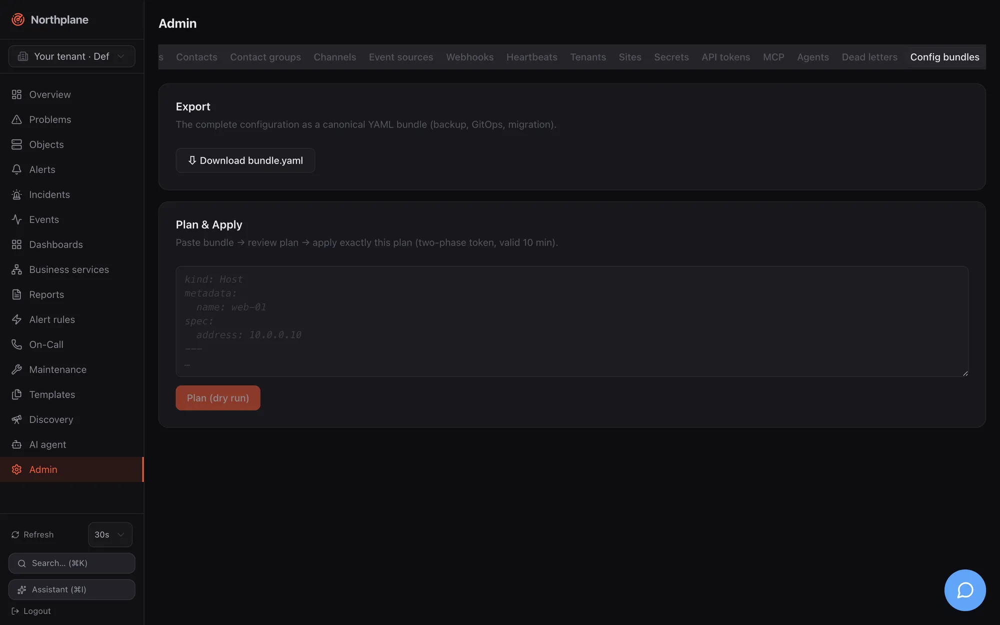

A **bundle** is a multi-document YAML file that describes configuration declaratively: hosts, services, templates, check commands, contacts, channels, escalation policies, alert rules, dashboards, reports and more. The server diffs a bundle against its current state (**plan**), applies it idempotently (**apply**) and can render its whole configuration back as a bundle (**export**). The same format and the same applier are used by `np apply`, the **Admin → Config bundles (Config-Bundles)** tab, the AI config tools, the Nagios importer and [federation](/docs/concepts/federation/).

Bundles are the GitOps vehicle of Northplane: keep them in a repository, review plans, apply on merge.

## Format

```yaml
kind: <Kind>            # required; one of the kinds below
metadata:
  name: <string>        # required; must not contain newline or tab characters
  host: <host name>     # Service only (required for Service)
  folder: /path         # Host/Service only
  labels: {k: v}        # Host/Service: object labels; other kinds: the document's "labels" field
spec: {...}             # the body (ObjectSpec for Host/Service; the resource document fields otherwise)
data: {...}             # optional non-spec payload (dashboard layouts, report params); merged with spec
---
kind: <next document>
```

- Documents are separated by `---`; empty documents (only separators/comments) are skipped. There is **no `apiVersion`** field.
- Parse errors name the document: `bundle: document 3: unknown kind "Hosts"`, `bundle: document 2 (Service): missing metadata.name`.
- Identity inside a bundle is `Kind/name`, or `Service/<host>/<name>` for services; duplicates are rejected (`duplicate Host/web-01`). A Service without `metadata.host` is rejected (`service requires metadata.host`).
- Structural errors come back as `422 np:validation/bundle` with all messages joined by `; `.
- The body may be JSON — JSON is valid YAML.

:::note[metadata.name is the name]
For every kind the document's name is taken from `metadata.name`. A `name` field inside `spec` is ignored and overwritten on apply; `metadata.labels` becomes the `labels` field of resource documents (and the object labels of hosts/services). `spec` and `data` are merged into one document — `data` exists only to keep non-spec payloads visually apart.
:::

## Kinds and apply order

Documents are applied in this fixed order (dependencies before dependents); export sorts the same way, then by host, then by name:

```text
Tenant, Role, TimePeriod, CheckCommand, Template, Contact, ContactGroup, Channel,
Schedule, IVRMenu, EscalationPolicy, EventSource, AlertGroup, AlertRule,
Host, Service, BusinessService, Heartbeat, Dashboard, Report, StaticGroup,
WebhookSubscription, SavedFilter
```

| Kind | Stored as | Applied | Exported | Notes |
|---|---|---|---|---|
| `Host`, `Service` | objects table | yes | yes | `metadata.folder`, `metadata.labels`, `spec` = [ObjectSpec](/docs/concepts/object-model/); services resolve `metadata.host` by host **name** |
| `Template`, `CheckCommand`, `TimePeriod` | resource documents | yes | yes | see [Templates](/docs/monitoring/templates/) |
| `Contact`, `ContactGroup`, `Schedule` | resource documents | yes | yes | `ContactGroup.members` and schedule participants are contact **ids** |
| `Channel`, `EscalationPolicy`, `AlertRule`, `AlertGroup`, `EventSource`, `IVRMenu` | resource documents | yes | yes | validated like the REST API (channel `type` required, rule compiles, policy has ≥ 1 step) |
| `BusinessService`, `Dashboard`, `Report`, `WebhookSubscription`, `SavedFilter`, `StaticGroup` | resource documents | yes | yes | `Dashboard.spec` is the opaque UI widget document |
| `Role` | resource documents | yes | **no** | roles export via admin tooling only; apply works |
| `Tenant` | — | **no** | no | in the vocabulary, but the applier has no handler: plan warns `unsupported kind Tenant`, apply skips it silently. Create tenants via `POST /api/v1/tenants`. |
| `Heartbeat` | — | **no** | no | same — plan warns `unsupported kind Heartbeat`; manage heartbeats via the [heartbeats API](/docs/monitoring/heartbeats/) |

Not bundle kinds at all: sites, schedule overrides, users, API tokens, secrets, preferences, branding, downtimes, silences. Secrets are referenced from bundles as `$SECRET:name$` and created separately ([Secrets](/docs/administration/secrets/)).

## Plan, apply, export

All endpoints act on the request tenant (`X-Northplane-Tenant` for holders of `admin:tenants`, otherwise the caller's tenant). The request body is read raw — the server does not inspect `Content-Type` — up to **8 MiB** (`413 np:bundle/size`).

| Endpoint | Permission | Behaviour |
|---|---|---|
| [`POST /api/v1/config/bundles:plan`](/docs/reference/api/operations/post_config_bundles_plan/) `[?prune=true&selector=…]` | `objects:read` | Dry run. Returns `{plan:[{action, kind, name, host?, diff?}], warnings:[…], applyToken?}`. When the plan is non-empty an `applyToken` (`ap_` + 32 hex) is cached **in memory for 10 minutes**, bound to the tenant, single use. |
| [`POST /api/v1/config/bundles:apply?dryRun=true`](/docs/reference/api/operations/post_config_bundles_apply/) | `config:write` | Same as plan. |
| `POST /api/v1/config/bundles:apply?applyToken=ap_…` | `config:write` | Applies exactly the planned documents (the cached plan). Unknown, expired or foreign-tenant token → `409 np:bundle/token` ("re-plan"). |
| `POST /api/v1/config/bundles:apply` `[?prune=true&selector=…]` | `config:write` | Direct apply of the posted bundle (plan + apply in one call). |
| [`GET /api/v1/config/bundles:export`](/docs/reference/api/operations/get_config_bundles_export/) `[?folder=/x]` | `objects:read` | Canonical YAML (`Content-Type: application/yaml`). With `folder`, only Host/Service documents of that subtree are rendered (global resources are skipped). |

`prune=true` deletes every currently exported document whose identity is not in the bundle; `selector` restricts pruning to documents whose `metadata.labels` match the [label selector](/docs/concepts/object-model/). Prune failures do not abort the apply — they are reported as warnings.

The response of an apply is a `PlanResult` whose `plan` lists what was actually applied (`create`/`update`/`delete`), plus warnings.

### How the plan is computed

- **Host/Service**: an object that does not exist is `create`. Otherwise `folder`, `labels` and every `spec.<field>` are compared (JSON projection); differing fields appear in `diff` as `{"field": [old, new]}`. A Service whose host does not exist yet is planned as `create` — the host may be created earlier in the same bundle.
- **Resource documents**: missing → `create`; otherwise a field-wise diff of `spec ∪ data ∪ {labels}` against the stored document (envelope fields `id`, `tenantId`, `version`, `createdAt`, `updatedAt`, `name` ignored). **Fields absent from the bundle are unmanaged** — they are never diffed.
- The plan is sorted create → update → delete. Unsupported kinds produce a warning and no action.

:::caution[An update writes the document as given in the bundle]
The plan ignores fields your bundle does not mention, but when any field differs the applier **replaces** the stored document with the bundle's `spec ∪ data ∪ labels` — fields you omitted are gone after that write. Keep resource documents complete: start from `np export`, edit, then plan/apply. (Host/Service specs are replaced wholesale too, exactly like a REST `PUT`.)
:::

### How apply works

1. The bundle is parsed and validated, and a plan is computed (`422 np:validation/bundle` on errors).
2. Documents are sorted by kind order and applied one by one: objects through the same `validateSpec` as the REST API (templates must resolve, `notifyOn` tokens valid, contacts/contact groups must exist); resource documents through `validateResourceDoc`. Creates use create-only semantics, updates are unconditional (no `If-Match`). Ids are preserved on update; a new document gets a fresh UUIDv7 unless its body carries an `id`.
3. Apply is **not transactional**: the first failure stops the run with `422 np:bundle/apply` ("apply failed at Kind/name", the cause in `detail`) and an audit entry `bundle.apply` listing what was already applied. Earlier documents stay applied; fix the bundle and re-run — the re-run is idempotent.
4. Prune deletions run after all documents.
5. An audit entry `bundle.apply` is written, the catalog is reloaded and alert rules are recompiled, and the response lists the applied actions.

Re-applying an unchanged bundle yields an empty plan (`np apply` prints `no changes`) — bundles are safe to apply on every CI run.

## Using the np CLI

```bash
export NP_SERVER=https://monitoring.example.net NP_TOKEN=np_…

np apply -f bundle.yaml --dry-run     # plan only
np apply -f bundle.yaml               # apply
np apply -f bundle.yaml --prune       # apply and delete everything not in the bundle
cat bundle.yaml | np apply -f -       # read the bundle from stdin
np export > bundle.yaml               # canonical export of the tenant
```

`np apply` posts to `…/bundles:apply` (with `dryRun=true` and/or `prune=true`) as `application/yaml` and prints one line per action — `applied create Host/web-01`, `would apply update Service/web-01/http`, `warning: unsupported kind Heartbeat` — or `no changes`. With `--json` the raw `PlanResult` is printed. The CLI has **no** `--selector` option for selective pruning; use the HTTP API for that. Permissions: `config:write` for apply, `objects:read` for dry-run and export. Full reference: [np CLI](/docs/reference/cli-np/).

## Admin → Config bundles tab

**Admin → Config bundles (Config-Bundles)** offers the two operations without a CLI:




- **Export** — a download link for `northplane-bundle.yaml` (`GET /api/v1/config/bundles:export`): the complete configuration for backup, GitOps or migration.
- **Plan & Apply** — paste a bundle, click **Plan (dry run)**, review the table of actions (badges `create`/`update`/`delete`, kind, name, diff), then **Apply** — which sends the `applyToken` from the plan, so exactly the reviewed plan is executed (two-phase token, valid 10 minutes). "No changes — configuration is identical" means the bundle matches. The tab does not expose `prune`.

## A complete example

```yaml title="bundle.yaml"
kind: TimePeriod
metadata: {name: business-hours}
spec:
  days:
    monday: ["09:00-17:00"]
    tuesday: ["09:00-17:00"]
    wednesday: ["09:00-17:00"]
    thursday: ["09:00-17:00"]
    friday: ["09:00-17:00"]
---
kind: Template
metadata: {name: linux-base}
spec:
  kind: host
  interval: 30s
  maxCheckAttempts: 2
---
kind: Contact
metadata: {name: ops-alice}
spec:
  email: alice@example.org
  phone: "+431234567"
  timeZone: Europe/Vienna
  preferences:
    - {profile: default, channels: [email]}
---
kind: ContactGroup
metadata: {name: ops}
spec:
  members: ["<contact id of ops-alice>"]
---
kind: Channel
metadata: {name: ops-mail}
spec:
  type: email
  enabled: true
  config:
    provider: smtp
    host: mail.internal
    port: "587"
    from: northplane@example.org
    username: northplane
    password: "$SECRET:smtp-pass$"
---
kind: EscalationPolicy
metadata: {name: default}
spec:
  steps:
    - {after: 0s, notify: {contactGroup: ops}, channels: [email]}
    - {after: 15m, unlessAcked: true, notify: {contact: ops-alice}, channels: [sms]}
---
kind: AlertRule
metadata: {name: critical}
spec:
  match: 'event.type == "state_change" && event.stateType == "hard" && (event.state == "CRITICAL" || event.state == "DOWN")'
  severity: critical
  escalationPolicy: default
---
kind: Host
metadata:
  name: db-01
  folder: /prod
  labels: {env: prod, role: db}
spec:
  address: 10.0.0.5
  checkCommand: builtin:icmp
  templates: [linux-base]
---
kind: Service
metadata:
  name: postgres
  host: db-01
  labels: {env: prod}
spec:
  checkCommand: builtin:tcp
  args: ["5432"]
  interval: 30s
  contactGroups: [ops]
---
kind: Dashboard
metadata: {name: wallboard}
spec:
  shared: true
data:
  spec:
    time: 24h
    refresh: 30s
    widgets:
      - {type: counters, w: 12, h: 2}
      - {type: problems, title: Open problems, selector: "env=prod", limit: 20, w: 12, h: 6}
```

Apply it, then verify:

```bash
np apply -f bundle.yaml --dry-run
np apply -f bundle.yaml
np apply -f bundle.yaml            # → no changes
```

The channel's `$SECRET:smtp-pass$` reference requires `PUT /api/v1/secrets/smtp-pass` beforehand ([Secrets](/docs/administration/secrets/)); channel config keys per type are in [Channels](/docs/alarming/channels/).

## GitOps workflow

1. `np export > bundle.yaml` once to capture the current state (includes the demo data if the instance was seeded — remove what you do not want to manage).
2. Commit; edit in pull requests.
3. CI: `np apply -f bundle.yaml --dry-run` on pull requests (token with `objects:read`), `np apply -f bundle.yaml` on merge (token with `config:write`). Add `--prune` only when the repository is the complete source of truth for the tenant — prune deletes every exported document not in the bundle, including dashboards and reports users created in the UI.
4. Use a tenant-scoped token and the `X-Northplane-Tenant` header (or one token per tenant) for multi-tenant set-ups — a bundle is always applied into one tenant.

Export limits: objects are exported up to 5 000 per tenant and resource documents up to 2 000 per kind; larger tenants would be truncated silently.

## Federation

A Site document's `bundle` field **is** a bundle: the main instance validates it on save, and each edge pulls it (`GET /api/v1/sites/{name}:pull`, conditional on the ETag) and applies it into its own default tenant with the same applier — without prune, retrying every tick until a revision applies. An empty bundle means "nothing managed centrally yet". See [Federation](/docs/concepts/federation/) and [Tenants and sites](/docs/administration/tenants-and-sites/).

## Other consumers of the format

- `northplaned import nagios --path /etc/nagios [--out northplane-import.yaml]` converts a Nagios/Icinga 1 configuration into a bundle (hosts, services, templates, commands, time periods, contacts, static groups) plus a deviation report; review, then `np apply -f northplane-import.yaml`. See [Plugins and Nagios](/docs/monitoring/plugins-and-nagios/).
- The AI tools `propose_config_change` / `apply_config_change` plan and apply bundles through the approval flow. See [Agent chat](/docs/ai/agent-chat/).
