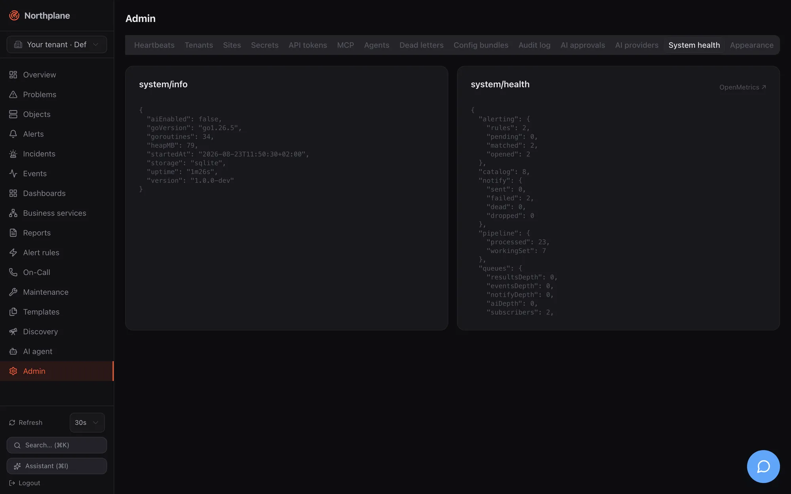

Northplane exposes its own health through a handful of HTTP endpoints, an OpenMetrics exposition, structured logs on stderr and a hash-chained audit log. This page covers all of them, plus the background workers you will see in those logs and the one request deadline that affects every API client.

## Endpoints at a glance

| Endpoint | Auth | Purpose |
|---|---|---|
| `GET /healthz` | none | liveness: `200` with body `ok` as soon as the listener is up |
| `GET /readyz` | none | readiness: JSON per subsystem, `503` when any is not ok |
| [`GET /api/v1/system/health`](/docs/reference/api/operations/get_system_health/) | none (anonymous) | queue depths, scheduler/pipeline/alerting/notify/TSDB counters |
| [`GET /api/v1/system/info`](/docs/reference/api/operations/get_system_info/) | none (anonymous) | version, Go version, goroutines, heap, uptime, storage dialect, AI enabled |
| `GET /metrics` | none | OpenMetrics text for Prometheus |
| `GET /api/v1/overview` | `objects:read` | the UI's overview numbers (state summary, open alerts, incidents, queues) |
| `GET /api/docs`, `GET /api/openapi.json` | none | Swagger UI and the OpenAPI 3.1 document |

:::note[Anonymous by design]
`/metrics`, `/api/v1/system/health` and `/api/v1/system/info` need no credentials so that scrapers and probes work without an API token; they reveal the version, goroutine/heap numbers and queue depths. Restrict them at the proxy or firewall if that matters to you — see [Security](/docs/administration/security/#unauthenticated-endpoints). Do not send an `Authorization: Bearer np_…` header from probes: an invalid `np_` token is answered `401` on every path served by the API handler, including `/healthz`.
:::

## Liveness and readiness

`/healthz` performs no checks — it answers `ok` as soon as the HTTP server accepts connections, which makes it the right probe for a proxy health check (Caddy: `health_uri /healthz`) and for the CI deploy verification.

`/readyz` aggregates subsystems:

```json
{"ready":true,"subsystems":[{"name":"storage","ok":true,"info":"sqlite"},{"name":"eventbus","ok":true},{"name":"scheduler","ok":true}]}
```

| Subsystem | Criterion |
|---|---|
| `storage` | database ping succeeds; `info` is `sqlite` or `postgres` |
| `eventbus` | results queue depth below 8000 (a saturated pipeline makes the instance not-ready) |
| `scheduler` | always `true` in this version |

Any `false` turns the response into HTTP `503`. Use `/readyz` for orchestrator readiness gates and for `make dev`, which waits for it after each rebuild.

## System health and info

`GET /api/v1/system/health` returns the live counters of every subsystem:

```json
{
  "queues":    {"resultsDepth":0,"eventsDepth":0,"notifyDepth":0,"aiDepth":0,"subscribers":3,"droppedAi":0,"droppedSubscriberMessages":0},
  "scheduler": {"scheduled":142,"queueDepth":0,"dispatched":8841,"maxLagMs":12},
  "pipeline":  {"processed":8830,"workingSet":142},
  "alerting":  {"rules":6,"pending":0,"matched":19,"opened":4},
  "notify":    {"sent":12,"failed":1,"dead":0,"dropped":0},
  "tsdb":      {"series":318,"samplesIngested":105220,"samplesDropped":0,"seriesDropped":0,"blocks":36,"walBytes":41250},
  "catalog":   142,
  "sse":       3
}
```

`GET /api/v1/system/info`:

```json
{"version":"main-daa6dc518a2b","goVersion":"go1.25.14","goroutines":44,"heapMB":134,"startedAt":"2026-08-23T08:50:57Z","uptime":"22m57s","storage":"sqlite","aiEnabled":false}
```

`np doctor` prints both documents (`--- system/info ---`, `--- system/health ---`) and fails with `server unreachable` when the server does not answer — a quick first check from any machine with `NP_SERVER`/`NP_TOKEN` set ([np CLI](/docs/reference/cli-np/)). The version string is also returned by `northplaned version`, in the OpenAPI `info.version`, in the MCP server implementation, in the footer of the login/setup/register pages and in every federation heartbeat (see [Upgrades](/docs/administration/upgrades/#how-versions-are-identified)).

## Prometheus metrics

`GET /metrics` serves `application/openmetrics-text; version=1.0.0; charset=utf-8`, terminated by `# EOF`, from a dependency-free in-process registry. It exports **server self-metrics only** — no per-object perfdata; monitored metrics live in the NP-TSDB and are queried through `POST /api/v1/metrics/query` (see [Metrics and NP-TSDB](/docs/monitoring/metrics-and-tsdb/)).

| Family | Type | Labels | Meaning |
|---|---|---|---|
| `np_http_requests_total` | counter | `method`, `status`, `route` | API requests under `/api/`; `route` is the matched mux pattern (custom-verb routes appear in their internal form, e.g. `/api/v1/alerts/{__seg}`; empty for 404s) |
| `np_http_request_duration_seconds` | histogram (`_bucket`, `_sum`, `_count`) | `method`, `status`, `route` | Prometheus default buckets 0.005 … 10 s + `+Inf` |
| `np_queue_results_depth` | gauge | — | check results waiting for the pipeline |
| `np_queue_events_depth` | gauge | — | events waiting on the bus |
| `np_queue_notifications_depth` | gauge | — | notifications waiting for the outbox worker |
| `np_sse_clients` | gauge | — | connected SSE subscribers |
| `np_scheduler_objects` | gauge | — | objects currently scheduled |
| `np_scheduler_lag_ms_max` | gauge | — | worst scheduling lag in the last window |
| `np_checks_dispatched_total` | gauge (see note) | — | checks handed to the executor since start |
| `np_results_processed_total` | gauge (see note) | — | results processed by the pipeline since start |
| `np_alert_rules` | gauge | — | compiled alert rules |
| `np_alerts_opened_total` | gauge (see note) | — | alerts opened since start |
| `np_notifications_total` | gauge (see note) | `result` = `sent` \| `failed` \| `dead` | notification outcomes since start |
| `np_events_dropped_total` | gauge / counter | `source` = `notify` \| `api` | events that could not be persisted |
| `np_tsdb_series` | gauge | — | series in the NP-TSDB registry |
| `np_tsdb_samples_total` | gauge (see note) | — | samples ingested since start |
| `np_tsdb_wal_bytes` | gauge | — | size of the TSDB WAL |
| `np_catalog_objects` | gauge | — | objects in the in-memory catalog |
| `np_ingress_events_total` | counter | `type` = `webhook` \| `alertmanager` \| `sms` | accepted ingest events |
| `np_ingress_dropped_total` | counter | `reason` = `rate` | ingest requests rejected by the per-source rate limit |

:::note
The `*_total` families that are collected at scrape time from subsystem statistics (`np_checks_dispatched_total`, `np_results_processed_total`, `np_alerts_opened_total`, `np_notifications_total`, `np_tsdb_samples_total`, `np_events_dropped_total{source="notify"}`) are exposed with `# TYPE … gauge` although they are monotonically increasing. `rate()` still works on them; strict OpenMetrics parsers may warn. Counters reset when the process restarts.
:::

A minimal scrape job:

```yaml title="prometheus.yml"
scrape_configs:
  - job_name: northplane
    scheme: https
    metrics_path: /metrics
    static_configs:
      - targets: ["monitoring.example.net:443"]
```

Useful alerts: `np_queue_results_depth` growing (pipeline stalled — the same condition that turns `/readyz` red at 8000 and pauses the dead-man ping at 7000), `rate(np_notifications_total{result="failed"}[10m])`, `np_ingress_dropped_total` increasing (a source needs a higher `rateLimit`/`burst`), `np_tsdb_series` approaching the 100 000 cap.

## Logs

- Structured logging via Go `slog`, always to **stderr**. Format `json` (default) or `text` (`logFormat` / `NORTHPLANE_LOG_FORMAT`); level `debug`/`info`/`warn`/`error` (`logLevel` / `NORTHPLANE_LOG_LEVEL`, default `info`). `northplaned mcp` forces text because stdout belongs to the MCP transport.
- There is no log file and no rotation inside Northplane: under systemd read them with `journalctl -u northplaned -f`; in containers with `docker compose logs -f northplane`.
- Lines worth knowing (message field):

| Message | Meaning |
|---|---|
| `storage: applying migration` (`version`, `name`) | a schema migration is running at start |
| `server: generated secret-store master key` / `server: configured secretKeyFile unusable — falling back to the data directory` / `server: secret store disabled (no usable master key)` | secret-store key provisioning; see [Secrets](/docs/administration/secrets/) |
| `seeded default admin with a GENERATED password — save it now, it is not recoverable` (WARN, with `email`, `password`) / `seeded default admin — CHANGE THE PASSWORD` | break-glass admin created at start; see [Authentication](/docs/administration/authentication/) |
| `server: serving plaintext HTTP (loopback/dev or behind a TLS-terminating proxy — A-15.10 requires TLS in production)` | no certificate configured; expected behind Caddy |
| `northplane: listening` (`addr`, `scheme`, `storage`, `objects`, `ai`) | the server is up |
| `first run: open <url>/setup to create your admin account` (WARN) | the `/setup` gate is open (only when no local user and no API token exist) |
| `federation: edge mode` | edge federation active |
| `demo: user ready`, `demo: hint`, `demo: environment seeded` | demo seeding; see [Demo mode](/docs/getting-started/demo-mode/) |
| `NORTHPLANE_DEMO is set but this database already holds real (non-demo) hosts — skipping demo seeding …` (WARN) | the real-data guard refused to seed |
| `server: background worker panicked; restarting` (`worker`, `panic`, `stack`) | a supervised worker crashed and will restart after 1 s |
| `deadman: skipping ping, results queue saturated` (WARN) | dead-man ping withheld because the pipeline is stalled |
| `janitor: event segments dropped` (`segments`) | nightly retention removed old event months |
| `northplane: shutting down` → `northplane: background workers drained` or `northplane: shutdown budget elapsed, workers still running` | graceful stop (30 s budget) |

Every API response also carries an `X-Request-Id` (UUIDv7); the same id is stored in audit entries, which lets you correlate a client-side error with the server-side record.

## Audit log

Every mutation performed through the API is recorded in an append-only, hash-chained audit log — object and config document changes (`host.create`, `service.update`, `template.delete`, `alert-rule.create`, …), alert operations (`alert.ack`, `alert.resolve`, `alert.snooze`, `alert.raise`), maintenance (`downtime.create`, `silence.delete`), administration (`user.create`, `token.create`, `token.rotate`, `secret.put` — without the value, `role.update`, `tenant.create`, `bundle.apply`, `branding.update`), logins (`login.local`, `login.ldap`, `setup.admin`, `user.register`), federation (`federation.apply`) and all AI actions (`ai.*`). Reads are not audited; neither are OIDC logins, failed logins or logouts.

Each entry: `seq`, `ts` (RFC 3339 UTC), `tenantId`, `actorType` (`user` \| `token` \| `ai_agent` \| `system`), `actorId`, `action`, `resource`, `sourceIp` (TCP peer — the proxy's address behind a reverse proxy), `requestId`, `before`, `after` (JSON snapshots), `prevHash`, `hash`. The hash is SHA-256 over the previous hash and the fields in fixed order; the genesis `prevHash` is 64 zeros. Verification re-walks the whole table and reports the first break.

| Operation | How |
|---|---|
| Browse | **Admin → Audit log (Audit-Log)**; [`GET /api/v1/audit`](/docs/reference/api/operations/get_audit/) (`admin:audit`) with filters `actorId`, `actorType`, `action` (prefix), `resource`, `limit` (default 200, max 5000), `afterSeq` (newest first) |
| Export to a SIEM | [`GET /api/v1/audit:export`](/docs/reference/api/operations/get_audit_export/) — NDJSON, ascending, the whole tenant; UI link "NDJSON (SIEM)" |
| Verify the chain | [`POST /api/v1/audit:verify`](/docs/reference/api/operations/post_audit_verify/) → `{"intact":true,"verified":N}` or `{"intact":false,"verified":N,"error":"audit chain broken at seq N: …"}`; CLI `np audit verify` prints `audit chain intact (N entries verified)` or exits non-zero with `AUDIT CHAIN BROKEN after N entries: …` |
| Tail | `np audit tail` — the last 30 entries as a table |

Things to be aware of: the audit log is **never purged** (plan disk accordingly or export and truncate manually); `audit:export` is **not** on the list of streaming paths, so a very large export can hit the 30 s request deadline — page with `GET /api/v1/audit?afterSeq=…` in that case; on PostgreSQL the `jsonb` normalisation can make verification report a false break (see [Storage](/docs/administration/storage/#known-postgresql-caveat)). Verification walks **all** tenants; search and export are per tenant.

## Dead-man switch

Northplane can prove that it is alive to an external monitor: set `deadManUrl` (env `NORTHPLANE_DEADMAN_URL`) to a healthchecks.io-compatible ping URL and the `dead-man` worker issues a `GET` every `deadManInterval` (default `1m`, values `<= 0` mean `1m`) with a 10 s client timeout. The ping is **skipped** (with the warning above) while the results queue holds more than 7000 items, so a stalled check pipeline makes the external monitor fire even though the process is running.

```yaml title="config.yaml"
deadManUrl: "https://hc-ping.com/<uuid>"
deadManInterval: 1m
```

Do not confuse this outgoing ping with the **Heartbeat resource**, which is the inbound dead-man input for your own cron jobs and integrations (`POST /api/v1/heartbeats/{name}/beat`, `heartbeat_missed` events). That one is documented in [Heartbeats](/docs/monitoring/heartbeats/).

## Admin → System health tab

**Admin → System health (System-Health)** shows two cards: the raw JSON of `system/info` (version, runtime) and `system/health` (refreshed every 10 s), with an **OpenMetrics** link that opens `/metrics`. It is the place to look when the Overview feels stale: growing `queues.resultsDepth` or `scheduler.maxLagMs`, `notify.failed`/`dead` counters, `tsdb.seriesDropped`. Dead letters themselves live in **Admin → Dead letters (Dead-Letters)** ([Reliability](/docs/alarming/reliability/)).




## Background workers and supervision

`serve` runs every subsystem as a supervised goroutine: a panic is recovered, logged with its stack, and the worker restarts after 1 s (`workerRestartBackoff`), so one misbehaving integration cannot take the process down. Worker names as they appear in logs:

| Worker | Role |
|---|---|
| `scheduler`, `executor`, `pipeline` | schedule checks, run them, turn results into state and events |
| `alerting`, `correlator`, `escalation`, `notify` | rules → alerts, incident correlation, escalation timers, outbox delivery |
| `traps`, `mailin`, `mqttin`, `espa`, `agi` | SNMP trap receiver, IMAP poller, MQTT subscriber, ESPA/ESPA-X listeners, FastAGI listener |
| `api-janitor` | periodic maintenance (table below) |
| `webhook-dispatcher` | outgoing webhook subscriptions |
| `report-scheduler` | scheduled reports (first tick 10 s after start, then every minute) |
| `dead-man` | the outgoing ping above |
| `ldap-sync` (when LDAP is configured), `federation-edge` (edge mode), `ai` (AI service) | conditional workers |

The janitor's schedule:

| Cadence | Work |
|---|---|
| every 30 s | recompute downtime depths and trigger flexible downtimes for every tenant |
| every 10 min | delete expired sessions and idempotency rows older than 24 h |
| hourly | flush closed TSDB windows; between 02:00 and 03:59 local time (at most once per 20 h) run full TSDB maintenance (downsample + retention) and event retention |

Alert auto-close (`autoCloseAfter`) and snooze wake-ups run inside the alerting engine loop; heartbeat misses are swept every 5 s.

On SIGINT/SIGTERM the HTTP server stops accepting connections and all workers get a shared 30 s budget to drain; the store and TSDB are closed afterwards (`close failed` is logged if that fails).

## The 30 s request timeout

Every ordinary request is wrapped in a 30 s response deadline (`http.TimeoutHandler`): when the handler has not finished, the client receives HTTP `503` with the plain-text body `request timeout` (not a problem+json document). Exempt — and therefore unbounded — are the streaming paths `/api/v1/stream` (SSE), `/api/v1/events:export` (NDJSON), `/api/v1/ai/chat` (agent chat) and `/mcp`, `/mcp/*`. Long synchronous operations that can approach the limit on large tenants: `audit:export`, `config/bundles:export`, large `objects:batch` calls and report rendering. The other server timeouts (`ReadHeaderTimeout` 10 s, `ReadTimeout` 60 s, `IdleTimeout` 120 s) are listed in [Configuration → Not configurable](/docs/administration/configuration/#not-configurable); proxy settings that match them are in [TLS and reverse proxies](/docs/administration/tls-and-proxy/#timeouts-a-proxy-should-respect).
