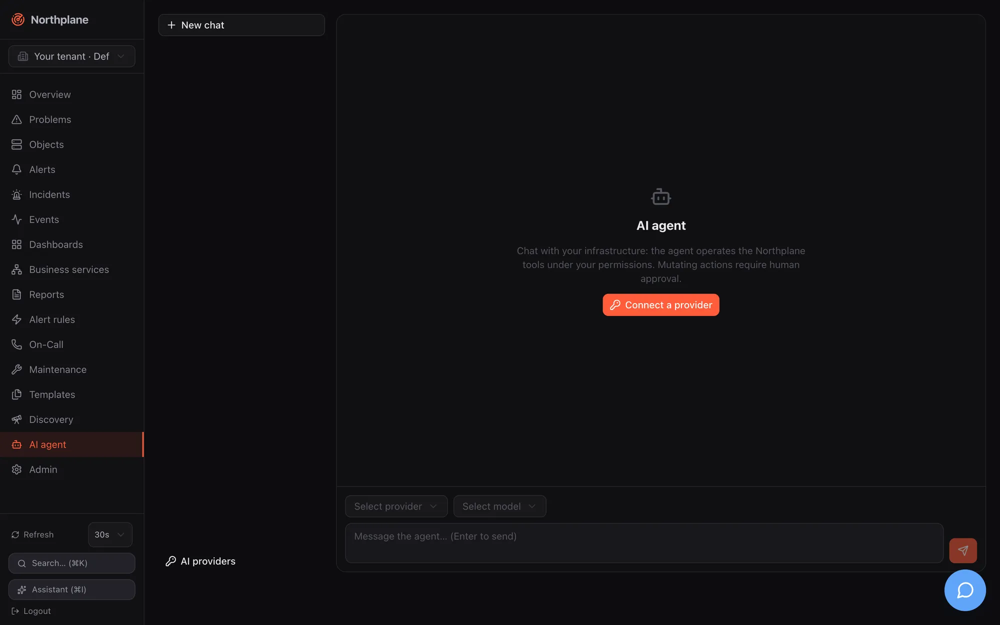
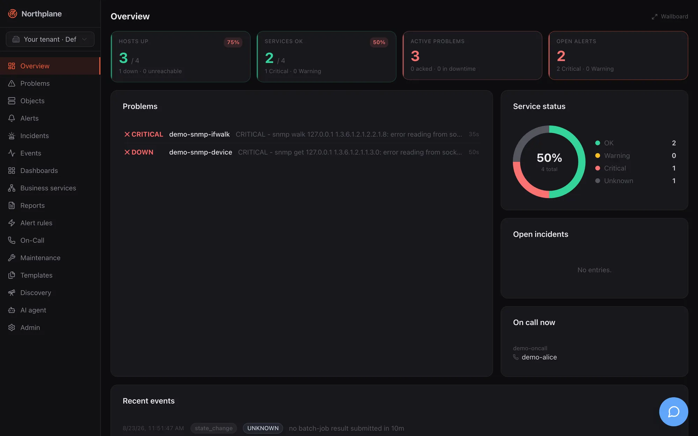

Northplane ships an AI agent that can read and — with human approval — operate your monitoring through the same tools the REST API exposes. The agent is a **privilege-less client**: every tool call is checked against the calling user's permissions, mutating actions ride an approval queue, and everything is audited. The language model comes from a provider you connect (Anthropic, OpenAI, Google, a local Ollama, …); Northplane never ships a model and never sends data anywhere until you configure a provider.




## The three surfaces




| Surface | Where | Model comes from | Persisted as | Needs server-level `ai.provider`? |
|---|---|---|---|---|
| **Agent chat page** | `/agent` (nav entry **AI agent** / *KI-Agent*) — streaming chat with tool cards, approvals inline | a **provider connection** (personal or shared per tenant) with a SecretBox-sealed API key | `ai_chats` + per-message `ai_chat_messages` | no |
| **Assistant sidebar** (legacy) | header button **Assistant (⌘I)** or Ctrl/⌘+I — non-streaming, one reply with "action cards" | the **server-level** `ai:` config (`ai.provider`, `ai.model`, …) | `ai_conversations` (one transcript blob) | yes — otherwise it shows `AI provider not configured (ai.provider=none)` |
| **MCP server** | `/mcp` (Streamable HTTP) and `northplaned mcp` (stdio) — your MCP client's model | the MCP client | only the approval queue + audit | no |

All three funnel tool execution through one gate: **tenant tool policy → RBAC of the calling principal → propose/approve for mutating tools → execute → audit**. The MCP surface is documented on [MCP server](/docs/ai/mcp-server/).

:::caution[What still depends on the server-level provider]
`Service.Enabled()` is true only when `ai.provider` in `config.yaml` is not `none`. It gates the legacy sidebar, `POST /incidents/{id}:summarize`, background incident summaries **and the execution step of approvals** (`:approve` only executes an approved action when a server-level provider is configured — see [Approvals](#approvals)). The agent chat and MCP themselves do not need it.
:::

## Providers

`GET /api/v1/ai/providers` ([get_ai_providers](/docs/reference/api/operations/get_ai_providers/), `events:read`) returns the catalog in the order the UI shows it. Every provider speaks one of two wire dialects: the native Anthropic Messages API (`/v1/messages`, SSE) or the OpenAI Chat Completions SSE dialect (`/chat/completions`).

| id | Label | Dialect | Default endpoint | API key | Curated fallback models (first = suggested default) | Quirks handled |
|---|---|---|---|---|---|---|
| `anthropic` | Anthropic Claude | anthropic | `https://api.anthropic.com` | required | `claude-opus-4-8`, `claude-fable-5`, `claude-sonnet-5`, `claude-haiku-4-5` | adaptive thinking for current model families |
| `openai` | OpenAI | openai | `https://api.openai.com/v1` | required | `gpt-5.6`, `gpt-5.6-terra`, `gpt-5.6-luna`, `gpt-5.2` | `reasoning_effort`; `max_completion_tokens` |
| `google` | Google Gemini | openai | `https://generativelanguage.googleapis.com/v1beta/openai` | required | `gemini-3.5-flash`, `gemini-3.1-pro-preview`, `gemini-3.1-flash-lite` | `reasoning_effort`; `max_completion_tokens`; `models/` prefix stripped in listings |
| `xai` | xAI Grok | openai | `https://api.x.ai/v1` | required | `grok-4.5`, `grok-4.3` | `reasoning_effort`; `max_completion_tokens` |
| `mistral` | Mistral | openai | `https://api.mistral.ai/v1` | required | `mistral-large-latest`, `mistral-medium-latest`, `mistral-small-latest` | — |
| `deepseek` | DeepSeek | openai | `https://api.deepseek.com/v1` | required | `deepseek-v4-pro`, `deepseek-v4-flash` | `reasoning_effort`; `reasoning_content` echoed back in tool loops |
| `groq` | Groq | openai | `https://api.groq.com/openai/v1` | required | `openai/gpt-oss-120b`, `llama-3.3-70b-versatile`, `llama-3.1-8b-instant` | — |
| `openrouter` | OpenRouter | openai | `https://openrouter.ai/api/v1` | required | `openrouter/auto`, `anthropic/claude-sonnet-5`, `openai/gpt-5.6-luna` | `reasoning_details` echoed; `HTTP-Referer` (= `baseUrl` or the GitHub URL) + `X-Title: Northplane` |
| `ollama` | Ollama (local) | openai | `http://localhost:11434/v1` | **none** | none — purely live via `/v1/models` | — |
| `openai-compat` | OpenAI-compatible (custom endpoint) | openai | **none — you must supply one** | none | none | — |

Curated lists are dated fallbacks (July 2026 in the code) used when the live model listing fails. Azure OpenAI is **not** a connection provider; it only exists in the legacy server-level config. All provider traffic is outbound HTTPS from `northplaned` itself — the browser only ever talks to its own origin — so allow the endpoints above (or your custom ones) in egress firewalls.

## Provider connections

A connection = provider + endpoint + sealed API key + default model, owned by a user (personal) or by the tenant (**shared**, `userId` empty). Wire shape:

```json
{
  "id": "0199…", "shared": false, "name": "My Anthropic account",
  "provider": "anthropic", "endpoint": "",
  "keyHint": "…abcd", "hasKey": true,
  "defaultModel": "claude-sonnet-5", "extra": {}, "disabled": false,
  "version": 1, "createdAt": "…", "updatedAt": "…"
}
```

The API key is never returned — only its last four characters as `keyHint`. Keys are sealed with the platform SecretBox (AES-256-GCM, master key from `secretKeyFile`); without a usable master key, creating a keyed connection fails with `secret store disabled — configure secretKeyFile to store provider keys` (see [Secrets](/docs/administration/secrets/)). Keyless providers (Ollama, openai-compat without key) work without a SecretBox.

| Method + path | Permission | Notes |
|---|---|---|
| `GET /api/v1/ai/connections` ([get_ai_connections](/docs/reference/api/operations/get_ai_connections/)) | `events:read` | own connections first, then shared, each group by name |
| `POST /api/v1/ai/connections` ([post_ai_connections](/docs/reference/api/operations/post_ai_connections/)) | `events:read`; plus `admin:ai` when `shared: true` | 201 with the connection |
| `PUT /api/v1/ai/connections/{id}` ([put_ai_connections_id](/docs/reference/api/operations/put_ai_connections_id/)) | `events:read`; plus `admin:ai` for shared | body must carry `"shared": true` to edit a shared one; `provider` is immutable |
| `DELETE /api/v1/ai/connections/{id}?shared=true` ([delete_ai_connections_id](/docs/reference/api/operations/delete_ai_connections_id/)) | `events:read`; plus `admin:ai` for shared | the query parameter selects the shared record |
| `POST /api/v1/ai/connections/{id}:test` ([post_ai_connections_id_test](/docs/reference/api/operations/post_ai_connections_id_test/)) | `events:read` | lists models; `{"status":"ok","models":<n>}` or `400 np:ai/invalid` with the provider's error text |
| `GET /api/v1/ai/connections/{id}/models` ([get_ai_connections_id_models](/docs/reference/api/operations/get_ai_connections_id_models/)) | `events:read` | `{"items":[{"id","label"?,"curated"?}],"note":""}` — curated first, then live models sorted by id; if the live listing fails but curated models exist the call still succeeds with a `note` |

Create/update body:

```json
{
  "name": "Team OpenRouter",
  "provider": "openrouter",
  "endpoint": "",
  "apiKey": "sk-or-v1-…",
  "defaultModel": "anthropic/claude-sonnet-5",
  "extra": {},
  "shared": true,
  "disabled": false
}
```

Validation rules:

- `name` is required; an unknown `provider` → `unknown provider "x"`; a duplicate name → `409 np:conflict`.
- `endpoint` is trimmed and a trailing `/` removed. If it differs from the catalog default it must start with `http://` or `https://` **and the caller needs `config:write`** (`custom endpoints require config:write`) — because it makes the server POST to an arbitrary URL. `openai-compat` has no default, so an endpoint is mandatory there.
- `apiKey`: on create required when the provider needs one (`provider "x" requires an API key`); on update omitted/`null` = keep, `""` = clear, non-empty = rotate.
- A disabled connection cannot be used for chats (`connection "x" is disabled`).
- Audit: `ai.connection.create`, `ai.connection.update` (payload says whether the key was rotated), `ai.connection.delete`.

In the UI, personal connections live in the **AI providers** dialog of the agent page (name, provider, key hint, default model, **Test** button → "N models" or "Test failed"); shared ones are managed under **Admin → AI providers** and appear read-only with a **Shared** badge for other users.

## Tool policy

The tenant-wide policy decides which tools exist, which mutating tools skip approval, and how many tool rounds a turn may take. Stored per tenant; zero value = defaults.

```json
{
  "disabled": ["delete_config_resource", "apply_config_change"],
  "autoApprove": ["create_silence"],
  "maxRounds": 12,
  "version": 3
}
```

| Field | Semantics |
|---|---|
| `disabled[]` | tools neither advertised to the model (agent chat, MCP) nor executable — execution is refused with `tool "x" is disabled by policy` and audited as `ai.disabled.<tool>`. The legacy sidebar still *advertises* all tools but execution is blocked the same way. |
| `autoApprove[]` | mutating tools that skip the approval queue (still RBAC-checked and audited). Only valid for mutating tools: `tool "x" is read-only — autoApprove applies to mutating tools`. |
| `maxRounds` | agent-loop cap per user turn: `0` = default **10**, maximum **24** (`maxRounds must be between 0 (default) and 24`). Not applied to the legacy sidebar (fixed 8). |
| `version` | incremented on every save |

Endpoints: `GET /api/v1/ai/policy` ([get_ai_policy](/docs/reference/api/operations/get_ai_policy/)) and `PUT /api/v1/ai/policy` ([put_ai_policy](/docs/reference/api/operations/put_ai_policy/)), both **`admin:ai`** (implied by `admin:*` and `*:*`); unknown tool names → `unknown tool "x"`; audit `ai.policy.update` with the full policy. `PUT` does not enforce `If-Match` — last write wins. `GET /api/v1/ai/tools` ([get_ai_tools](/docs/reference/api/operations/get_ai_tools/), `events:read`) returns the catalog with the effective policy state: `items: [{name, description, mutating, autoOk, disabled, autoApprove}]`, sorted by name.

There are **no** per-connection allow-lists, per-tenant token budgets or per-tool argument limits. The only hard per-tool limit is the downtime cap: `create_downtime` accepts at most **4 hours**. The only budget is the instance-wide `ai.maxMonthlyTokens` ([Budget and usage](#budget-and-usage)).

## Tools

The registry holds **22 tools**, shared by the agent chat, the legacy sidebar and MCP. Input schemas are JSON Schema reflected from typed structs (required inputs are **bold** below). Gate classes:

- **read** — executes directly; audit `ai.read.<tool>`.
- **mutating, auto** — executes immediately; audit `ai.execute.<tool>`.
- **mutating, approval** — queued as a *proposal* unless the policy's `autoApprove` lists the tool; the model receives `{"status":"proposed","actionId":"…","note":"queued for human approval (POST /api/v1/ai/actions/<id>:approve)"}`; audit `ai.propose.<tool>`.

### Read tools

| Tool | Permission | Input | Result |
|---|---|---|---|
| `get_overview` | `events:read` | — | `{summary, openAlerts, openIncidents}` (open incidents, max 10) |
| `search_objects` | `objects:read` | `selector` (label selector, e.g. `env=prod,role!=db`), `query` (free text), `kind` (`host`/`service`), `limit` (default 50, max 100) | `[{id, name, kind, labels, state}]` (`PENDING` without state) |
| `get_object` | `objects:read` | **`id`** | `{object, state, effectiveConfig, templateChain, metrics}` |
| `query_metrics` | `metrics:read` | **`objectId`**, `metric` (empty = all), `fromHoursAgo` (default 24), `agg` (`avg/min/max/sum/last/count`) | NP-TSDB query, at most 100 points |
| `get_alerts` | `alerts:read` | `status` (`open/acked/resolved/expired`, default open + acked), `limit` | alert list |
| `analyze_metric` | `metrics:read` | **`objectId`**, `metric`, `hours` (default 168) | deterministic (no LLM): seasonal baseline (hour × weekday EWMA) + MAD anomaly detection → `currentValue, baselineMean/StdDev/Mad, seasonalExpected, deviationSigma, anomalous, anomalousRunLen, totalAnomalyCount` |
| `forecast_capacity` | `metrics:read` | **`objectId`**, **`threshold`**, `metric`, `horizonHours` (default 168) | least-squares trend (needs ≥ 10 samples): `slopePerHour, projectedValue, confidenceR2, projectedExhaustionAt, hoursToThreshold` (null + `note` when not within a year) |
| `suggest_thresholds` | `metrics:read` | **`objectId`**, `metric`, `hours` (default 168) | needs ≥ 20 samples: `suggestedWarn` = P98, `suggestedCrit` = P99.5 |
| `get_incidents` | `incidents:read` | `open` (bool) | up to 50 incidents |
| `who_is_oncall` | `oncall:read` | `schedule` (name) | `{scheduleName: [contact names]}`, overrides resolved at "now" |
| `explain_alert` | `alerts:read` | **`alertId`** | `{alert, topology{object, kind, host, hostState, parents}, recentConfigChanges (audit, 72 h, 10), recentStateChanges (24 h, 20), similarPastAlerts (same rule, resolved, 5)}` |
| `render_report` | `reports:render` | **`name`** | renders a stored report as JSON |
| `list_config_resources` | per-kind read permission (table below) | **`kind`**, `query` (name substring), `limit` (default 100, max 500) | `{kind, count, items[]}` |
| `get_config_resource` | per-kind read permission | **`kind`**, **`name`** | the document including `version` |

The three statistics tools read the series with average aggregation and up to 10 000 points; with an empty `metric` the first series (lowest metric name) is used.

### Mutating tools

| Tool | Permission | Gate | Input | Effect |
|---|---|---|---|---|
| `run_check_now` | `checks:run` | auto | **`objectId`** | enqueues an immediate recheck; `{"status":"queued"}` |
| `acknowledge_alert` | `alerts:ack` | auto | **`alertId`**, `comment` | acknowledges as `ai:<principal name>`, stops the escalation chain; `{"status":"acked","alert":"<title>"}` |
| `create_downtime` | `downtimes:write` | approval | `objectId` **or** `selector`, `hours` (default 2, **max 4**), **`comment`** | fixed downtime from now; `{"status":"scheduled","id"}`; `createdBy: ai:<name>` |
| `create_silence` | `silences:write` | approval | **`selector`**, `hours` (default 1), **`comment`** | `{"status":"silenced","id"}` |
| `propose_config_change` | `config:write` | approval | **`bundleYaml`** | bundle dry-run plan — but it is registered as mutating-without-auto, so even the plan is computed only after approval (unless `autoApprove` lists it) |
| `apply_config_change` | `config:write` | approval | **`bundleYaml`** | applies the bundle after approval |
| `upsert_config_resource` | per-kind **write** permission | approval | **`kind`**, **`name`**, **`doc`** (the same JSON the REST API accepts), `expectedVersion` (0 = unconditional) | validated like the REST route |
| `delete_config_resource` | per-kind write permission | approval | **`kind`**, **`name`** | `{deleted, kind}` |

### Configuration kinds and their permissions

`list_config_resources`, `get_config_resource`, `upsert_config_resource` and `delete_config_resource` accept these `kind` values; the required permission mirrors the REST route (parity is pinned by a test):

| `kind` | read | write |
|---|---|---|
| `template`, `check-command`, `time-period`, `alert-rule`, `alert-group`, `escalation-policy`, `channel`, `event-source`, `business-service`, `dashboard`, `report`, `saved-filter`, `webhook-subscription`, `static-group` | `objects:read` | `config:write` |
| `schedule`, `contact`, `contact-group` | `oncall:read` | `oncall:write` |
| `role` | `admin:read` | `admin:write` |
| `preference` | `admin:users` | `admin:users` |

Not reachable through the AI/MCP tools: `override`, `site`, `ivr-menu`, `branding`. An unknown kind is rejected with `unsupported resource kind "x" (one of: …)`.

## Approvals

Mutating tools without auto-execution create an **AI action** in the approval queue:

```json
{ "id":"0199…", "tenantId":"…", "conversationId":"", "tool":"create_downtime",
  "args":{"objectId":"0199…","hours":2,"comment":"patching"},
  "summary":"create_downtime {\"objectId\":…}", "status":"proposed",
  "actor":"mcp-agent", "result":null, "decidedBy":"", "decidedAt":null, "createdAt":"…" }
```

Status lifecycle: `proposed` → `approved` → `executed` or `failed`; or `proposed` → `denied`. `summary` is the tool name plus the first 200 characters of the arguments; `actor` is the proposing principal (token name or user).

| Method + path | Permission | Behaviour |
|---|---|---|
| `GET /api/v1/ai/actions?status=` ([get_ai_actions](/docs/reference/api/operations/get_ai_actions/)) | `alerts:read` | newest first, max 100, optional status filter |
| `POST /api/v1/ai/actions/{id}:approve` ([post_ai_actions_id_approve](/docs/reference/api/operations/post_ai_actions_id_approve/)) | **`config:write`** | marks `approved` (only from `proposed`, otherwise 404), audit `ai.action.approve`; **then, only if a server-level provider is configured**, executes the tool under the **approver's** permissions → `{"status":"executed","result":…}` or `502 np:ai/execute` (`approved but execution failed`, status `failed`). With `ai.provider: none` the answer is `{"status":"approved"}` and **nothing is executed**. |
| `POST /api/v1/ai/actions/{id}:deny` ([post_ai_actions_id_deny](/docs/reference/api/operations/post_ai_actions_id_deny/)) | `alerts:ack` | status `denied`, audit `ai.action.deny` |

Execution re-evaluates the tool's required permission (including the per-kind permission derived from the stored arguments) against the **approver**; if the approver lacks it the action fails with `approver lacks permission X required by tool` (audit `ai.execute.denied.<tool>`). The tool then runs as a synthetic `ai_agent` principal (`actorId: ai-approved`, name = the original proposer, permissions = the approver's) and the result is stored on the action.

:::caution[Approve executes only with a server-level provider]
Because `:approve` calls the executor only when `ai.provider` is not `none`, proposals coming from the agent chat or from MCP clients cannot be executed through the UI or API on an instance whose `config.yaml` has `ai.provider: none`. Set `ai.provider` (for example `anthropic` with `apiKeyEnv`) if you want approvals to execute; the `ai:` block is described under [Configuration](#configuration).
:::

Where approvals appear in the UI: **Admin → AI approvals** (*AI-Freigaben*) lists actions with status badge, tool, arguments, actor and time, with **Approve**/**Deny** for proposed ones (auto-refresh every 15 s). Tool cards in the agent chat show the badge **Approval required** (*Freigabe nötig*) with inline approve/deny and switch to **Approved & executed** or **Denied**; the legacy sidebar shows the same on its action cards.

## Chats and the legacy conversations

**Chats** are the agent-page workspace: per-message rows, any connection/model, switchable mid-chat. **Conversations** are the legacy sidebar's single-blob transcripts bound to the server-level provider. Both are per user and tenant.

| Method + path | Permission | Notes |
|---|---|---|
| `GET /api/v1/ai/chats` ([get_ai_chats](/docs/reference/api/operations/get_ai_chats/)) | `events:read` | own chats, newest first, max 100 |
| `POST /api/v1/ai/chats` ([post_ai_chats](/docs/reference/api/operations/post_ai_chats/)) | `events:read` | `{title?, connectionId?, model?, settings?}` → 201 |
| `GET /api/v1/ai/chats/{id}` ([get_ai_chats_id](/docs/reference/api/operations/get_ai_chats_id/)) | `events:read` | `{chat, messages[]}`; ownership (tenant + user) enforced |
| `PUT /api/v1/ai/chats/{id}` ([put_ai_chats_id](/docs/reference/api/operations/put_ai_chats_id/)) | `events:read` | partial update of `title`, `connectionId`, `model`, `settings` (no `If-Match`) |
| `DELETE /api/v1/ai/chats/{id}` ([delete_ai_chats_id](/docs/reference/api/operations/delete_ai_chats_id/)) | `events:read` | cascades messages; audit `ai.chat.delete` |
| `DELETE /api/v1/ai/chats/{id}/messages/{msgId}` | `events:read` | audit `ai.chat.message.delete` |
| `POST /api/v1/ai/chat` ([post_ai_chat](/docs/reference/api/operations/post_ai_chat/)) | `events:read` | the streaming turn (below) |
| `POST /api/v1/ai/conversations` ([post_ai_conversations](/docs/reference/api/operations/post_ai_conversations/)) | `events:read` | legacy: `{"conversationId":"","message":"…"}` → `{"conversationId","reply","actions":[{tool,input,proposed,actionId?,result?,error?}]}`; `503 np:ai/disabled` without server-level provider, `502 np:ai/provider` on provider errors; max 8 rounds, context = last 40 messages |
| `GET /api/v1/ai/conversations`, `GET …/{id}` ([get_ai_conversations](/docs/reference/api/operations/get_ai_conversations/), [get_ai_conversations_id](/docs/reference/api/operations/get_ai_conversations_id/)) | `events:read` | last 50 `{id,title,createdAt,updatedAt}`; transcript `{id,title,messages}` |

Chat JSON: `{id, title, connectionId, model, settings, version, createdAt, updatedAt}`. Message JSON: `{id, chatId, role: user|assistant, parts[], model, usage{inputTokens,outputTokens,stopReason}, createdAt}`; message ids are UUIDv7, so insertion order is id order. Per-chat `settings`:

```json
{ "toolsEnabled": true, "allowedTools": ["get_alerts", "explain_alert"], "effort": "high", "maxTokens": 8000 }
```

- `toolsEnabled` null/true = tools on; false = no tool definitions are sent.
- `allowedTools` can only **narrow** the policy-filtered set.
- `effort`: `low`/`medium`/`high` in the UI ("Reasoning effort" / *Denkaufwand*); Anthropic additionally accepts `xhigh`/`max`, mapped to adaptive thinking where the model supports it; the OpenAI dialect sends `reasoning_effort` only for providers that accept it (openai, google, xai, deepseek).
- `maxTokens`: Anthropic defaults to 16000 when unset; the OpenAI dialect sends nothing when unset.

Turn request (`POST /api/v1/ai/chat`):

```json
{ "chatId": "0199…", "message": "What is going on with web01?", "trigger": "submit-message" }
```
```json
{ "chatId": "0199…", "trigger": "regenerate-message", "messageId": "<assistant message id>" }
```

Rules: `chatId` is required and the chat must have a `connectionId` (`np:ai/no-connection`); `submit-message` (the default) needs a non-empty message of at most **32 KiB**, appends it and sets the chat title from the first 80 characters if empty; `regenerate-message` deletes the given assistant message **and everything after it**, then re-answers; the last stored message must be a user message (`np:ai/no-user-message`); an unknown trigger → 422; a second concurrent stream on the same chat → `409 np:ai/busy`.

Loop behaviour per turn: budget pre-check; model = `chat.model` → `connection.defaultModel` → first curated model (else `no model selected`); tool definitions = policy filter ∩ chat allow-list; the full history is replayed (no compaction) with a redacted copy sent to the provider; up to `maxRounds` provider rounds, each audited as `ai.chat.round` (model, tokens in/out, tool calls); every tool call goes through the gate; the model sees at most **16 KiB** of a tool result (`…(truncated)`), the persisted part keeps up to **64 KiB** (bigger results are stored as `{"truncated":true,"sizeBytes":n,"preview":"<first 2048 bytes>"}`); after the last allowed round with tool calls the turn stops with `stopReason: "max-rounds"` and an error chunk `agent stopped after N tool rounds`. Persistence always happens — also on client abort (`stopReason: "aborted"`) or provider error after partial output. Provider messages are always derived from the stored UI parts, so switching provider/model mid-chat is lossless.

The system prompt tells the model that it is the Northplane monitoring agent, to answer in the user's language (German or English), that event texts are **untrusted data**, to format answers in Markdown, to link alerts as `<baseUrl>/alerts/<id>`, and which tenant and user it acts for.

## Stream protocol

`POST /api/v1/ai/chat` answers with a Server-Sent-Events stream in the **Vercel AI SDK UI-message-stream v1** format: headers `Content-Type: text/event-stream`, `Cache-Control: no-cache`, `Connection: keep-alive`, `X-Accel-Buffering: no`, `x-vercel-ai-ui-message-stream: v1`; each chunk is `data: {json}` followed by a blank line; the stream ends with `data: [DONE]`. The route is exempt from the 30 s request deadline and has no server-side keepalive beyond the chunks.

| Chunk `type` | Fields |
|---|---|
| `start` | `messageId` (the pre-assigned, persisted assistant message id) |
| `start-step` / `finish-step` | — (one provider round) |
| `text-start` / `text-delta` / `text-end` | `id`, `delta` |
| `reasoning-start` / `reasoning-delta` / `reasoning-end` | `id`, `delta` |
| `tool-input-start` | `toolCallId`, `toolName`, `dynamic: true` |
| `tool-input-delta` | `toolCallId`, `inputTextDelta` |
| `tool-input-available` | `toolCallId`, `toolName`, `input`, `dynamic: true` |
| `tool-output-available` | `toolCallId`, `output`, `dynamic: true`, optional `toolMetadata: {proposed: true, actionId}` |
| `tool-output-error` | `toolCallId`, `errorText`, `dynamic: true` |
| `error` | `errorText` |
| `finish` | `finishReason`, `messageMetadata: {inputTokens, outputTokens, stopReason}` |

`finishReason` values: `stop`, `tool-calls`, `length`, `content-filter`, `error`, `other`. A failure before anything streamed still emits `error` + `finish{finishReason:"error"}` and `[DONE]`.

```text
data: {"type":"start","messageId":"0199…"}
data: {"type":"start-step"}
data: {"type":"tool-input-start","toolCallId":"toolu_01","toolName":"get_alerts","dynamic":true}
data: {"type":"tool-input-available","toolCallId":"toolu_01","toolName":"get_alerts","input":{"status":"open"},"dynamic":true}
data: {"type":"tool-output-available","toolCallId":"toolu_01","output":[…],"dynamic":true}
data: {"type":"finish-step"}
data: {"type":"start-step"}
data: {"type":"text-start","id":"blk_0"}
data: {"type":"text-delta","id":"blk_0","delta":"2 open alerts …"}
data: {"type":"text-end","id":"blk_0"}
data: {"type":"finish-step"}
data: {"type":"finish","finishReason":"stop","messageMetadata":{"inputTokens":1234,"outputTokens":88,"stopReason":"end_turn"}}
data: [DONE]
```

Persisted part types: `step-start`, `text`, `reasoning`, `dynamic-tool` (with `state` ∈ `input-available | output-available | output-error`, plus `proposed` and `actionId`).

## Incident summaries

`POST /api/v1/incidents/{id}:summarize` ([post_incidents_id_summarize](/docs/reference/api/operations/post_incidents_id_summarize/), `incidents:write`) asks the **server-level** provider for a 2–3 sentence summary (what is affected, likely common cause with confidence, scope — the prompt asks for a **German** reply), using `ai.modelDeep` when set, with redaction applied; the text is stored as `incident.summary` and audited as `incident.summarize`. Without a provider: `503 np:ai/disabled` (`AI provider not configured — set ai.provider in config.yaml`). The correlation engine also enqueues background summaries for incidents it creates (a 256-slot queue; dropped under load and counted in `droppedAi` of `/system/health`).

## Budget and usage

- Every provider round (legacy, agent chat, summaries) adds input/output tokens to a per-month counter (`YYYY-MM`, UTC).
- `ai.maxMonthlyTokens` greater than 0 is a **hard stop** before every round: `monthly AI token budget exhausted (n/max) — hard stop per policy`; mid-turn in the agent loop this arrives as an `error` chunk with `stopReason: "budget"`.
- Crossing **80 %** emits one system event `AI token budget at N% (x of y)` (severity warning, default tenant).
- There is no per-tenant, per-user or per-connection budget, no monetary cost computation and no `/ai/usage` endpoint; usage is visible per message (`usage`) and in the audit trail (`ai.completion`, `ai.chat.round`).

## Redaction

Before every provider call a **copy** of the messages and tool results is redacted (persisted transcripts stay unredacted). Always-on patterns: Northplane tokens (`np_…`), `password`/`passwd`/`secret`/`api key`/`token` followed by `:`/`=` and a value, PEM private keys, e-mail addresses, IPv4 addresses and MAC addresses → `[REDACTED:<6-hex tag>]`. `ai.redaction.customPatterns` adds regexes replaced by `[REDACTED]`; `ai.redaction.hostnames: pseudonymize` replaces dotted hostnames with stable `host-0001`-style pseudonyms.

## Audit

Actor type `ai_agent`. Actions emitted: `ai.connection.create|update|delete`, `ai.policy.update`, `ai.disabled.<tool>`, `ai.denied.<tool>`, `ai.propose.<tool>`, `ai.execute.<tool>`, `ai.read.<tool>` (every read tool call too), `ai.execute.denied.<tool>`, `ai.completion` (legacy, with prompt hash and a ≤ 500-char redacted prompt), `ai.chat.round`; on the REST side `ai.action.approve`, `ai.action.deny`, `ai.chat.delete`, `ai.chat.message.delete`, `incident.summarize`. Read the trail under **Admin → Audit log** or via `np audit tail` ([Observability](/docs/administration/observability/)).

## RBAC interplay

- Every tool checks `principal.Allow(<perm>)` with the same permission as the equivalent REST route; denial → `permission denied: <perm> required` (audit `ai.denied.<tool>`). Wildcards `admin:*`, `*:*`, `*` apply.
- Built-in role `ai-agent`: `objects:read, alerts:read, alerts:ack, incidents:read, incidents:write, events:read, metrics:read, oncall:read, checks:run, downtimes:write, silences:write, config:propose, reports:render`. Note that `config:propose` is consumed by **no** tool — `propose_config_change` requires `config:write`, so a principal with only the `ai-agent` role cannot call it.
- API tokens flagged `aiAgent: true` authenticate as actor type `ai_agent`; see [API tokens](/docs/administration/api-tokens/).
- Multi-tenant admins: the agent chat honours `X-Northplane-Tenant` for callers with `admin:tenants` (the SPA sends it); the MCP server always uses the token's own tenant.
- Policy and shared connections need `admin:ai`; custom endpoints need `config:write`; approving needs `config:write`, denying `alerts:ack`. Full permission reference: [Users, roles and permissions](/docs/administration/users-roles-permissions/).

## Configuration

The `ai:` block in `config.yaml` configures the **legacy, server-level** provider — needed for the assistant sidebar, incident summaries and the execution step of approvals — plus the budget and redaction that apply to everything. The template written by `northplaned init`:

```yaml title="config.yaml"
ai:
  provider: none     # anthropic | azure-openai | openai-compat | none
  #endpoint: "https://api.anthropic.com"
  #apiKeyEnv: ANTHROPIC_API_KEY
  #model: claude-sonnet-4-6
  #modelDeep: claude-opus-4-8
  #maxMonthlyTokens: 50000000
```

| Key | Env override | Default | Meaning |
|---|---|---|---|
| `ai.provider` | `NORTHPLANE_AI_PROVIDER` | `none` | `anthropic`, `azure-openai`, `openai-compat` or `none`; any other value fails validation (`ai.provider "<v>": must be one of none\|anthropic\|azure-openai\|openai-compat`) |
| `ai.endpoint` | `NORTHPLANE_AI_ENDPOINT` | anthropic `https://api.anthropic.com` | anthropic: requests go to `<endpoint>/v1/messages`; openai-compat: **no default**, requests to `<endpoint>/v1/chat/completions`; azure-openai: used **verbatim** as the full deployment URL |
| `ai.apiKeyEnv` | `NORTHPLANE_AI_API_KEY_ENV` | — | **name** of the environment variable holding the key; wins over `apiKey` when set and non-empty |
| `ai.apiKey` | — | — | static key (discouraged; for gateways) |
| `ai.model` | `NORTHPLANE_AI_MODEL` | `claude-sonnet-4-6` (anthropic), `gpt-4o` (openai-compat/azure) | default model |
| `ai.modelDeep` | — | = `model` | model for "deep" calls (incident summaries) |
| `ai.maxMonthlyTokens` | — | `0` = unlimited | hard monthly budget (input + output tokens), instance-wide |
| `ai.redaction.hostnames` | — | `""` | `""` or `pseudonymize` |
| `ai.redaction.customPatterns` | — | none | extra regexes replaced by `[REDACTED]` |

Auth headers used by the legacy provider: anthropic `x-api-key` + `anthropic-version: 2023-06-01`; openai-compat `Authorization: Bearer`; azure `api-key`. Legacy calls are non-streaming with `max_tokens: 2048` and a 120 s HTTP timeout. Provider connections for the agent chat are **not** configured in `config.yaml` — they are API/UI resources; they do need `secretKeyFile` for keyed providers. The complete key table lives in [Configuration](/docs/administration/configuration/).

## UI

| Surface | What you see |
|---|---|
| **AI agent** page (`/agent`) | left: chat list (title, age, hover-delete), **New chat**, **AI providers** button; centre: Markdown answers, collapsible **Reasoning** (*Überlegung*) parts, tool cards (name, approval badge, expandable input/output JSON, approve/deny), per-message delete, regenerate on the last assistant message, model id on hover; composer: connection picker, model picker (from `/connections/{id}/models`, cached 5 min), **Tools** (*Werkzeuge*) popover (**Tools enabled** switch, **Reasoning effort** (*Denkaufwand*) Standard/low/medium/high), Stop while streaming, textarea (Enter sends, Shift+Enter newline). The first send auto-creates the chat with the chosen connection/model. Empty state: "Chat with your infrastructure: the agent operates the Northplane tools under your permissions. Mutating actions require human approval." with a **Connect a provider** (*Provider verbinden*) call to action |
| **AI providers** dialog | personal connections with **Test**, edit/delete; shared ones read-only with a **Shared** badge; form: Name, Provider (create only), API key (password field, link to the provider's key page, placeholder `Key stored …abcd` on edit), Endpoint (placeholder = catalog default), Default model |
| **Assistant** sidebar (⌘I) | legacy non-streaming chat with action cards (approve/deny or "executed (audited)"); shows `⚠ … AI provider not configured (ai.provider=none)` without a server-level provider |
| **Admin → AI providers** (*KI-Provider*) | card **Shared connections (for all tenant users)** (*Geteilte Verbindungen*); card **Agent policy** (*Agent-Richtlinie*): table of all tools (name, *mutating* badge, description) with switches **Active** (→ `disabled[]`) and **Auto-approve** (mutating non-auto tools only → `autoApprove[]`), numeric **Max tool rounds per message** (0–24), Save → `PUT /ai/policy` |
| **Admin → AI approvals** (*AI-Freigaben*) | the approval queue |
| **Admin → MCP** | token minting and client snippets — [MCP server](/docs/ai/mcp-server/) |

The admin tabs are also summarised on [Admin](/docs/ui/admin/).

## Limits

| Item | Value |
|---|---|
| User message | ≤ 32 KiB |
| Tool result to the model / persisted | 16 KiB / 64 KiB (agent chat); 8 KiB (legacy sidebar) |
| Agent rounds per turn | policy `maxRounds`, default 10, max 24; legacy 8 |
| Context management | none beyond: legacy keeps the last 40 messages; agent chat replays the full history |
| Default max output tokens | Anthropic 16000 (chat) / 2048 (legacy); OpenAI dialect unset (chat) / 2048 (legacy) |
| Streaming provider client | no total timeout; response-header timeout 60 s, idle 90 s; cancelled when the browser aborts |
| Model listing / connection test / legacy calls | 120 s timeout |
| Retries to providers | none |
| Downtime via AI | ≤ 4 h |
| Route deadline | `/api/v1/ai/chat` is exempt from the 30 s deadline; other AI routes are not |

## Known gaps

- Approve does not execute with `ai.provider: none` (see [Approvals](#approvals)).
- `propose_config_change` rides the approval queue even though it is a dry-run.
- The `ai-agent` role's `config:propose` is consumed by no tool.
- Policy-disabled tools are still advertised to the legacy sidebar model (execution is blocked).
- `PUT /ai/policy`, `PUT /ai/connections/{id}` and `PUT /ai/chats/{id}` do not enforce `If-Match` (last write wins).
- No per-tenant or per-user budget, no cost computation, no usage endpoint.
- No retry/backoff towards providers; no context compaction for long chats.

All of these are also tracked on [Roadmap and known issues](/docs/project/roadmap-and-known-issues/).
