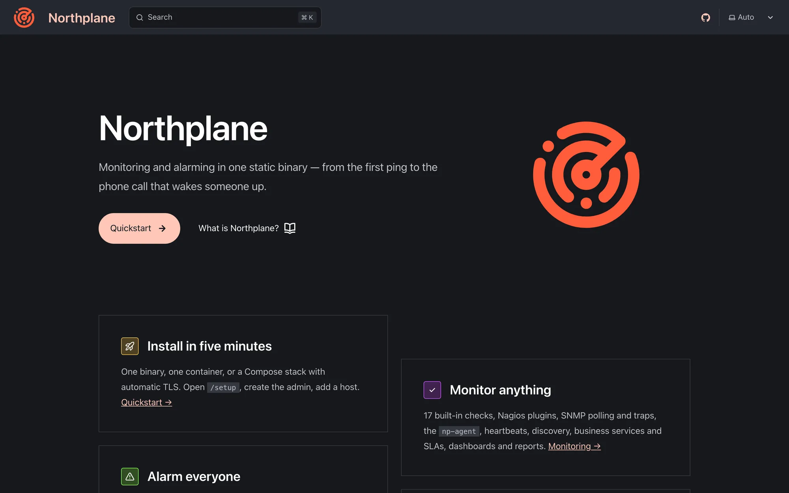

This manual is an [Astro Starlight](https://starlight.astro.build/) site in `docs/` at the repository root. It is built to static HTML, gzip-compressed, staged into `internal/docs/dist` and embedded into `northplaned` with `go:embed`, so every instance — binary, container, edge VM, air-gapped box — serves the manual that matches its own version at `/docs/`, publicly and offline. The public showcase instance serves it at `https://doktrace.com/docs/`.




## Layout and toolchain

```text
docs/
├── astro.config.mjs          Starlight config: base /docs, plugins, sidebar groups
├── package.json              scripts: dev, build, build:embed, preview
├── compress.mjs              gzip pre-compression for embedding (build:embed)
├── tsconfig.json             extends astro/tsconfigs/strict
├── public/favicon.svg        copied unprocessed by Astro → /docs/favicon.svg
└── src/
    ├── content.config.ts     the `docs` collection (Starlight docsLoader + docsSchema)
    ├── content/docs/         the pages — one directory per sidebar section
    │   ├── index.mdx         landing page (template: splash)
    │   ├── getting-started/  concepts/  monitoring/  alarming/  ai/  ui/
    │   ├── administration/   deployment/  reference/  development/  project/
    ├── assets/
    │   ├── logo.svg          site logo (also the hero image)
    │   ├── openapi.json      spec copy the REST reference is rendered from (`make types`)
    │   └── screenshots/      *.webp UI screenshots (overview.webp, objects.webp, admin-users.webp, …)
    ├── components/
    │   ├── Diagram.astro                 shared frame for inline SVG diagrams
    │   ├── ArchitectureDiagram.astro     the process/request-path diagram (concepts)
    │   ├── AlarmingPipelineDiagram.astro inputs → sources → rules → alerts → escalation → channels (alarming)
    │   └── ProdTopologyDiagram.astro     the np-01 Proxmox topology (deployment)
    └── styles/custom.css     brand accent (Obsidian & Fire), denser tables
```

Dependencies (`docs/package.json`): `astro` 7, `@astrojs/starlight` 0.41, `starlight-openapi` (the generated REST reference), `starlight-links-validator` (build-time link check), `starlight-llms-txt` (`llms.txt` exports) and `sharp` (Astro's image service). `dist/`, `.astro/` and `node_modules/` are git-ignored.

Configuration essentials in `astro.config.mjs`: `site: 'https://doktrace.com'` (only for canonical URLs and the sitemap), **`base: '/docs'`** (the site lives under that prefix everywhere, which is why every internal link starts with `/docs/`), logo/favicon/custom CSS, a GitHub social link, `editLink.baseUrl` pointing at `…/edit/main/docs/` (the repository is public, so every page has a working edit link), `lastUpdated: false` (the Docker build has no `.git` checkout), pagination on, credits off, table of contents for headings 2–4, and a sidebar of eleven groups each autogenerated from its directory: Getting started, Concepts, Monitoring, Alarming, AI & MCP, User interface, Administration, Deployment, Reference (plus the generated REST API groups), Development, Project. Do not change the sidebar configuration when adding pages — directories and `sidebar.order` do the work.

## Authoring loop

```bash
make docs-dev                 # = cd docs && npm run dev  → http://localhost:4321/docs/
cd docs && npm ci             # first time / after a lockfile change
cd docs && npm run build      # full build incl. link validation (what CI runs)
cd docs && npm run preview    # serve the built dist locally
```

The dev server hot-reloads content, config and components. Two things only exist in a production build: the Pagefind search index (search is disabled in `astro dev`) and the link validation. `make dev` does **not** proxy `/docs/` through Vite, and a locally built server only serves `/docs/` after `make docs` — use the Astro dev server while writing.

## Pages, frontmatter, sidebar order

A file `src/content/docs/<section>/<slug>.md` becomes `/docs/<section>/<slug>/`. Every page starts with:

```yaml
---
title: Page title
description: One real sentence — it is the search-engine description and the sidebar tooltip.
sidebar:
  order: 3
---
```

`sidebar.order` sorts pages inside their autogenerated group (lower first); keep the numbering stable when you insert a page. `sidebar.badge: { text: 'New', variant: 'tip' }` is available but used sparingly. The landing page `index.mdx` uses `template: splash` with a `hero` block.

Use `.md` by default. Switch to `.mdx` only when you need components, and then import them right after the frontmatter:

```mdx
import { Tabs, TabItem, Steps, Card, CardGrid, LinkCard, FileTree, Badge, Aside } from '@astrojs/starlight/components';
```

Asides work in both formats:

```md
:::caution[Disabled by default]
A channel created through the API without `enabled: true` never sends.
:::
```

(`note`, `tip`, `caution`, `danger`.) Headings start at `##` — the `#` title comes from the frontmatter. Starlight slugifies headings to lower-case hyphenated ids (`## Data directory layout` → `#data-directory-layout`), which is what anchor links must use. Tag every code block with a language (`bash`, `yaml`, `json`, `go`, `ini`, `xml`, `text`, `toml`, `js`, `ts`, `sql`, `dockerfile`; Caddyfiles as `text`) and use `title="config.yaml"` for file contents; shell examples have no `$` prompt so they paste cleanly; secrets are written as `<secret>` or `np_…`.

MDX pitfalls that fail the build: a bare `<` or `{` in prose (put `<host>` and `{{ .event.type }}` in backticks or code blocks), `<url>` autolinks (use `[text](url)`), HTML comments (`{/* */}` in `.mdx`, none in `.md`), `<br>` instead of `<br />`, code fences inside list items indented past the list marker, and an unescaped `|` inside a table cell (`\|`).

## Components and diagrams

Starlight's built-ins cover most needs: `Tabs`/`TabItem` for the Docker/Compose/binary variants, `Steps` for procedures, `Card`/`CardGrid`/`LinkCard` for link maps, `FileTree` for directory listings (see [Development setup](/docs/development/setup/)), `Badge`, `Aside`.

Diagrams are **inline SVG components** in `docs/src/components/`, not images, so they scale, follow the light/dark theme and are searchable/accessible. `Diagram.astro` is the shared frame: props `title` (also the accessible `<title>` and the id prefix), `description` (the `<desc>` and the caption), `viewBox`, optional `maxWidth` (default `900px`). All colours come from Starlight's CSS variables; the frame defines element classes `box`, `box-accent`, `box-soft`, `t`, `t-sm`, `t-muted`, `t-accent`, `t-head`, `edge`, `edge-accent`, and two arrowhead markers whose ids derive from the title slug (`#dg-<title-slug>-arrow`, `#dg-<title-slug>-arrow-accent`). The three concrete diagrams compose it:

```mdx
import ArchitectureDiagram from '../../../components/ArchitectureDiagram.astro';

<ArchitectureDiagram />
```

To add one, copy `ArchitectureDiagram.astro`, change the title/viewBox and draw with `rect`/`text`/`path` using the classes above; the page that embeds it must be `.mdx`.

## Screenshots

UI screenshots live in `docs/src/assets/screenshots/` as **WebP**, named after the page or dialog they show (`overview.webp`, `objects.webp`, `object-detail.webp`, `alerts-trigger-dialog.webp`, `admin-users.webp`, `command-palette.webp`, …). Because they sit under `src/assets`, Astro's image pipeline (sharp) processes them — optimised, content-hashed into `_astro/`, with width/height for layout stability. Reference them relative to the page:

```md

```

or in `.mdx` via `import { Image } from 'astro:assets'` and `import objects from '../../../assets/screenshots/objects.webp'`, then `<Image src={objects} alt="…" />`. Always write a real `alt` text. Do not drop images into `public/` — they would bypass optimisation and need the `/docs/` prefix spelled out by hand. The screenshots are inserted by the documentation lead; writers leave a one-line placeholder note rather than adding images themselves.

## Links and the validator

Every internal link is absolute and carries the base: `/docs/<section>/<slug>/` with the trailing slash, anchors as `/docs/<section>/<slug>/#heading-id`, external links as full `https://` URLs. The build runs `starlight-links-validator` with `errorOnRelativeLinks: false` and `errorOnInvalidHashes: true`: a link to a page that does not exist or to a heading id that does not exist **fails `npm run build`** — and therefore the CI `docs` job, the Docker build and the release. Link only to pages that exist (or are being written in the same change) and to headings you have checked.

The generated REST reference is linkable too: the overview is `/docs/reference/api/`, each operation is `/docs/reference/api/operations/<operationId>/`. The `operationId` is derived by the Go generator as lower-cased method + path with `/api/v1/` → `_`, `/` → `_`, braces removed, `:` and `-` → `_` — `get_hosts`, `post_alerts_id_ack`, `put_objects_id`, `get_objects_id_effective_config`, `post_config_bundles_apply`, `post_check_commands_test` (see [Backend](/docs/development/backend/)).

## The REST API reference pages

`starlight-openapi` renders `docs/src/assets/openapi.json` into the sidebar group **REST API reference** (collapsed, method badges, operations labelled by their `summary`, in document order) under the base `reference/api`: one overview page plus one page per operation (currently 224 operations over 138 paths with 102 schemas). The JSON file is **generated**: `make types` dumps the spec with `northplaned openapi` and copies it there (besides producing `web/src/types.gen.ts`), and `make types-check` — the CI `types` job — fails when the committed copy differs from what the Go route registry produces. Never edit it by hand; if an endpoint's summary or shape is wrong, fix the `a.handle(...)` registration or the Go type and run `make types`. Swagger UI on a running instance (`/api/docs`) and `GET /api/openapi.json` show the same document live. The hand-written conventions page is [API overview](/docs/reference/api-overview/).

## `llms.txt` for AI assistants

`starlight-llms-txt` exports the manual as plain Markdown so AI assistants can read it — fitting for a product that ships its own AI agent and MCP server. With `base: '/docs'` the files are:

| URL | Content |
|---|---|
| `/docs/llms.txt` | the index: project name, description, `details` (a pointer to `/api/openapi.json` and `/api/docs`), links to every page and to the custom sets |
| `/docs/llms-full.txt` | every page, unminified, in order |
| `/docs/llms-small.txt` | the same with `note`/`tip` asides and `<details>` removed and whitespace collapsed (`caution`/`danger` asides stay); `exclude: ['reference/api/**']` applies to this file |
| `/docs/_llms-txt/<slug>.txt` | one file per custom set — **Alarming** (`alarming/**`), **Administration and deployment** (`administration/**`, `deployment/**`), **API and CLI reference** (`reference/*`); the slug is the GitHub-style slug of the label |

`promote: ['index*', 'getting-started/**', 'concepts/**']` sorts those first, `demote: ['project/**']` last. The generated REST reference pages are not content-collection entries, so they never appear in these dumps; the spec itself is the machine-readable source for the API. The plugin requires `site` to be set, which it is.

## Building for embedding

| Command | Output |
|---|---|
| `npm run build` | `astro build`: renders every page, runs the links validator, builds the Pagefind index (`dist/pagefind/`), writes the sitemap and `404.html`. About 39 MB — the operation pages of the REST reference dominate |
| `npm run build:embed` | `astro build && node compress.mjs`: the same, then gzip pre-compression in place |
| `make docs` | `cd docs && npm ci --silent && npm run build:embed`, then `rm -rf internal/docs/dist`, copy `docs/dist/.` → `internal/docs/dist/`, `touch internal/docs/dist/.gitkeep` |

`compress.mjs` walks `dist/` and, for every file with extension `.html`, `.css`, `.js`, `.mjs`, `.json`, `.xml`, `.svg`, `.txt`, `.map` or `.webmanifest`, writes `<file>.gz` (zlib level 9) and deletes the original; images, fonts and Pagefind's `.pf_*` chunks are left alone. It prints `[docs] pre-compressed N files: A MB → B MB` — roughly 39 MB → 5 MB. `go:embed` stores files verbatim, so without this step the binary would grow by the full size of the HTML.

In git, `internal/docs/dist/` contains only `.gitkeep` (`/internal/docs/dist/*` is ignored except that file). A plain `go build` therefore compiles but embeds no manual; `make clean` removes `docs/dist` and `internal/docs/dist` and recreates the `.gitkeep`.

## Serving `/docs/` from the binary (`internal/docs`)

`internal/docs/docs.go` embeds `dist` with `//go:embed all:dist` and is mounted in `server.rootHandler` at `docs.Prefix` (`/docs/`) **ahead of** the SPA catch-all, so the client-side router never swallows it. It is public by design — the pages hold no instance data and are what an operator reads before they can log in — and it is not behind the API middleware, so no token or cookie is involved. `docs.Embedded()` reports whether a real build is present.

| Request | Response |
|---|---|
| `GET /docs/` | `index.html` |
| `GET /docs/a/b/` | `a/b/index.html` |
| `GET /docs/a/b` (and `a/b/index.html` exists) | `308` → `/docs/a/b/` so relative links inside the page resolve |
| `GET /docs/a/b/index.html` | `301` → `/docs/a/b/` (canonical directory form) |
| `GET /docs/_astro/<hashed asset>` | `Cache-Control: public, max-age=31536000, immutable` |
| any other existing file | `Cache-Control: no-cache` |
| unknown path | Starlight's own `404.html` with a real **404** status |
| anything but `GET`/`HEAD` | `405` with `Allow: GET, HEAD` |
| no build embedded (only `.gitkeep`) | `501` with the text ``documentation not embedded in this build — run `make docs` before building`` |

Every file may exist verbatim or as `<name>.gz`. For a pre-compressed file the handler sends the `.gz` bytes as-is with `Content-Encoding: gzip` and `Vary: Accept-Encoding` when the client's `Accept-Encoding` includes gzip, and inflates them in memory otherwise. `Content-Type` comes from the extension; a strong `ETag` (FNV-64a over the served bytes) is set, and successful responses go through `http.ServeContent`, which handles `If-None-Match` → 304, `Range` and `HEAD`. Paths are cleaned (`path.Clean`) so there is no traversal. The server's 30 s request timeout and the generic security headers (`X-Content-Type-Options`, `X-Frame-Options: DENY`, `Referrer-Policy`, HSTS on HTTPS) still apply; only the Content-Security-Policy is the handler's own:

```text
default-src 'self'; script-src 'self' 'unsafe-inline' 'wasm-unsafe-eval'; style-src 'self' 'unsafe-inline'; img-src 'self' data:; font-src 'self'; connect-src 'self'; frame-ancestors 'none'; base-uri 'self'; form-action 'self'
```

Starlight relies on inline bootstrap scripts (theme before first paint, sidebar state) and its Pagefind search instantiates WebAssembly at runtime; the SPA's stricter policy (hash-allow-listed inline script, the Stept origins) would block both, and the docs contain no user input, so `'unsafe-inline'` and `'wasm-unsafe-eval'` are the accepted trade here — everything else stays locked to the own origin, and `securityHeaders` skips the SPA CSP for `/docs/` paths. `internal/docs/docs_test.go` covers the routing table, the canonical redirect, pre-compressed serving with and without `Accept-Encoding`, write rejection and the 501 case against an in-memory tree (`HandlerFS`). The headers the rest of the server sends are documented in [TLS and proxying](/docs/administration/tls-and-proxy/).

## How the docs get shipped

| Path | Step |
|---|---|
| CI (`.github/workflows/ci.yml`, job `docs`) | Node 22, `cd docs && npm ci`, **`npm run build`** — the quality gate: a page that does not compile or a broken link fails the job; uploads `docs-dist` (1 day). Runs on every push and pull request to `main` alongside `ui`, `types`, `lint`, `test`, `e2e`, `postgres`, `cross-build` |
| Docker image (`Dockerfile`, stage `docs`) | `node:22-alpine`, `npm ci --legacy-peer-deps`, **`npm run build:embed`**; the Go stage does `COPY --from=docs /docs/dist ./internal/docs/dist` before `go build`, so every image — including the `main-<sha>` images the Deploy workflow rolls to production — serves `/docs/` |
| Release (`.github/workflows/release.yml`) | the `ui` job runs `npm run build:embed` in `docs/` and uploads `docs-dist`; the `binaries` job downloads it into `internal/docs/dist` before building, so the tarball binaries carry the manual too (see [Release process](/docs/development/release-process/)) |
| Local | `make docs` before `make build` (or `make all`) |

`.dockerignore` excludes `docs/node_modules`, `docs/dist` and `docs/.astro`, so the image always builds the docs from source.

## Style rules (summary)

The binding rules for writers, condensed:

- **Readers** are operators, integrators and on-call engineers: Linux-fluent, no prior Northplane knowledge. English; second person; present tense; lead with what the reader wants to do, then exact commands, fields and defaults. No marketing, no filler.
- **Every** config key, flag, field, endpoint, default, unit and permission name comes from the code (or the research sheets distilled from it). Document real behaviour; when the code deviates from the intended behaviour, say so in a `:::caution` or `:::note` instead of describing what should work.
- **Terminology**: Northplane (product), `northplaned` (server), `np` (CLI), `np-agent`, `np-gen`; object = host or service; check command; alert (the domain is "alarming"); event source; channel; escalation policy; on-call schedule; contact; tenant; site (federation edge); bundle (YAML config); NP-TSDB; secret store; the instance. UI labels in English with the German label in parentheses on first use — **Admin → Channels (Kanäle)** — and menu paths in bold.
- **Shape**: tables for references, numbered steps for procedures, one copy-pasteable example per feature; reference pages complete, guides 120–400 lines; each fact has one home page and other pages link to it.
- **No** "verified on …" stamps except on the deployment environments page, where the date is the point; no images by writers (the lead inserts screenshots); never hand-edit `docs/src/assets/openapi.json`.
- **Links** as described above; a broken one fails the build.

## Editing workflow

1. Work on a feature branch in a worktree ([Development setup](/docs/development/setup/)); create or edit the page under `src/content/docs/<section>/` with the frontmatter and `sidebar.order`.
2. Write against the code; run `make docs-dev` and read the page in the browser.
3. `cd docs && npm run build` to catch broken links and MDX errors before pushing (or rely on the CI `docs` job, which runs the same build).
4. If you changed an API route or type, run `make types` so the REST reference and `types.gen.ts` follow; commit the regenerated files.
5. Open the pull request; the `docs` job must be green. After the merge to `main`, CI and the Deploy workflow build the image and the updated pages are live at `/docs/` on the production instance after the rollout; the next `v*` tag ships them in the release binaries.
