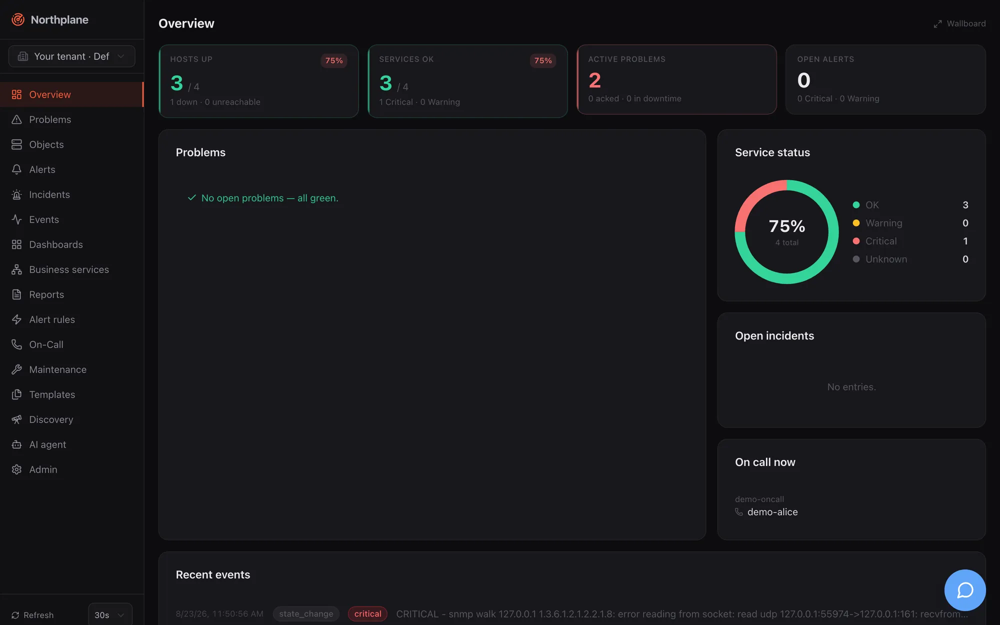

import { Card, CardGrid, LinkCard } from '@astrojs/starlight/components';

Northplane is a monitoring **and** alarming server in one static binary. It polls hosts and services
(built-in checks, Nagios plugins, SNMP, an optional host agent), turns state changes and external
events into alerts, escalates those alerts to the people on call over phone, SMS, push, e-mail,
chat and ticket systems, and records everything in an append-only event log with a hash-chained
audit trail. Everything is driven through one REST API; the web UI, the `np` CLI, the AI agent chat
and the MCP server are all clients of that API and share the same roles and permissions.




The server binary is called `northplaned`. It ships with the React UI, the Swagger UI and this
documentation embedded, uses SQLite and its own time-series store (NP-TSDB) by default, and needs
no external services to run. PostgreSQL, a TLS-terminating proxy, OIDC/LDAP and AI providers are
optional additions, not prerequisites.

## Who it is for

- **Operators and sysadmins** who want Nagios-style monitoring (active checks, plugins, SNMP,
  dependencies, soft/hard states, downtimes) without an external database, web server or message
  broker to look after.
- **On-call engineers** who need reliable alarming: escalation policies, on-call schedules, voice
  calls with IVR, SMS, push to the Northplane alarm app, acknowledgement from the phone, and an
  outbox with retries and dead letters so a notification is never silently lost.
- **Integrators and developers** who want an API-first system: OpenAPI 3.1 spec, RFC 9457 errors,
  declarative YAML config bundles, webhooks in and out, a typed CLI, MCP for AI assistants.
- **Control rooms and factories**: inbound alarms over ESPA 4.4.4, ESPA-X, MQTT, IMAP and
  Asterisk/FastAGI; outbound MQTT; wallboards; business-service trees with SLAs.

Northplane assumes Linux fluency but no prior knowledge of the product — this section takes you
from zero to a monitored host with a working alarm chain.

## The one-binary idea

`northplaned` contains the scheduler, the check executor, the result pipeline and state machine,
the alerting engine, the escalation engine, the notifier with its outbox, every inbound listener
(SNMP traps, IMAP, MQTT, ESPA, FastAGI), the report scheduler, the MCP server, the UI and the docs.
A fresh install looks like this:

```bash
northplaned serve
# northplane: listening addr=127.0.0.1:8443 scheme=http storage=sqlite objects=0 ai=false
```

Configuration is deliberately minimal: `config.yaml` (or `NORTHPLANE_*` environment variables)
holds only what must exist before the API is reachable — listen address, data directory, TLS,
storage DSN, OIDC/LDAP, federation. Every other object — hosts, services, templates, channels,
rules, policies, schedules, dashboards — is managed through the API, the UI or YAML bundles, and
can be exported again as a bundle.

Three more binaries come with it:

| Binary | Role |
|---|---|
| `np` | CLI — a thin client of the public API (`np get hosts`, `np apply -f bundle.yaml`, `np ack …`). |
| `np-agent` | Host agent for Linux, macOS and Windows: pushes load/memory/disk/process/network results and local plugin output over HTTPS (no inbound ports), optionally pulls checks from the server or listens NCPA-style. |
| `np-gen` | Developer scaffolding for new resource kinds; not needed to run Northplane. |

## At a glance

| Aspect | What you get |
|---|---|
| Server | `northplaned`, static Go binary (CGO-free), Linux/macOS amd64+arm64; also a distroless container image. Default listen `127.0.0.1:8443`; plaintext is refused on non-loopback listeners unless TLS is configured, a trusted proxy terminates TLS, or `tls.insecure` is set for development. |
| UI | Embedded React SPA at `/`; German or English from the browser language; 31 colour themes; wallboard mode; command palette (Ctrl/⌘ K). |
| Storage | SQLite by default (`core.db` in the data directory, WAL mode, monthly event segments) or PostgreSQL via `storage.dsn`. Schema migrations run automatically. |
| Metrics | NP-TSDB, embedded under `<dataDir>/tsdb`: perfdata of every check, raw samples 30 days, 5-minute aggregates 400 days, 1-hour aggregates 5 years. |
| Checks | 17 built-in checks (ICMP, TCP, HTTP/HTTPS, TLS certificate, DNS, SMTP, IMAP, NTP, SSH banner, SNMP get/walk, NRPE, agent, HTTP flow …), any Nagios plugin via `exec:`, passive results, `np-agent`, SNMP traps, heartbeats, network discovery. |
| Alarming | Event sources (webhook, Alertmanager, e-mail, SNMP trap, MQTT, ESPA/ESPA-X, Twilio voice and SMS, Asterisk), CEL alert rules, incidents, escalation policies, on-call schedules, contacts, IVR menus, 13 channel types (e-mail, SMS, voice, push, ntfy, Slack, Teams, webhook, MQTT, ServiceNow, Zendesk, Jira, generic ticket), outbox with retries and dead letters. |
| API | REST under `/api/v1`, OpenAPI 3.1 at `/api/openapi.json`, Swagger UI at `/api/docs`, RFC 9457 problem details, ETag/If-Match versioning, SSE event stream, NDJSON exports, YAML config bundles. |
| CLI | `np` (uses `NP_SERVER` / `NP_TOKEN`). |
| Agent | `np-agent` (push, pull and listener modes; token-authenticated HTTPS). |
| AI | Agent chat page (`/agent`) and sidebar with 10 provider types (Anthropic, OpenAI, Google, xAI, Mistral, DeepSeek, Groq, OpenRouter, Ollama, OpenAI-compatible), tool policy with approvals, incident summaries. |
| MCP | Streamable HTTP at `/mcp` and stdio via `northplaned mcp`; 22 tools, 3 prompts; same RBAC as the API. |
| Identity | Local users (argon2id), OIDC (code + PKCE), LDAP/AD sync, API tokens (`np_…`), roles and permissions, tenants, federation sites (edge instances pulling config from a main instance). |
| Operations | `/healthz`, `/readyz`, `/metrics` (OpenMetrics self-metrics), structured JSON logs, hash-chained audit log, `northplaned backup`, dead-man URL. |
| Licence | MIT. |

## Feature tour

### Monitoring

- **Objects** — hosts and services with folders, labels and label selectors; templates with
  multi-inheritance and an "effective config" view; UUIDv7 ids; optimistic locking with `If-Match`.
- **Checks** — `builtin:<name>` in-process checks, `exec:<plugin>` for Nagios/Monitoring plugins with
  full perfdata parsing, `agent:exec:<plugin>` executed by `np-agent`, `passive` for results pushed
  through the API, named check commands with `$ARGn$` and custom-variable macros.
- **State machine** — interval/retry scheduling with deterministic splay, soft and hard states, host
  UP/DOWN/UNREACHABLE with parent reachability, flapping detection, freshness/staleness for passive
  objects, acknowledgements, check-now.
- **SNMP** — `snmp` and `snmp-walk` checks (v1/v2c/v3) plus an SNMP trap receiver that turns traps
  into events and alerts.
- **Nagios compatibility** — `northplaned import nagios` converts an existing Nagios/Icinga
  configuration into a bundle with a deviation report; NRPE client built in.
- **Heartbeats, discovery, maintenance** — dead-man inputs with grace periods, CIDR scans with
  suggestions, downtimes (fixed, flexible, recurring via RRULE), silences, time periods.
- **Metrics, dashboards, business services, reports** — NP-TSDB charts on every object, dashboards
  with 11 widget types and a wallboard mode, BPI trees with worst/best/quorum/weighted rules and SLA
  budgets, scheduled availability/SLA/alert/on-call/audit reports delivered by e-mail.

### Alarming

- **Inputs** — event sources for webhooks, Prometheus Alertmanager, e-mail (IMAP), SNMP traps, MQTT,
  ESPA 4.4.4 and ESPA-X, inbound Twilio voice and SMS, Asterisk FastAGI; manual alarms from the UI,
  the API, the alarm app or an IVR menu.
- **Rules** — CEL expressions over the event (`event.type`, `event.state`, `event.labels.*`,
  `event.payload.*`), Go templates for titles and dedup keys, pending-for, auto-close, label
  injection (`np.sound`, `np.volume` for the alarm app), heartbeat rules.
- **Escalation** — policies with timed steps, "unless acked", repeats, on-call schedules with
  layers and overrides (and a backup person), contact groups, ticket and webhook actions; timers are
  persisted and survive restarts.
- **Outputs** — e-mail (SMTP/sendmail/Resend/SES), SMS and voice (Twilio, Asterisk AMI, generic HTTP
  gateways) with DTMF acknowledgement, push (Web Push, FCM, APNs) for the Northplane alarm app,
  ntfy, Slack, Teams, webhooks with HMAC signatures, MQTT, ServiceNow/Zendesk/Jira/generic tickets
  with auto-close.
- **Acknowledge from anywhere** — UI, `np ack`, API, signed ack links, SMS keyword, IVR digit,
  DTMF during a call, the app. Snooze re-arms the chain later.
- **Reliability** — outbox with exponential backoff, dead-letter queue with replay, supervised
  workers, suppression by downtime/silence/flapping/dependencies with re-arm, every delivery attempt
  recorded as an event.

### Platform

- **API-first** — every capability is a documented endpoint; the UI never does anything the API
  cannot. Tenants (`X-Northplane-Tenant`), roles with `resource:action` permissions, API tokens with
  scopes, expiry and IP binding, secrets at rest (AES-256-GCM) referenced as `$SECRET:name$`.
- **Config as code** — multi-document YAML bundles with plan/apply/export/prune, applied through the
  API, `np apply` or the Admin UI; the same mechanism distributes configuration to federated edge
  sites.
- **Deployment** — one binary with systemd, a distroless container, or a Compose stack with a bundled
  Caddy for automatic TLS; SQLite or PostgreSQL; backups with `northplaned backup`.
- **Observability of the monitor itself** — health and readiness endpoints, OpenMetrics, structured
  logs, audit chain verification, outbound dead-man pings.

### AI and API

- **Agent chat** — a chat workspace with tool use against the live instance, per-user or shared
  provider connections, approval flow for mutating tools, budget and redaction settings.
- **MCP server** — connect Claude Code, Claude Desktop, Cursor, VS Code, Windsurf, Codex or Gemini
  CLI to your instance over HTTP or stdio with a scoped token; tools respect the token's RBAC.
- **Typed clients** — the UI's TypeScript types are generated from the OpenAPI spec
  (`openapi-typescript`); you can do the same for your own integrations.

## How the documentation is organised

| Section | Read it when you want to … |
|---|---|
| **Getting started** (this section) | install Northplane, log in, add the first objects, try the demo. |
| **Concepts** | understand the architecture, the object model, checks and states, events, alerts and incidents, tenancy and federation. |
| **Monitoring** | configure hosts and services, built-in checks, plugins, the agent, SNMP, discovery, heartbeats, metrics, dashboards, business services, reports, maintenance and templates. |
| **Alarming** | build the alarm pipeline: event sources, rules, channels, voice/IVR, mobile push, contacts and on-call, escalation, acknowledgement, reliability, outgoing webhooks. |
| **AI & MCP** | use the agent chat and connect MCP clients. |
| **User interface** | find your way around every page, dialog and Admin tab. |
| **Administration** | configure the server, authentication, users and roles, tenants, tokens, secrets, TLS, storage, bundles, branding, observability, upgrades and security. |
| **Deployment** | choose and run a deployment variant, Compose, Proxmox, CI/CD, provisioning, operations, environments. |
| **Reference** | look up every subcommand of `northplaned`, `np`, `np-agent`, `np-gen`, the API conventions and the generated REST reference. |
| **Development** | build, test and extend Northplane, and edit these docs. |
| **Project** | see the roadmap and known issues. |

Every running instance serves this manual at `/docs/` and the interactive API reference at
`/api/docs`, so the documentation always matches the version you run.

## Where to go next

<CardGrid>
  <LinkCard title="Quickstart" href="/docs/getting-started/quickstart/" description="Docker, Compose or a single binary — running with a monitored host in five minutes." />
  <LinkCard title="Installation" href="/docs/getting-started/installation/" description="Every install variant in depth: tarball, systemd, Docker, Compose with Caddy, build from source." />
  <LinkCard title="First steps" href="/docs/getting-started/first-steps/" description="The UI in ten minutes, your first bundle, a minimal alarm chain, an API token, an agent." />
  <LinkCard title="Demo mode" href="/docs/getting-started/demo-mode/" description="Seed a complete showcase environment with one flag — and keep it away from real data." />
  <LinkCard title="Architecture" href="/docs/concepts/architecture/" description="Components, request path, workers, storage and the event bus." />
  <LinkCard title="Alarming overview" href="/docs/alarming/overview/" description="The pipeline from inputs to phone calls, with worked examples." />
  <LinkCard title="Configuration reference" href="/docs/administration/configuration/" description="Every config.yaml key, environment variable and default." />
  <LinkCard title="API overview" href="/docs/reference/api-overview/" description="Conventions, authentication, errors, pagination, SSE, curl examples." />
</CardGrid>
