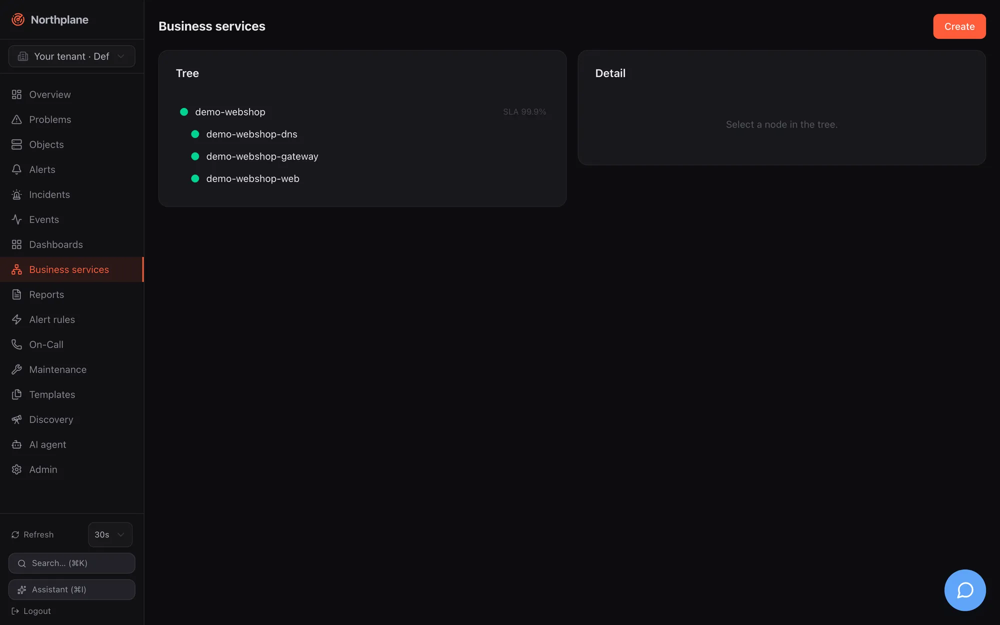

Business services (Business Process Intelligence, BPI) turn the flat object list into a tree that mirrors what your users experience — "Webshop" depends on "Frontend", "Database" and "Payments", each of which is backed by hosts and services. The tree is evaluated live from check states, every node gets an SLA budget, and every object knows which business services it impacts.




## Concepts

| Term | Meaning |
|---|---|
| Business service | a node of the tree; resource kind `business-service`, addressed by `name` |
| Leaf | a node without children; it binds objects by `objectId` and/or a label `selector` and aggregates their check states |
| Inner node | a node with children; it aggregates the states of its children (its own bindings are ignored for the state) |
| Rule | how a node combines its inputs: `worst` (default), `best`, `quorum`, `weighted` |
| Causes | up to five names of non-OK leaf objects, bubbled up to every ancestor — the "why is it red" of the impact view |
| SLA | per node: `slaTarget` (% availability, default 99.9), `slaWindow` (`month`, `quarter`, `year`), `excludeDowntimes` |

States use the service palette: OK, WARNING, UNKNOWN, CRITICAL, ranked OK < WARNING < UNKNOWN < CRITICAL. A node with no inputs at all (a leaf whose selector matches nothing, or an empty inner node) is UNKNOWN.

:::caution[Host states in a leaf]
Host and service states share one numeric space (UP/OK = 0, DOWN/WARNING = 1, UNREACHABLE/CRITICAL = 2). A leaf that binds hosts therefore counts a **DOWN host as WARNING** and an UNREACHABLE host as CRITICAL, and the tree shows the warning glyph for it. When a dead host must turn the business service red, bind a service on that host (for example its `icmp` or `ping` service) instead of the host object.
:::

### Aggregation rules

| `rule` | Result of a node |
|---|---|
| `worst` (default, also used when `rule` is empty) | the highest-ranked input state |
| `best` | the lowest-ranked input state |
| `quorum` | OK when at least `quorumPct` % of the inputs are OK (default 50), otherwise CRITICAL — nothing in between |
| `weighted` | **evaluated as `worst`** in this version; `weight` is stored but not used |

## Creating the tree

**Business services** in the sidebar shows the live tree on the left (refreshed every 30 s; glyphs `●` OK, `▲` WARNING, `✕` CRITICAL, `?` UNKNOWN, plus "SLA N %" when a target is set) and the selected node on the right. **Create (Anlegen)** and **Edit** open the same dialog:

| Field | Notes |
|---|---|
| Name | unique per tenant; used in URLs and in the `bpi` dashboard widget |
| Parent | "Root" or any other business service (stored as the parent's id) |
| Aggregation rule | `worst`, `best`, `quorum` (shows "Quorum % healthy"), `weighted` |
| Leaf binding | **Object** (searchable picker), **Selector** (label selector, e.g. `env=prod,role=web`), or **none** (inner node) |
| Weight | stored, not evaluated |
| SLA target %, SLA window | e.g. `99.9`, `month` / `quarter` / `year` |
| Exclude planned downtimes | stored flag; see the SLA caveat below |

The detail pane shows the definition, **Edit**, **Delete**, and the SLA card: availability (green/red against the target), target, budget, spent, remaining, window in days. Inner nodes without bindings show "no data" instead of a meaningless 100 %.

The same tree is available as a dashboard widget (`bpi`, see [Dashboards](/docs/monitoring/dashboards/)) and the demo data set ships the root `demo-webshop` with three selector-bound leaves ([Demo mode](/docs/getting-started/demo-mode/)).

## API

The resource uses the generic CRUD at `/api/v1/business-services` (`objects:read` to read, `config:write` to write, `If-Match` on `PUT`). Document fields:

| Field | Type | Notes |
|---|---|---|
| `name` | string | required |
| `parentId` | string | **id** of the parent node (not its name); empty = root. A `parentId` that matches no node makes the node a root |
| `rule` | `worst` \| `best` \| `quorum` \| `weighted` | default `worst` |
| `quorumPct` | number | quorum threshold in %, default 50 |
| `objectId` | string | leaf binding: one object id |
| `selector` | string | leaf binding: label selector; may be combined with `objectId` |
| `weight` | number | stored only |
| `slaTarget` | number | %; default 99.9 when 0 or absent |
| `slaWindow` | `month` \| `quarter` \| `year` | 30, 90 or 365 days; default `month` |
| `excludeDowntimes` | bool | stored only (see below) |

```bash
NP=https://np.example.com
TOK=np_…
# root with a pinned id so children can reference it
curl -s -X POST "$NP/api/v1/business-services" -H "Authorization: Bearer $TOK" -H 'Content-Type: application/json' \
  -d '{"id":"0198f000-0000-7000-8000-00000000b001","name":"webshop","rule":"worst","slaTarget":99.9,"slaWindow":"month"}'
curl -s -X POST "$NP/api/v1/business-services" -H "Authorization: Bearer $TOK" -H 'Content-Type: application/json' \
  -d '{"name":"webshop-frontend","parentId":"0198f000-0000-7000-8000-00000000b001","rule":"quorum","quorumPct":66,"selector":"role=web,env=prod"}'
curl -s -X POST "$NP/api/v1/business-services" -H "Authorization: Bearer $TOK" -H 'Content-Type: application/json' \
  -d '{"name":"webshop-db","parentId":"0198f000-0000-7000-8000-00000000b001","objectId":"<service-id>"}'
```

A caller-supplied `id` is honoured on create; otherwise a UUIDv7 is minted and returned in the response.

### Evaluated tree

`GET /api/v1/business-services:tree` (`objects:read`) returns the roots sorted by name, each as `{service, state, children, causes}` with `state` as the numeric state (0 OK, 1 WARNING, 2 CRITICAL, 3 UNKNOWN):

```json
[
  {"service": {"id": "0198…b001", "name": "webshop", "rule": "worst", "slaTarget": 99.9},
   "state": 2,
   "causes": ["http"],
   "children": [
     {"service": {"name": "webshop-frontend", "rule": "quorum", "quorumPct": 66}, "state": 0},
     {"service": {"name": "webshop-db"}, "state": 2, "causes": ["http"]}
   ]}
]
```

Reference: [get_business_services_tree](/docs/reference/api/operations/get_business_services_tree/).

### SLA budget

`GET /api/v1/business-services/{name}/sla` (`objects:read`):

```json
{"service": "webshop-db", "target": 99.9, "windowDays": 30,
 "availability": 99.972, "budgetTotal": "43m0s", "budgetSpent": "12m0s", "budgetLeft": "31m0s"}
```

How it is computed:

1. The window is the last 30 / 90 / 365 days ending now.
2. For every object bound to **this node** (`objectId` and selector matches), the hard non-OK time inside the window is summed from its `state_change` events (hard transitions only; the state before the window is assumed OK; an ongoing problem counts up to now; at most 1000 events per object are read). WARNING and UNKNOWN count as "down", not only CRITICAL.
3. The per-object downtimes are added up (worst case: any leaf down = service down) and capped at the window length.
4. `availability = 100 × (1 − down / window)`, `budgetTotal = window × (100 − target) / 100`, `budgetLeft = max(0, budgetTotal − down)`; durations are Go duration strings rounded to minutes.

:::caution[SLA covers the node's own bindings only]
The SLA calculation does not recurse into children. An inner node without its own `objectId`/`selector` reports `availability: 100` with nothing spent — the UI shows "no data" for it. Put the SLA target on the leaf that carries the bindings, or bind the inner node to a selector that covers all of its objects.

`excludeDowntimes` is stored and displayed but **not applied** — planned downtimes are counted as unavailability in this version. The same holds for the `includeDowntimes` flag of [reports](/docs/monitoring/reports/).
:::

### Impact of an object

`GET /api/v1/objects/{id}/impact` (`objects:read`) returns the sorted names of all business services the object is bound to (by id or by selector) plus all their ancestors — useful in runbooks and chat-ops to answer "what breaks if this goes down". Reference: [get_objects_id_impact](/docs/reference/api/operations/get_objects_id_impact/).

## Bundles

Bundle kind `BusinessService` (see [Config bundles](/docs/administration/config-bundles/)):

```yaml
kind: BusinessService
metadata: {name: webshop}
spec:
  id: 0198f000-0000-7000-8000-00000000b001
  rule: worst
  slaTarget: 99.9
  slaWindow: month
---
kind: BusinessService
metadata: {name: webshop-frontend}
spec:
  parentId: 0198f000-0000-7000-8000-00000000b001
  rule: quorum
  quorumPct: 66
  selector: role=web,env=prod
```

:::note[Parent references are ids]
`parentId` links by id, and `np export` strips `id` from every exported document while keeping `parentId` in the children. Re-applying an exported tree on the **same** instance works (ids are preserved on update); applying it on a fresh instance or a federation edge creates new ids for the parents and turns the children into roots. Pin `id` on parent nodes in bundles you intend to apply elsewhere, as in the example above.
:::
