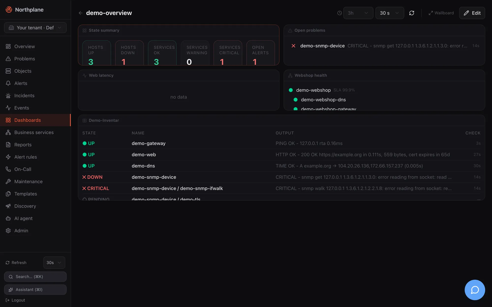

A dashboard is a named grid of widgets: KPI counters, problem and alert lists, object tables, metric charts, stats, gauges, donuts, bars, business-service trees and free text. Dashboards are stored as config documents (`/api/v1/dashboards`), so you can create them in the UI, with `np apply` bundles, or through the AI agent. Open one with `?wallboard` to get a chrome-free, auto-refreshing screen for a NOC display.




## Where to find it

**Dashboards** in the sidebar lists all dashboards of the current tenant as cards (name, **Shared (Geteilt)** badge, widget count, **Open**, delete). **New dashboard (Dashboard anlegen)** asks for a name and the shared switch and creates the dashboard with a single `counters` widget, then opens it.

The dashboard view has:

| Control | What it does |
|---|---|
| **Time range** select | `1h 3h 6h 12h 24h 7d 30d` — overrides the range of every time-series widget (`metric`, `stat`) |
| **Refresh** select | `Off (Aus)`, `10 s`, `30 s`, `1 min`, `5 min` — every widget re-fetches at this interval (default 30 s) |
| Refresh-now button | invalidates all widget queries immediately |
| **Wallboard** | opens `/dashboards/<name>?wallboard` |
| **Edit (Bearbeiten)** | enters edit mode |

In edit mode: **+ Add widget (Widget hinzufügen)**, **Tidy (Aufräumen)** (re-flows all panels left-to-right and closes gaps), **Cancel**, **Save**. Drag a panel by its header, resize it from the bottom-right grip; the rest of the grid reflows live. Hovering a panel shows **Configure**, **Duplicate** and **Remove**. The panel dialog offers title, width (1–12 columns), height (1–8 rows), the type-specific fields and a live preview; the add dialog shows an icon gallery of all types first.

**Save** writes `spec.widgets`, `spec.time` and `spec.refresh` with `PUT /api/v1/dashboards/{name}` and the held ETag; if another tab saved in the meantime (`409`), the UI re-fetches once and retries on the fresh version.

## Grid and layout

- 12 columns, row height 120 px, 12 px margins. Widget `w` is the column span (1–12), `h` the row span (1–8); `x`/`y` is the top-left cell.
- `x`/`y` are optional for documents written by hand or older versions: widgets without positions are auto-flowed left-to-right, top-to-bottom on load. New and duplicated widgets are placed at the bottom of the grid.

## Wallboard mode

`/dashboards/<name>?wallboard` renders the dashboard without sidebar and controls, with a large title, the Northplane logo and a clock; widgets refresh at the dashboard's saved `refresh` interval (default 30 s) and use its saved `time` range. It is the same page with the same authentication — a wallboard browser needs a logged-in session (or a reverse proxy that injects one); there is no anonymous share link.

:::note[Sharing status]
`shared` is a flag shown as a badge. It is not enforced: every dashboard of a tenant is visible to every user who may read objects, and editing requires `config:write` regardless of who created it. The model also carries `ownerId` and `shareToken`, but no server route reads them — in particular `shareToken` does not enable a public wallboard URL.
:::

## Widget types

All widgets share `type`, optional `title` (the type label is shown when empty) and the grid fields `x, y, w, h`. Time-series widgets honour the dashboard time range; everything else refreshes at the dashboard refresh interval. Selectors use the [label selector grammar](/docs/concepts/object-model/).

| `type` | Label (EN / DE) | Default size | Config fields | Data and rendering |
|---|---|---|---|---|
| `counters` | Counters (KPIs) / Zähler (KPIs) | 12 × 1 | — | `GET /overview`; six tiles: hosts up, hosts down, services OK, warning, critical, open alerts (critical + warning); each tile links to the filtered objects or alerts list |
| `problems` | Problems / Probleme | 6 × 2 | `limit` (1–50, default 10), `selector` | `GET /problems?limit&selector`; hard non-OK objects: state, `host / name`, output, time since last hard change; links to the object |
| `alerts` | Alerts / Alarme | 6 × 2 | `limit` (1–50, default 10) | `GET /alerts?status=open&limit`; severity badge, title, age; links to the alerts page |
| `table` | Table (hosts/services) / Tabelle | 12 × 2 | `scope` (`hosts`, `services`, unset = both), `selector`, `query` (full-text on name/spec), `limit` (1–100, default 15) | objects list (`/hosts`, `/services` or `/objects`) with state, name, output, last check; rows link to the object |
| `metric` | Metric chart / Metrik-Diagramm | 6 × 2 | `object` **or** `selector` (overlay one metric across many objects), `metric` (empty = all metrics of the object), `range` (default `3h`), `warn`, `crit` | `POST /metrics/query` (`maxPoints: 300`); one chart per unit group; dashboard range overrides `range` |
| `stat` | Single value (stat) / Einzelwert | 3 × 2 | `object`, `metric`, `range` (default `6h`), `warn`, `crit` | `POST /metrics/query` (`maxPoints: 60`); latest value in big type, colour by threshold, tiny sparkline over the range |
| `gauge` | Gauge / Gauge (Tacho) | 3 × 2 | `object`, `metric`, `max` (scale end), `warn`, `crit` | last value of the last hour; 240° SVG arc with amber/red zones; `max` defaults to the crit value, else `max(100, value × 1.25)` |
| `donut` | Status donut / Status-Donut | 4 × 2 | `scope` (`services` default, `hosts`) | `GET /overview`; state distribution with legend and percentages; slices and legend rows link to the filtered objects list |
| `bar` | Bar chart / Balkendiagramm | 6 × 2 | `object`, `metric` (filter; empty = all), `limit` (1–20, default 8), `warn`, `crit`; `max` (scale end, JSON/API only — not in the dialog) | last value per metric of one object, sorted descending, threshold-coloured horizontal bars; without any threshold or `max` only values are shown |
| `bpi` | Business service / Business Service | 6 × 2 | `service` (business service name) | `GET /business-services:tree`; the named subtree with live state glyphs (whole forest when the name is empty or not found) — see [Business services](/docs/monitoring/business-services/) |
| `markdown` | Text / Markdown | 6 × 1 | `text` | rendered as **plain, whitespace-preserving text** — no Markdown or HTML is interpreted (deliberately XSS-safe) |

Threshold fields: `warn`/`crit` are numbers that override the thresholds stored with the metric's perfdata; leave them empty to use the plugin's own ranges. Because perfdata thresholds are stored in the plugin's original unit while values are normalised, set explicit overrides for metrics reported in `ms`, `KB`, `MB` or `GB` — see [Metrics and NP-TSDB](/docs/monitoring/metrics-and-tsdb/#what-is-stored). `np_*` series are never shown.

Widgets that need metrics require `metrics:read`; the alerts widget `alerts:read`; everything else `objects:read`. The built-in `viewer` role has all of them.

## Document format

The server treats `spec` as an opaque JSON blob; the shape is owned by the UI and validated there with a zod schema (`dashboardDocSchema`) when a dashboard is read. A document that does not match the schema makes the dashboard page fail with one `502 invalid_response` error instead of a half-rendered grid.

```json
{
  "name": "NOC",
  "shared": true,
  "spec": {
    "time": "24h",
    "refresh": "30s",
    "widgets": [
      {"type": "counters", "x": 0, "y": 0, "w": 12, "h": 1},
      {"type": "problems", "title": "Production problems", "selector": "env=prod", "limit": 20, "x": 0, "y": 1, "w": 6, "h": 3},
      {"type": "metric", "title": "Web latency", "selector": "role=web", "metric": "time", "range": "3h", "warn": 1, "crit": 3, "x": 6, "y": 1, "w": 6, "h": 3},
      {"type": "bpi", "service": "webshop", "x": 0, "y": 4, "w": 6, "h": 2},
      {"type": "markdown", "title": "Runbook", "text": "Escalate to network on-call if the gateway is down.", "x": 6, "y": 4, "w": 6, "h": 1}
    ]
  }
}
```

| Field | Allowed values |
|---|---|
| `spec.time` | `1h`, `3h`, `6h`, `12h`, `24h`, `7d`, `30d` — default `3h` when absent |
| `spec.refresh` | `off`, `10s`, `30s`, `1m`, `5m` — default `30s` when absent or unknown |
| `spec.widgets[].type` | one of the 11 types above |
| other widget fields | `title, object, metric, range, warn, crit, max, scope (services\|hosts), limit, selector, query, service, text, w, h, x, y` — all optional; numbers for `warn, crit, max, limit, w, h, x, y` |

## API

Dashboards use the generic resource CRUD: `GET /api/v1/dashboards`, `POST /api/v1/dashboards`, `GET|PUT|DELETE /api/v1/dashboards/{name}`. Reads need `objects:read`, writes `config:write`; `PUT` requires `If-Match` with the current version. See [REST API overview](/docs/reference/api-overview/) and the generated reference, e.g. [post_dashboards](/docs/reference/api/operations/post_dashboards/).

```bash
NP=https://np.example.com
TOK=np_…
curl -s -X POST "$NP/api/v1/dashboards" -H "Authorization: Bearer $TOK" \
  -H 'Content-Type: application/json' \
  -d '{"name":"NOC","shared":true,"spec":{"time":"24h","refresh":"30s","widgets":[
        {"type":"counters","w":12,"h":1},
        {"type":"problems","title":"Open problems","limit":20,"selector":"env=prod","w":6,"h":3},
        {"type":"metric","title":"web01 latency","object":"<object-id>","metric":"time","range":"3h","w":6,"h":3}]}}'
```

:::note[Permission names]
The built-in `operator` role carries `dashboards:read` and `dashboards:write`, but no route checks those names: dashboard routes check `objects:read` and `config:write`. Among the built-in roles only `admin` can create or save dashboards; give a custom role `config:write` if operators should edit them. See [Users, roles and permissions](/docs/administration/users-roles-permissions/).
:::

### Bundle

In a [config bundle](/docs/administration/config-bundles/) the kind is `Dashboard`. The bundle's `spec:` (or `data:`) map holds the document fields, so the widget spec is nested one level:

```yaml
kind: Dashboard
metadata:
  name: NOC
spec:
  shared: true
  spec:
    time: 24h
    refresh: 30s
    widgets:
      - {type: counters, w: 12, h: 1}
      - {type: problems, title: Open problems, selector: env=prod, limit: 20, w: 6, h: 3}
      - {type: donut, scope: hosts, w: 4, h: 2}
```

`np export` produces exactly this shape. Fields absent from the bundle are left untouched on apply.

## Demo dashboard

[Demo mode](/docs/getting-started/demo-mode/) seeds the shared dashboard `demo-overview` (counters, problems, a metric chart of `demo-web-latency` over 3 h, the `demo-webshop` business service and a table with selector `demo=true`) — a good starting point to copy from.
