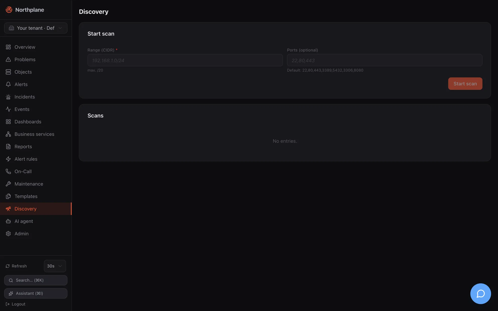

Discovery answers "what is out there" for a subnet you already own: Northplane sweeps a CIDR
with TCP connects, records which ports answered, resolves reverse DNS and proposes builtin checks
per open port. Nothing is created automatically — you review the hits and adopt the ones you want
as hosts. The feature lives on the **Discovery** page (sidebar entry *Discovery*) and behind
`/api/v1/discovery/scans`.




## What a scan does

| Aspect | Behaviour |
|---|---|
| Probe | plain TCP connect per address and port, 800 ms dial timeout; **no ICMP, no SNMP, no banner grabbing** |
| Range | any CIDR up to `/20` (4096 addresses); larger ranges are rejected with 422 `scan limited to /20 or smaller`; the network address itself is skipped |
| Refused ranges | loopback, link-local (including `169.254.169.254`), multicast and the unspecified address are refused (SSRF guard); RFC 1918 ranges are the normal case and allowed |
| Ports | the request's `ports` list, default `22, 80, 443, 3389, 5432, 3306, 8080` |
| Concurrency / limits | 64 addresses in parallel, 10 minutes overall deadline per scan |
| Per hit | address, reverse-DNS name (first PTR), list of open ports, suggested checks |
| Suggestions | `22` → `builtin:ssh-banner`; `80` → `builtin:http -p 80`; `443` → `builtin:http -S` and `builtin:tls-cert`; `5432` → `builtin:tcp -p 5432 (postgres)`; `3306` → `builtin:tcp -p 3306 (mysql)`; any other port → `builtin:tcp -p <port>` |
| Lifetime | scans live **in memory** of the server process, newest first, per tenant — a restart forgets them |
| Safety | a panic inside the scanner marks that scan `failed` and leaves the server running |

Hosts without a single open port do not appear at all, so a firewalled host that only answers
ICMP is invisible to discovery — add it by hand or with [Batch add](/docs/monitoring/hosts-and-services/#batch-add).

## Starting a scan

**UI**: **Discovery** → *Start scan* (Scan starten): enter the CIDR (hint "max. /20") and,
optionally, a comma-separated port list; the scan appears in the table below with status
*running* and the page polls every 5 s until it is *done* or *failed*. The table shows status,
CIDR, when it started, the number of suggestions and a *Suggestions* (Vorschläge) button.

**API** (permission `config:write`, [reference](/docs/reference/api/operations/post_discovery_scans/)):

```bash
curl -sS -X POST "$NP_SERVER/api/v1/discovery/scans" \
  -H "Authorization: Bearer $NP_TOKEN" -H "Content-Type: application/json" \
  -d '{"cidr":"10.10.10.0/24","ports":[22,80,443,161,5693]}'
# HTTP 202
# {"id":"0199…","tenantId":"…","cidr":"10.10.10.0/24","ports":[22,80,443,161,5693],
#  "status":"running","startedAt":"2026-08-23T09:12:00Z"}
```

The call returns immediately with `202 Accepted`; the sweep runs in the background. Note that a
TCP probe on UDP services (161/snmp above) never succeeds — list TCP ports only. Each start is
audited as `discovery.scan`.

## Reading the results

```bash
curl -sS "$NP_SERVER/api/v1/discovery/scans" -H "Authorization: Bearer $NP_TOKEN"        # list, newest first
curl -sS "$NP_SERVER/api/v1/discovery/scans/$SCAN_ID" -H "Authorization: Bearer $NP_TOKEN" # one scan
```

([list](/docs/reference/api/operations/get_discovery_scans/),
[single scan](/docs/reference/api/operations/get_discovery_scans_id/); permission `objects:read`.)

```json
{
  "id": "0199…", "tenantId": "…", "cidr": "10.10.10.0/24", "ports": [22, 80, 443],
  "status": "done", "startedAt": "2026-08-23T09:12:00Z", "doneAt": "2026-08-23T09:12:41Z",
  "found": [
    {"address": "10.10.10.11", "hostname": "saas1.lab.local.", "openPorts": [22, 443],
     "suggest": ["builtin:ssh-banner", "builtin:http -S", "builtin:tls-cert"]},
    {"address": "10.10.10.20", "hostname": "targets.lab.local.", "openPorts": [22, 80, 443],
     "suggest": ["builtin:ssh-banner", "builtin:http -p 80", "builtin:http -S", "builtin:tls-cert"]}
  ]
}
```

`status` is `running`, `done` or `failed` (with `error`); `found` is sorted by address once the
scan is done and is absent while nothing has answered yet. Hostnames keep the trailing dot of the
PTR record; the UI strips it when it creates objects.

## Turning suggestions into objects

Click *Suggestions* on a finished scan. The panel offers:

- **Folder** (Zielordner), default `/discovered`, and optional **Templates** applied to every new host;
- a table with a checkbox per hit (all pre-selected), address, hostname, open ports, suggested
  checks and, after submitting, a per-row result;
- **Accept selected** (Ausgewählte übernehmen).

Accepting calls `POST /api/v1/objects:batch` with `mode: partial` and one **host** per selected
row: `name` = hostname without the trailing dot (or the address), the chosen folder, the label
`discovered=true`, `spec.address`, the templates, and `checkCommand: builtin:icmp`. The result
line shows created/failed counts and the error per row (for example when a host of that name
already exists).

:::note[Hosts only — services are up to you]
The suggested checks are **hints**, not created objects: adoption creates one host per hit with an
ICMP check and nothing else. Add the services afterwards — per host in the UI, with
[Batch add](/docs/monitoring/hosts-and-services/#batch-add) (kind *service*, default host,
command from the suggestion), or with a bundle:

```yaml
kind: Service
metadata: {name: https, host: saas1.lab.local, labels: {discovered: "true"}}
spec:
  checkCommand: builtin:http
  args: ["-S"]
---
kind: Service
metadata: {name: tls-cert, host: saas1.lab.local}
spec:
  checkCommand: builtin:tls-cert
```

Because ICMP needs an unprivileged ICMP socket or raw-socket capability, a freshly adopted host
in a container may report `UNKNOWN - icmp socket …`; switch its check to `builtin:tcp -p 22`
(or whatever answered) in that case — see [Builtin checks](/docs/monitoring/builtin-checks/#icmp-and-ping).
:::

The `discovered=true` label is handy later: `GET /api/v1/hosts?selector=discovered=true` lists
everything that came in through discovery, a downtime or silence by that selector covers all of it,
and `np apply --prune` with a selector cleans up an experiment.

## Limits and caveats

- A scan is **not persisted**: after a server restart the list is empty. Adopt hits soon after the
  scan, or export the JSON.
- `/20` is the hard upper bound per scan; split larger networks into several scans.
- The scanner sees only TCP listeners on the ports you list. Hosts behind strict firewalls, pure
  UDP services (SNMP, NTP, DNS) and ICMP-only hosts are not found.
- Reverse DNS uses the server's resolver; without PTR records the address becomes the host name.
- Starting a scan needs `config:write` (it is a configuration action and audited); reading scans
  needs `objects:read`; accepting suggestions needs `objects:write`.
- Discovery creates hosts in the **current tenant** (the tenant header rules of the API apply).
- There is no scheduled or recurring discovery — run scans by hand or from a cron job against the API.
