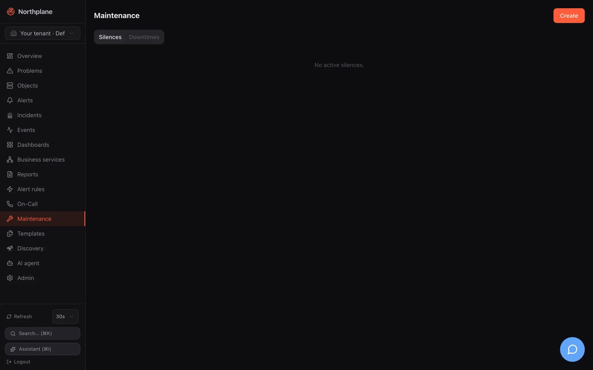

Northplane has three tools to keep planned work and known noise from paging people:




| Tool | Targets | Typical use | Effect |
|---|---|---|---|
| **Downtime** | objects (one object id or a label selector), with a time window | patch windows, hardware swaps, recurring backup jobs | marks the objects as "in downtime": problems are hidden from the Problems view, direct object notifications are skipped, rule-based alert escalations are held |
| **Silence** | alerts (label selector and/or title regex), with a TTL of at most 90 days | a noisy rule, a known flapping integration, "we know, stop paging" | holds the escalation of matching alerts; does nothing at object level |
| **Time period** | named weekday/time tables | office hours, night shift, holidays | an input for notification periods, contact channel preferences and on-call restrictions — not a suppression by itself |

Acknowledging an alert is the fourth way to stop paging; it is described in [Acknowledge and snooze](/docs/alarming/acknowledge-and-snooze/).

## Downtimes

### Fields

| Field | Required | Meaning |
|---|---|---|
| `objectId` **or** `selector` | one of them | the object, or every object matching the [label selector](/docs/concepts/object-model/) (re-evaluated on every depth refresh, so objects created later are covered too) |
| `type` | no | `fixed` (default) or `flexible` |
| `start`, `end` | yes | RFC 3339; `end` must be after `start` |
| `duration` | flexible only | how long the downtime lasts once triggered (`"2h"`, `"45m"` or seconds) |
| `rrule` | no | RRULE subset for recurrence, see below |
| `comment` | yes | shown in the UI and in audit |

Server-filled: `id`, `createdBy` (the principal's name), `startedAt` (flexible: trigger time), `triggeredBy` (reserved for chains, not set by the API), `createdAt`, `version`.

**Fixed** downtimes are active in `[start, end)`. **Flexible** downtimes wait: when an object in scope is in a non-OK state (soft or hard) at any moment inside `[start, end]`, the janitor — which checks every 30 s — sets `startedAt` and the downtime then lasts `duration` from that moment. A flexible downtime whose window passes without a problem never activates.

A host downtime cascades to all services of the host. The per-object counter `downtimeDepth` (visible in the object's state) counts how many active downtimes cover it.

### Recurring downtimes (RRULE)

`rrule` accepts a subset of RFC 5545: `FREQ=HOURLY|DAILY|WEEKLY|MONTHLY`, `INTERVAL=n`, `BYDAY=MO,TU,…` (weekly; ordinal prefixes such as `1MO` are reduced to the weekday), `BYMONTHDAY=n` (monthly), `COUNT=n`, `UNTIL=20261231T235959Z` (also `20261231T235959` or `20261231`). The `[start, end]` window is the first occurrence and fixes the clock time and length; every later occurrence is that window shifted onto the rule. Everything is evaluated in **UTC** (no DST shifts). `BYHOUR`/`BYMINUTE` are accepted but ignored; a rule without a usable `FREQ` falls back to the literal first window.

:::caution[Recurrence is only honoured while the first window has not ended]
Every consumer of downtimes — the janitor's depth refresh, the flexible trigger, the alert engine's suppression check and `GET /downtimes?active=true` — lists only downtimes whose literal `end` lies in the future. As soon as the first window's `end` has passed, the downtime is no longer evaluated, so later RRULE occurrences do **not** suppress anything in this version. Treat `rrule` as experimental; for a weekly backup window create the downtime before each occurrence (the idempotent API below makes that safe from cron) or schedule it through automation.
:::

### Creating downtimes

**UI** — **Maintenance (Wartung) → Downtimes → Create (Anlegen)**: target radio **Object** (searchable picker) / **Selector**, type `fixed`/`flexible` (+ duration), **From**/**To**, optional **RRULE** (free text, e.g. `FREQ=WEEKLY;BYDAY=SA`), comment. Shortcuts: the **Downtime** button on the object detail page and on Problems rows creates a fixed downtime starting now for *n* hours (default 2, steps of 0.5) with a comment. The Downtimes tab lists all downtimes (target, type, window, RRULE, comment) with a delete button.

**API** — `POST /api/v1/downtimes` (permission `downtimes:write`) returns `201` with the stored downtime. It honours an `Idempotency-Key` header: the same key with the same body replays the first response (`Idempotency-Replayed: true`), the same key with a different body is `409 np:conflict/idempotency`; keys are kept 24 h.

```bash
NP=https://np.example.com
TOK=np_…
# fixed window for all prod databases, safe to re-run from cron
curl -s -X POST "$NP/api/v1/downtimes" -H "Authorization: Bearer $TOK" -H 'Content-Type: application/json' \
  -H 'Idempotency-Key: db-backup-2026-08-30' \
  -d '{"selector":"env=prod,role=db","type":"fixed","start":"2026-08-30T22:00:00Z","end":"2026-08-31T00:00:00Z","comment":"weekly backup window"}'

# flexible: 2 h starting at the first problem between 22:00 and 02:00
curl -s -X POST "$NP/api/v1/downtimes" -H "Authorization: Bearer $TOK" -H 'Content-Type: application/json' \
  -d '{"objectId":"'$HOST'","type":"flexible","start":"2026-08-30T22:00:00Z","end":"2026-08-31T02:00:00Z","duration":"2h","comment":"kernel upgrade + reboot"}'

curl -s "$NP/api/v1/downtimes?active=true" -H "Authorization: Bearer $TOK"   # objects:read; active = end in the future
curl -s -X DELETE "$NP/api/v1/downtimes/$ID" -H "Authorization: Bearer $TOK"   # 204, ends the downtime now
```

Validation errors are `422` with codes `np:validation/target`, `/selector`, `/comment`, `/window`. Listing returns at most 1000 entries, newest `start` first. Reference: [post_downtimes](/docs/reference/api/operations/post_downtimes/).

**CLI** — `np downtime --object <id>|--selector 'k=v' [--hours 2] -m "comment"` creates a fixed downtime from now (see [np CLI](/docs/reference/cli-np/)); `np get downtimes` lists the active ones. The AI agent's `create_downtime` tool is capped at 4 hours ([AI agent chat](/docs/ai/agent-chat/)).

Creating a downtime emits a `downtime` event (severity `info`) and the audit entry `downtime.create`; deleting one writes `downtime.delete` to the audit log. Downtimes are not part of bundles.

## Silences

### Fields

| Field | Required | Meaning |
|---|---|---|
| `selector` | one of selector / `textRegex` | label selector matched against the **alert's labels** (event labels plus the rule's `setLabels`); empty = every alert |
| `textRegex` | one of selector / `selector` | Go regular expression matched against the **alert title** |
| `comment` | — (the UI requires it) | why |
| `startsAt` | no | default now |
| `expiresAt` | **yes** | at most 90 days in the future — there are no eternal silences |

The regex and the selector are validated on create (`422 np:validation/textRegex` / `/selector`); a missing `expiresAt` or one beyond 90 days is `422 np:validation/expiresAt`; neither selector nor regex is `422 np:validation/match`.

### Creating silences

**UI** — **Maintenance (Wartung) → Silences → Create**: selector (`env=prod`), text regex (`disk.*full`), comment, expiry via quick buttons **1h / 4h / 24h** or a date-time picker. The list shows selector, regex, comment, expiry and creator; **Delete** expires a silence early.

**API** — `POST /api/v1/silences` (permission `silences:write`) → `201`; `GET /api/v1/silences?active=true` (`objects:read`, active = not yet expired, up to 1000, latest expiry first); `DELETE /api/v1/silences/{id}` (`silences:write`, `204`). Reference: [post_silences](/docs/reference/api/operations/post_silences/).

```bash
curl -s -X POST "$NP/api/v1/silences" -H "Authorization: Bearer $TOK" -H 'Content-Type: application/json' \
  -d '{"selector":"env=staging","textRegex":"(?i)disk.*full","comment":"staging disks being resized","expiresAt":"2026-08-24T18:00:00Z"}'
```

**CLI** — `np silence --selector 'k=v' [--hours 2] -m "comment"` (selector required); `np get silences`. The AI tool `create_silence` does the same.

Creating a silence emits a `silence` event and the audit entry `silence.create`. Silences are not part of bundles.

:::note[What silences do not do]
A silence only gates the **escalation of rule-based alerts**. It does not hide objects from the Problems view, does not stop direct object notifications (`contacts`/`contactGroups` on an object), and does not prevent the alert from being opened and shown. Use a downtime for object-level quiet, an acknowledgement for one specific alert.
:::

## Time periods

A time period is a named weekly table with date exceptions. Resource kind `time-period`, API `/api/v1/time-periods` (generic CRUD: `objects:read` / `config:write`, `If-Match` on `PUT`), bundle kind `TimePeriod`, UI **Templates → Time periods (Zeiträume)** — see [Templates](/docs/monitoring/templates/).

```yaml
kind: TimePeriod
metadata: {name: office}
spec:
  alias: Office hours
  days:
    monday: ["08:00-18:00"]
    tuesday: ["08:00-18:00"]
    wednesday: ["08:00-18:00"]
    thursday: ["08:00-18:00"]
    friday: ["08:00-12:00", "13:00-17:00"]
    saturday: ["19:00-07:00"]        # wraps midnight: Saturday ≥ 19:00 or < 07:00
  exceptions:
    "2026-12-24": ["00:00-00:00"]    # closed all day
    "2026-12-31": ["08:00-12:00"]
  exclude: [holidays]                # accepted, but not applied — see below
```

Format rules:

| Rule | Detail |
|---|---|
| Day keys | `monday` … `sunday`; a missing day = closed |
| Ranges | `HH:MM-HH:MM`; several per day; `end` `00:00` means midnight (24:00); `end ≤ start` wraps past midnight |
| `00:00-00:00` | closed (used in exceptions to block a day) |
| `exceptions` | exact dates `YYYY-MM-DD` that **replace** the weekday entry for that date |
| `24x7` | well-known name that always matches; a period without `days` and `exceptions` also always matches |
| `exclude` | stored and shown in the UI, but no evaluator subtracts excluded periods in this version |

**Time zone semantics** — a time period has no zone of its own; it is evaluated against the clock of whoever consults it:

| Consumer | Evaluated in |
|---|---|
| Contact channel preferences (`preferences[].period`) | the contact's `timeZone` (built-in names `worktime`/`arbeitszeit` = Mon–Fri 08:00–17:59 and `night`/`nacht` = the inverse also exist) — see [Contacts and on-call](/docs/alarming/contacts-and-oncall/) |
| On-call rotation `restriction` | the schedule's `timeZone` |
| Object `notificationPeriod` (direct object notifications) | **UTC** — write the ranges in UTC for this use |
| Object `checkPeriod` | enforced: outside the period scheduled runs and freshness probes are skipped (the object keeps its last state); manual check-now always runs |

## What gets suppressed, and by what

| Mechanism | Problems view | Direct object notifications | Rule-based alert escalation |
|---|---|---|---|
| Object in downtime (`downtimeDepth > 0`, incl. cascaded host downtime) | hidden unless **incl. acked/downtime** | skipped | held |
| Selector downtime that matches the alert's labels | — | — | held |
| Silence | shown | sent | held |
| Acknowledged alert | hidden unless **incl. acked/downtime** | problem notifications skipped (recoveries still sent) | chain stops |
| Object flapping | shown (badge) | sent | held |
| Host hard DOWN / UNREACHABLE (for its services) | — | — | held |

For rule-based alerts the engine evaluates, in this order, when an alert opens: object in downtime → object flapping → host unreachable → (services) host down → host in downtime → selector downtimes → silences. A suppressed alert is **still created** and visible as open; a `notification` event with status `suppressed` and the reason (e.g. `object in downtime`, `silence <id>`) is recorded; the escalation chain is not started. Details of the chain are in [Escalation policies](/docs/alarming/escalation-policies/) and [Alerts and incidents](/docs/concepts/alerts-incidents/).

:::caution[Re-arm: suppression ends, paging starts]
Every 5 s the engine re-checks alerts that opened while suppressed. When the reason is gone — you deleted the downtime, the window or the silence expired, flapping stopped — and the alert is still open and unacknowledged, the escalation chain starts **then**, with step timers computed from the alert's original `openedAt`: steps whose `after` has already elapsed fire within seconds, one after the other. Ending a downtime while problems are still open therefore pages immediately. Acknowledge or resolve those alerts first, or extend the downtime.

Two more edges: the set of suppressed alerts is kept in memory, so alerts that opened while suppressed are not re-armed after a `northplaned` restart (they page again when they re-fire); and direct object notifications are evaluated only at the hard state transition — a downtime that ends mid-problem does not send the missed notification retroactively.
:::

Depth bookkeeping: `downtimeDepth` is recomputed synchronously when a downtime is created or deleted and every 30 s by the janitor, so a freshly created downtime covers its objects before the API call returns; a selector downtime picks up newly matching objects within 30 s.

## Permissions

| Action | Permission |
|---|---|
| list downtimes / silences | `objects:read` |
| create / delete downtimes | `downtimes:write` |
| create / delete silences | `silences:write` |
| time periods: read / write | `objects:read` / `config:write` |

The built-in `operator` role has `downtimes:write` and `silences:write`; `viewer` has neither.
