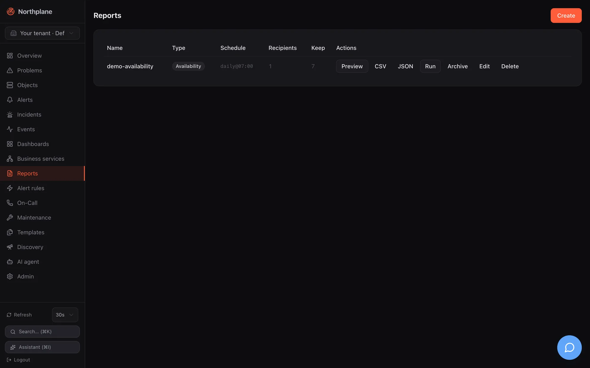

A report is a stored definition (type + parameters + optional schedule and recipients). You can render it at any time in HTML, CSV or JSON, run it by hand, or let the built-in scheduler render, archive and e-mail it on a daily, weekly or monthly slot. Reports are config documents (`/api/v1/reports`), so they travel in bundles like everything else.




## Report types

| `type` | Label (EN / DE) | Rows | Totals | Parameters used |
|---|---|---|---|---|
| `availability` | Availability / Verfügbarkeit | one row per object matched by `selector` (max 500): `availability` (%, 3 decimals) and `downtime` (minute-rounded); row class `ok`, `warn` (below target + half the remaining margin) or `crit` (below target) | `avgAvailability` | `selector`, `windowDays`, `target` |
| `sla` | SLA | identical to `availability` (same renderer, different title) | `avgAvailability` | `selector`, `windowDays`, `target` |
| `alert-stats` | Alert statistics / Alarm-Statistik | top 20 alert titles by count within the window | `alerts` (count), `mtta` (mean open→ack), `mttr` (mean open→resolve) | `windowDays` |
| `oncall` | On-call / Bereitschaft | `<schedule> / <contact>` with `hours` on duty in the window (layers and overrides from the schedule timeline) | — | `windowDays` |
| `audit` | Permissions (Berechtigungen) | one row per role: `permissions`, `idpGroups`, `includes` | — | — |

Availability is computed from `state_change` events exactly like the [business-service SLA](/docs/monitoring/business-services/#sla-budget): hard transitions only, the state before the window is assumed OK, an ongoing problem counts up to now, and every hard non-OK state (WARNING and UNKNOWN included) counts as downtime. `alert-stats` reads at most 1000 alerts opened since the window start.

:::caution[`includeDowntimes` has no effect]
The **count planned downtimes (geplante Downtimes zählen)** checkbox stores `params.includeDowntimes`, but the availability math does not read it — downtimes are always counted as unavailability in this version.
:::

## Definition

| Field | Type | Notes |
|---|---|---|
| `name` | string | required, unique per tenant |
| `type` | string | one of the five types; an unknown type fails at render time with `500` |
| `params.selector` | string | label selector for `availability`/`sla` (empty = all objects of the tenant) |
| `params.windowDays` | int | default 30; the UI offers 1, 7, 30, 90 |
| `params.target` | number | SLA target in %, default 99.9 |
| `params.includeDowntimes` | bool | stored, not applied |
| `params.channel` | string | name of the e-mail channel used for scheduled delivery; empty = first enabled e-mail channel |
| `schedule` | string | see grammar below; empty = never scheduled |
| `email` | string[] | recipients for scheduled/manual runs |
| `keep` | int | archive retention in distinct slots; `0`/absent = 12 (the UI dialog proposes 10) |

```json
{
  "name": "prod-availability",
  "type": "availability",
  "params": {"selector": "env=prod", "windowDays": 30, "target": 99.95, "channel": "ops-mail"},
  "schedule": "monthly:1@06:30",
  "email": ["ops@example.com", "management@example.com"],
  "keep": 24
}
```

## Rendering on demand

`POST /api/v1/reports/{name}:render?format=html|csv|json|pdf` (permission `reports:render`):

| `format` | Response |
|---|---|
| `html` (default) | a print-optimised page (labels are German) |
| `csv` | `text/csv`, `Content-Disposition: attachment; filename="<name>.csv"` |
| `json` | the render model: `{"title","type","generatedAt","windowDays","rows":[{"name","values":{…},"class"}],"totals":{…}}` |
| `pdf` | **`501 np:reports/pdf`** — PDF needs the optional Chromium renderer sidecar, which is not part of the single binary; render HTML and print it, or deploy the renderer container |

Rendering always uses the stored parameters — query-string overrides are not implemented. Every render is audited (`report.render`).

```bash
NP=https://np.example.com
TOK=np_…
curl -s -X POST "$NP/api/v1/reports/prod-availability:render?format=json" -H "Authorization: Bearer $TOK" | jq .totals
curl -s -X POST "$NP/api/v1/reports/prod-availability:render?format=csv"  -H "Authorization: Bearer $TOK" -o prod-availability.csv
```

Reference: [post_reports_name_render](/docs/reference/api/operations/post_reports_name_render/). The AI tool `render_report` (see [MCP server](/docs/ai/mcp-server/)) returns the same JSON model.

## Schedules

`schedule` uses a small grammar — not cron, not RRULE:

| Spec | Meaning |
|---|---|
| `daily` | every day at 07:00 |
| `daily@HH:MM` | every day at the given time |
| `weekly:<weekday>` | once per ISO week on that weekday at 07:00; long or three-letter names (`monday`, `mon`, … case-insensitive) |
| `weekly:<weekday>@HH:MM` | as above at the given time |
| `monthly` | on the 1st of every month at 07:00 |
| `monthly:<day>` | on day 1–31 (clamped to the month's length, so `31` fires on 28/29/30 February/April/…) |
| `monthly:<day>@HH:MM` | as above at the given time |

Times are in the **server's local time zone**. An empty schedule means the report is never run automatically; an unparseable schedule is logged once per sweep and skipped (the UI composer always produces a valid spec).

How the scheduler works:

- A sweep runs every minute (the first one ~10 s after start) over every tenant and every scheduled report.
- Each period has a **slot key**: `2006-01-02` for daily, `2006-Www` (ISO week) for weekly, `2006-01` for monthly. When the slot's due time has passed and no archive entry exists for that slot, the report is rendered, archived and e-mailed. A slot is produced at most once — and a missed run (server down at 07:00) is caught up once at the next sweep, not skipped and not repeated.
- Archival stores HTML **and** CSV for the slot. A failed render leaves the slot open and is retried next minute; a failed mail is logged but does not block archival (the slot is done, the mail is not retried).
- Mail goes to every address in `email` with subject `[Northplane] Report <name> <slot>` and the HTML as body, through the e-mail channel named in `params.channel` (it must exist, be of type `email` and be enabled) or, if unset, the first enabled e-mail channel of the tenant. Without any enabled e-mail channel the run records `mailError: no enabled e-mail channel configured`. Channels are described in [Channels](/docs/alarming/channels/).

## Running now

`POST /api/v1/reports/{name}:run` (permission `config:write`) renders, archives and mails immediately, independent of the schedule. The manual run gets its own slot `manual-<UTC timestamp>` so it never collides with the scheduled slot's dedup gate:

```bash
curl -s -X POST "$NP/api/v1/reports/prod-availability:run" -H "Authorization: Bearer $TOK"
```

```json
{"report": "prod-availability", "slot": "manual-2026-08-23T10:00:00", "archived": true, "recipients": 2, "sent": 2}
```

`mailError` appears when delivery failed; `archived` is still `true` in that case. Reference: [post_reports_name_run](/docs/reference/api/operations/post_reports_name_run/).

## Archive

| Endpoint | Permission | Result |
|---|---|---|
| `GET /api/v1/reports/{name}/archive?limit=100` | `objects:read` | newest first: `{"items":[{"id","tenantId","reportName","slot","format","createdAt"}]}`; a typo in the name is `404`, not an empty list |
| `GET /api/v1/reports/{name}/archive/{id}` | `objects:read` | the stored bytes with `Content-Disposition: attachment; filename="<name>-<slot>.<html\|csv>"`; the id must belong to the named report |

Retention counts **distinct slots** per report: on every insert the archive is pruned to the newest `keep` slots (default 12), and all formats of a kept slot survive together. Manual runs consume slots like scheduled ones.

## UI

**Reports** in the sidebar lists every definition: name, type badge, schedule (raw grammar), recipient count — with an amber warning when a schedule is set but no recipients — and keep. Row actions:

| Action | Effect |
|---|---|
| **Preview (Vorschau)** | `:render?format=html` shown in a sandboxed iframe, with CSV/JSON download buttons |
| **CSV**, **JSON** | download via `:render` |
| **Run (Ausführen)** | `:run` — render + archive + send now |
| **Archive (Archiv)** | lists the stored slots with download links |
| **Edit (Bearbeiten)**, delete | |

The create/edit dialog has Name, Type, Selector (availability/SLA only), Window (24 h / 7 / 30 / 90 days), SLA target % (empty = 99.9), the downtimes checkbox, a **schedule composer** (frequency none/daily/weekly/monthly, weekday or day of month, time — the resulting grammar is shown live), the recipient list and "Keep archive" (default 10). Saving an edited report re-fetches the document for a fresh ETag.

## Permissions

| Action | Permission |
|---|---|
| list/read definitions, list/download archive | `objects:read` |
| create/update/delete definitions, `:run` | `config:write` |
| `:render` (preview, CSV, JSON) | `reports:render` |

:::note
The built-in `viewer` and `operator` roles carry `reports:read`, but no route checks that name. `operator` has `reports:render` (preview and download) but not `config:write`, so operators cannot create, edit or run reports; `viewer` lacks `reports:render` and can only list definitions and download archived renders. Grant `reports:render`/`config:write` through a custom role if needed — see [Users, roles and permissions](/docs/administration/users-roles-permissions/).
:::

## Bundles and demo data

Bundle kind `Report` (see [Config bundles](/docs/administration/config-bundles/)):

```yaml
kind: Report
metadata: {name: prod-availability}
spec:
  type: availability
  params: {selector: env=prod, windowDays: 30, target: 99.95, channel: ops-mail}
  schedule: monthly:1@06:30
  email: [ops@example.com]
  keep: 24
```

[Demo mode](/docs/getting-started/demo-mode/) seeds `demo-availability` (availability over `demo=true`, 30 days, `daily@07:00`, one recipient, keep 7) — note that it only mails when an enabled e-mail channel can actually deliver.
