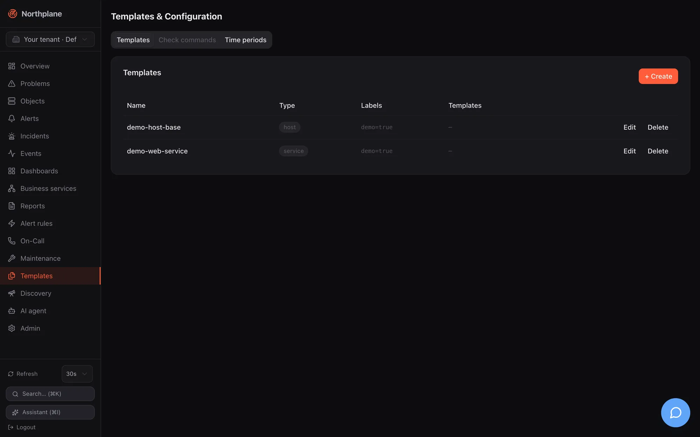

Templates hold reusable fragments of an object spec — check command, intervals, thresholds, notification settings, custom variables — that hosts and services inherit by name. Named **check commands** turn a plugin invocation into a reusable catalog entry, and **time periods** are referenced from templates and objects as check or notification periods. All three are config documents, edited on the **Templates** page, through the API, or in [bundles](/docs/administration/config-bundles/), and every change is applied to all objects immediately.




## Templates

### The resource

| Field | Type | Notes |
|---|---|---|
| `name` | string | referenced from `spec.templates` of objects and other templates |
| `kind` | `host` \| `service` \| `command` | informational scope; the UI offers *both* (empty), *host*, *service*. Not enforced — a `host` template can be attached to a service |
| `labels` | map | shown in the list; **not** merged into objects (see below) |
| `spec` | ObjectSpec | the inheritable fragment — any field of an object spec, including `templates` to inherit from further templates |

The spec fields and their defaults are listed in [Object model](/docs/concepts/object-model/); everything an object can carry, a template can carry.

:::note[Template labels are not inherited]
`labels` on a template are stored and displayed, but no code path copies them onto objects — selectors, downtimes and business services only see the labels set on the object itself (or via `metadata.labels` in a bundle). Use template labels as documentation or for filtering the template list.
:::

### Inheritance and the effective spec

When an object is saved or the catalog is loaded, Northplane resolves the **effective spec**:

```text
defaults  ⊕  templates (in declared order, each after its own parents)  ⊕  the object's own spec
```

Rules:

1. `spec.templates` lists template names. They are applied in that order: a later entry overrides an earlier one.
2. A template may itself list `templates`; those parents are applied before the template, so the template overrides its parents.
3. The object's own spec overrides every template; `SpecDefaults` (interval 60 s, retry 15 s, 3 attempts, timeout 30 s, check period `24x7`, flap thresholds 25/50 %, `thresholdMode static`) fill whatever is still unset.
4. Merge semantics per field: scalars and `*bool` switches replace the inherited value when set (`enableNotifications: false` in a child wins); `vars` are merged key by key; `templates`, `parents`, `args`, `contacts`, `contactGroups` and `notifyOn` are replaced **wholesale** — a child that sets `args` loses the parent's `args`.
5. An unset field means "inherit". You cannot reset a field to its default by writing an empty value; write the default explicitly instead.
6. Every template may occur only **once** in the whole chain: cycles and diamonds (the same template reachable via two paths) are rejected with `template cycle or duplicate via "<name>"`; an unknown name is `unknown template "<name>"`. Both are `422` when you save the object.

The resolved result is what the scheduler, executor and notification routing use. Inspect it with `GET /api/v1/objects/{id}/effective-config` → `{"spec": {…}, "templateChain": ["…"]}` ([get_objects_id_effective_config](/docs/reference/api/operations/get_objects_id_effective_config/)), on the object's **Configuration** tab in the UI ("Effective configuration" table plus the chain `a → b`, with a raw-JSON toggle), or with `np describe <object-id>`. `templateChain` lists the templates in resolution order — each template followed by the templates it inherits from.

Worked example:

```yaml
kind: Template
metadata: {name: base}
spec:
  kind: host
  spec:
    checkCommand: builtin:icmp
    interval: 60s
    maxCheckAttempts: 3
    vars: {owner: ops}
---
kind: Template
metadata: {name: prod-host}
spec:
  kind: host
  spec:
    templates: [base]
    interval: 30s
    contactGroups: [ops]
    notificationPeriod: office
    vars: {env: prod}
---
kind: Host
metadata:
  name: db-01
  folder: /prod
  labels: {env: prod, role: db}
spec:
  address: 10.0.0.5
  templates: [prod-host]
  vars: {owner: dba}
```

Effective spec of `db-01`: `checkCommand: builtin:icmp` and `maxCheckAttempts: 3` from `base`, `interval: 30s`, `contactGroups: [ops]` and `notificationPeriod: office` from `prod-host`, `vars: {owner: dba, env: prod}` (key-wise merge, the object wins on `owner`), `address` from the object, `retryInterval: 15s` and `timeout: 30s` from the defaults; `templateChain: ["prod-host", "base"]`.

:::note[Template `spec` is nested in bundles]
In a bundle the `spec:` map of a `Template` document holds the resource fields (`kind`, `spec`), so the inheritable object spec sits under `spec.spec` — exactly as `np export` writes it. Fields placed directly under the first `spec:` (e.g. `interval: 30s` next to `kind: host`) are stored but not read as part of the template's spec. The REST body has the same shape: `{"name":"base","kind":"host","spec":{"interval":"30s"}}`.
:::

### Editing templates

**Templates → Templates** tab lists name, type (`host`/`service`/both), labels and parent templates; the dialog offers Name, Type, Labels and the full object form (Address, Check, Interval, Notifications, Advanced) — the same fields as the host/service dialog described in [Hosts and services](/docs/monitoring/hosts-and-services/). Objects pick templates in their **Templates** field.

API: generic CRUD at `/api/v1/templates` (`objects:read` / `config:write`, `If-Match` on `PUT`). Saving, updating or deleting a template reloads the tenant's catalog and reschedules every object — the new values take effect with the next check; no object needs to be re-saved.

:::caution[Deleting a template that is still in use]
There is no reference check. If objects still list a deleted template, their effective spec falls back to the bare defaults at the next catalog reload — no check command, i.e. **passive and unscheduled** — and their effective config shows an empty template chain. Saving such an object fails with `422 unknown template` until you recreate the template or remove the reference. Check `GET /api/v1/objects?q=<template-name>` (or the Objects page full-text filter) before deleting.
:::

## Check commands

A **check command** is a stored, named invocation. Objects reference it by its bare name in `checkCommand` (anything that is not `passive`, `builtin:…`, `exec:…` or `agent:…` is looked up as a check command).

| Field | Type | Notes |
|---|---|---|
| `name` | string | the reference used in `checkCommand` |
| `type` | `exec` \| `builtin` \| `agent` \| `passive` | execution class |
| `line` | string[] | argv; `exec`: `line[0]` is the plugin (resolved in the plugins directory unless absolute), the rest its arguments; `builtin`: `line[0]` is the builtin name, the rest its flags; `agent`: the command np-agent runs |
| `env` | bool | export `NAGIOS_*` / `NORTHPLANE_*` environment macros to `exec` plugins |
| `timeout` | duration | stored, but **not used** — the executor applies the object's effective `timeout` (default 30 s) |

How the object's `args` relate to a named command: for `builtin:` and `exec:` references written directly on the object, `args` are appended to the command. For a **named** `exec`/`agent` command, `line` is used as-is and the object's `args` are **not** appended; they are available only as `$ARG1$`…`$ARG32$` macros inside `line`. `$SECRET:name$`, `$USER1$` (plugins dir), `$HOSTADDRESS$`, `$_HOSTVAR$`/`$_SERVICEVAR$` and the other macros are expanded per element without a shell — see [Plugins and Nagios compatibility](/docs/monitoring/plugins-and-nagios/) for the macro table and the output grammar.

```yaml
kind: CheckCommand
metadata: {name: check_http_vhost}
spec:
  type: exec
  line: ["$USER1$/check_http", "-H", "$HOSTADDRESS$", "-u", "$ARG1$", "-w", "$ARG2$", "-c", "$ARG3$"]
  env: false
---
kind: Service
metadata: {name: shop-frontpage, host: web-01}
spec:
  checkCommand: check_http_vhost
  args: ["/", "1", "3"]
```

The catalog of commands consists of the stored check commands (`GET /api/v1/check-commands`) and the builtins (`GET /api/v1/check-commands:builtins` → `agent cert dns http http-flow https icmp imap nrpe ntp ping smtp snmp snmp-walk ssh-banner tcp tls-cert`, documented in [Builtin checks](/docs/monitoring/builtin-checks/)). `POST /api/v1/check-commands:test` (`checks:run`) runs a **builtin** against an address with flags and returns `state, label, output, perfdata, tookMs` without touching any object — use it to validate flags before creating a template. The Nagios importer creates `CheckCommand` documents from `command` definitions ([Plugins and Nagios compatibility](/docs/monitoring/plugins-and-nagios/)).

**Templates → Check commands (Check-Kommandos)** tab: name, type, command line, env, timeout; dialog with Name, Type, Command line (list editor), Timeout and the "Export env macros" switch. API: `/api/v1/check-commands` (generic CRUD, `objects:read` / `config:write`).

## Time periods

Time periods are the third tab, **Templates → Time periods (Zeiträume)**: name, alias, per-weekday ranges (comma-separated, e.g. `08:00-17:00, 18:00-20:00`), exceptions and an exclusion list. Their format, the `24x7` default and the time-zone semantics are documented in [Maintenance → Time periods](/docs/monitoring/maintenance/#time-periods).

In templates and objects they are referenced by name from two fields:

| Field | Used by |
|---|---|
| `notificationPeriod` | direct object notifications (`contacts`/`contactGroups`): a hard state change outside the period sends nothing; evaluated in UTC |
| `checkPeriod` | resolved into the effective config (default `24x7`) and enforced: scheduled runs and freshness probes outside the period are skipped; a manual check-now always runs |

Contacts and on-call schedules reference time periods as well (channel preferences, rotation restrictions); see [Contacts and on-call](/docs/alarming/contacts-and-oncall/).

## Bundles

All three kinds are bundle kinds and are applied before hosts and services (`KindOrder`: `TimePeriod`, `CheckCommand`, `Template`, …, `Host`, `Service`), so one bundle can carry the whole hierarchy. `CheckCommand` and `TimePeriod` documents are flat (`spec:` holds `type`/`line`/… or `days`/`exceptions`/…); `Template` documents nest the object spec under `spec.spec` as shown above. `np export` writes all of them; `np apply --dry-run` shows the planned diff. Details: [Config bundles](/docs/administration/config-bundles/).

[Demo mode](/docs/getting-started/demo-mode/) seeds two templates to look at: `demo-host-base` (host: 30 s interval, 10 s retry, 2 attempts, 10 s timeout) and `demo-web-service` (service: 60 s, 10 s timeout).

## Permissions

| Action | Permission |
|---|---|
| read templates, check commands, time periods | `objects:read` |
| create / update / delete them | `config:write` |
| `check-commands:test` | `checks:run` |
| read an object's effective config | `objects:read` |

Among the built-in roles only `admin` has `config:write`; an `operator` can attach existing templates to objects but not edit templates.
