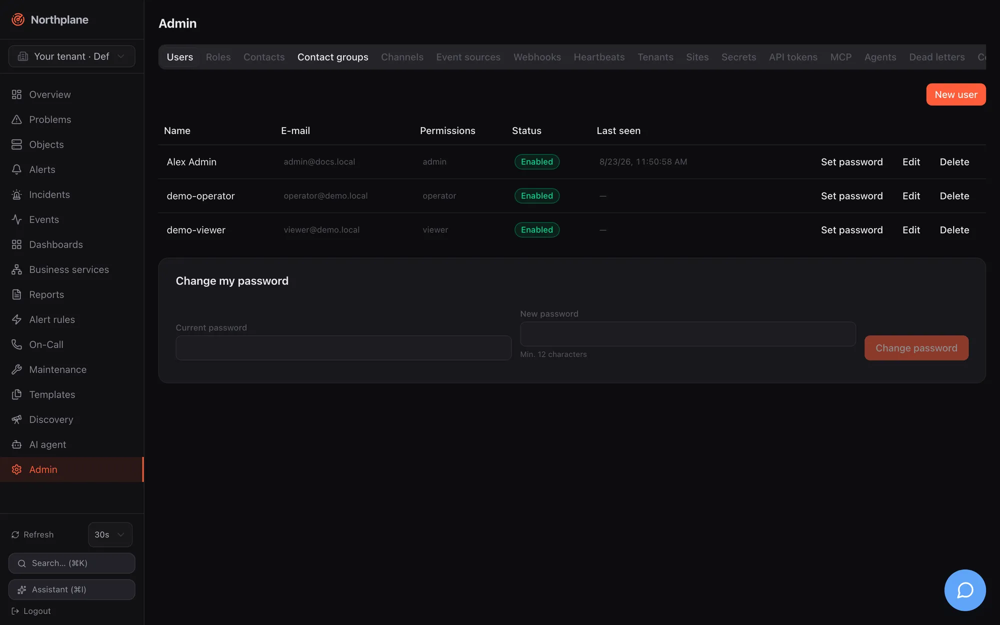
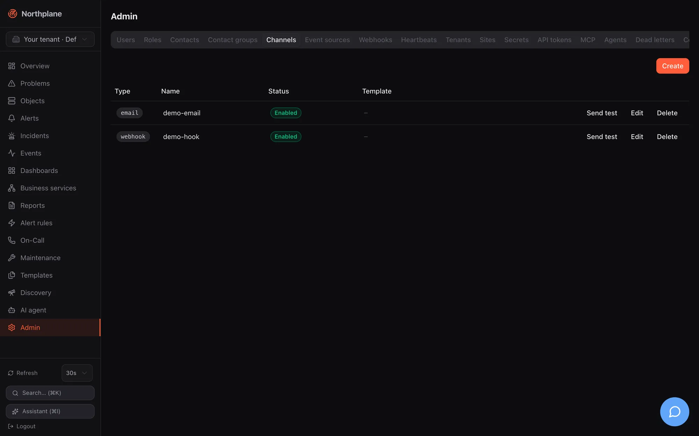
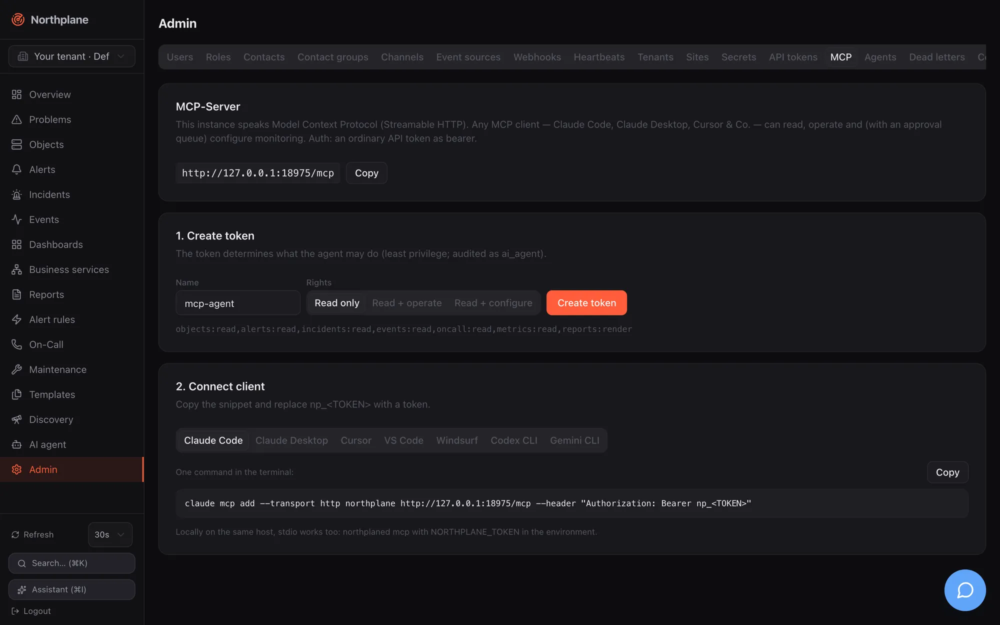
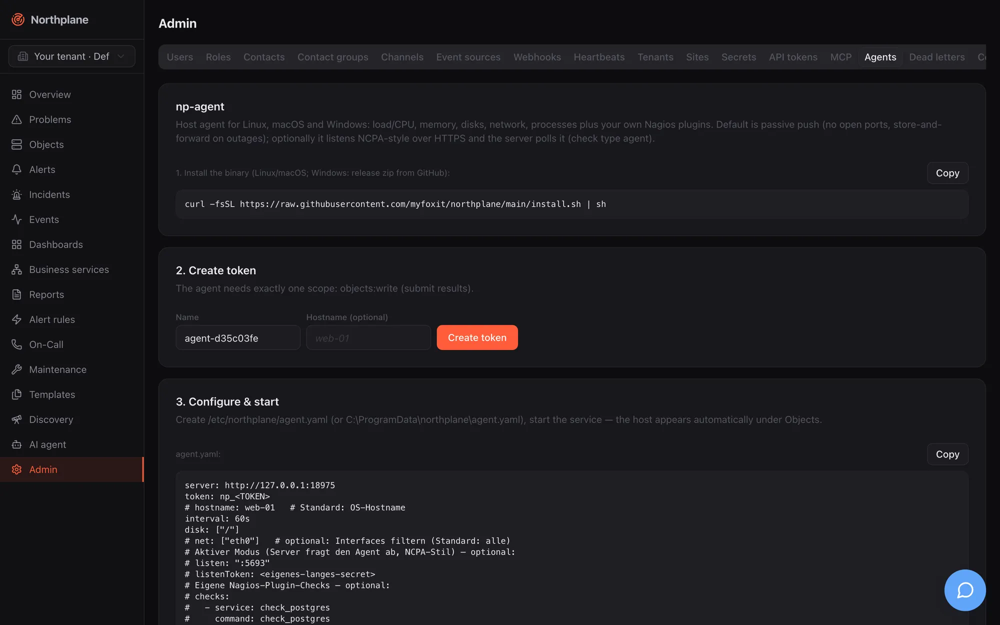
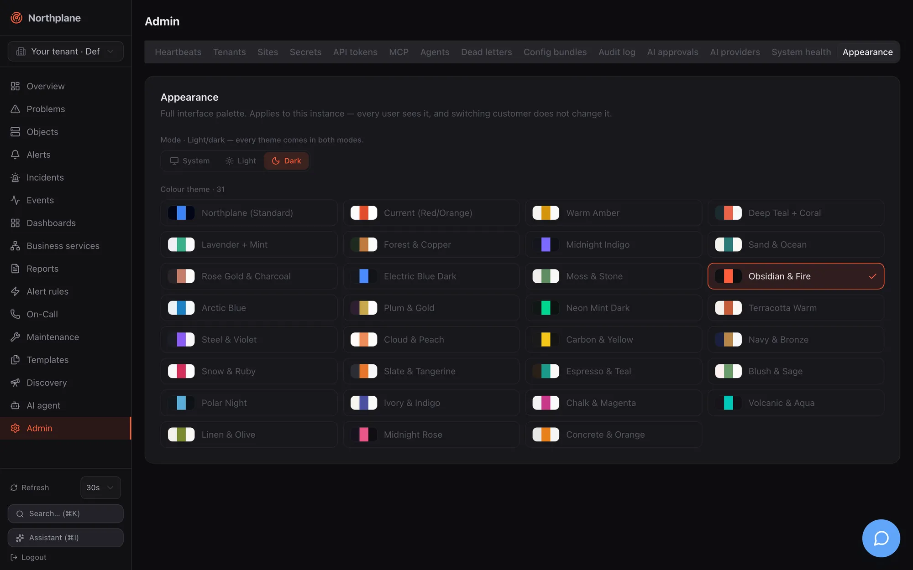

**Admin** (Administration) at `/admin` gathers everything that is not day-to-day monitoring: identity and access, the alarming building blocks (contacts, channels, event sources, heartbeats, webhooks), multi-tenant and federation management, secrets and tokens, integration helpers (MCP, agents), operational queues (dead letters, AI approvals), configuration as code, the audit log, system health and the instance's appearance. The page is a single horizontally scrollable tab strip with 21 tabs; the first tab, **Users**, is selected by default.

:::caution[Tabs are not filtered by permission]
The tab strip is the same for every user. Only the tenant switcher (`admin:tenants`) and the **Appearance** controls (`config:write`) are hidden or disabled client-side; every other tab renders and fires its requests, and a user without the permission sees empty tables or `403` errors (for example a tenant user opens **Tenants** and gets a **Create** button that fails). The API enforces the permissions listed below in all cases. This is tracked as RBAC-1/RBAC-2 in [Known issues](/docs/project/roadmap-and-known-issues/).
:::

## The 21 tabs

Permissions are what the API requires; "read / write" means list/get vs. create/update/delete. Built-in roles: `admin` has everything, `operator` has no `admin:*` and no `config:write`, `viewer` reads only — see [Users, roles and permissions](/docs/administration/users-roles-permissions/).

| # | Tab EN (DE) | What it offers | Main endpoints | Permission |
|---|---|---|---|---|
| 1 | **Users** (Benutzer) | Local/OIDC/LDAP users, create, edit, set password, disable, delete; LDAP sync card; change own password | `/api/v1/users`, `…/{id}:set-password`, `/api/v1/users/me:change-password`, `/api/v1/directory/status`, `/api/v1/directory:sync` | `admin:users` (own password: any session user) |
| 2 | **Roles** (Rollen) | Custom roles with permissions, includes, IdP groups, scope | `/api/v1/roles` | `admin:read` / `admin:write` |
| 3 | **Contacts** (Kontakte) | People to notify, with notification preferences | `/api/v1/contacts` | `oncall:read` / `oncall:write` |
| 4 | **Contact groups** (Kontaktgruppen) | Named sets of contacts, optional IdP group | `/api/v1/contact-groups` | `oncall:read` / `oncall:write` |
| 5 | **Channels** (Kanäle) | Notification channels of 13 types, test send | `/api/v1/channels`, `…/{name}:test-notification` | `objects:read` / `config:write` |
| 6 | **Event sources** (Event-Quellen) | Inbound integrations of 11 types with ingest URLs | `/api/v1/event-sources` | `objects:read` / `config:write` |
| 7 | **Webhooks** | Outgoing webhook subscriptions on events | `/api/v1/webhooks` | `objects:read` / `config:write` |
| 8 | **Heartbeats** | Dead-man inputs with beat URL | `/api/v1/heartbeats`, `…/{name}/beat` | `objects:read` / `config:write` (beat: `objects:write`) |
| 9 | **Tenants** (Mandanten) | List and create tenants | `/api/v1/tenants` | `admin:tenants` |
| 10 | **Sites** (Standorte) | Federation edges: status, bundle editor | `/api/v1/sites:overview`, `/api/v1/sites` | `objects:read` / `config:write` |
| 11 | **Secrets** | Write-only secret store, `$SECRET:name$` references | `/api/v1/secrets` | `admin:secrets` |
| 12 | **API tokens** (API-Tokens) | Mint, list, revoke tokens | `/api/v1/api-tokens` | `admin:tokens` |
| 13 | **MCP** | MCP endpoint, scope presets, client snippets | `POST /api/v1/api-tokens` | `admin:tokens` (to mint) |
| 14 | **Agents** | np-agent install, token, `agent.yaml`, service units | `POST /api/v1/api-tokens` | `admin:tokens` (to mint) |
| 15 | **Dead letters** (Dead-Letters) | Permanently failed deliveries, replay | `/api/v1/notifications/dead-letters`, `…/{id}:replay` | `alerts:read` / `alerts:ack` |
| 16 | **Config bundles** (Config-Bundles) | Export YAML, plan and apply a pasted bundle | `/api/v1/config/bundles:export`, `:plan`, `:apply` | `objects:read` (export, plan) / `config:write` (apply) |
| 17 | **Audit log** (Audit-Log) | Hash-chained audit trail, verify, NDJSON export | `/api/v1/audit`, `:verify`, `:export` | `admin:audit` |
| 18 | **AI approvals** (AI-Freigaben) | Proposed AI actions, approve/deny | `/api/v1/ai/actions`, `…/{id}:approve`, `…:deny` | `alerts:read` / `config:write` (approve) / `alerts:ack` (deny) |
| 19 | **AI providers** (KI-Provider) | Shared LLM connections, agent tool policy | `/api/v1/ai/connections`, `/api/v1/ai/tools`, `/api/v1/ai/policy` | `events:read` (+ `admin:ai` for shared connections and the policy) |
| 20 | **System health** (System-Health) | `system/info` and `system/health` JSON, link to `/metrics` | `/api/v1/system/info`, `/api/v1/system/health` | none (anonymous endpoints) |
| 21 | **Appearance** (Darstellung) | Instance-wide colour theme and light/dark mode | `/api/v1/branding`, `/api/v1/whoami` | read: any user; change: `config:write` |

Most tabs use the generic resource API pattern: list `GET …?limit=500`, get with ETag, `POST` to create, `PUT …/{name}` with `If-Match`, `DELETE`. A `409`/`412` on save shows "Conflict — please reload." Deletes are two-click inline confirmations ("Really delete?").

## Users (Benutzer)

Table: **Name** (with an LDAP or OIDC badge for non-local accounts), **E-mail**, **Roles** (Rollen), **Status**, **Last seen** (Zuletzt gesehen — stamped on session activity). Per row: **Set password** (Passwort setzen; local users only), **Edit**, **Delete**. The last remaining admin cannot be deleted.




**New user** (Benutzer anlegen) dialog: **Name**, **E-mail**, **Password** (Passwort; optional for new users, minimum 12 characters; "Empty = OIDC login only"), **Roles** (list with suggestions from `GET /api/v1/roles`), switch **Disabled** (Deaktiviert). Calls: `POST /api/v1/users`, `PUT /api/v1/users/{id}`, `POST /api/v1/users/{id}:set-password` ("Leaving it empty removes the password (OIDC only)"), `DELETE /api/v1/users/{id}`.

Two footer cards: **Directory sync (LDAP)** (Verzeichnis-Sync (LDAP)) appears only when LDAP is configured and shows URL, interval, last run, counts (new / updated / deactivated / skipped), warnings and a **Sync now** (Jetzt synchronisieren) button (`POST /api/v1/directory:sync`); **Change my password** (Mein Passwort ändern) takes the current and a new password (≥ 12) and calls `POST /api/v1/users/me:change-password`. Note that `GET /api/v1/users` lists users of the whole installation, not only the current tenant. Authentication sources and password policy: [Authentication](/docs/administration/authentication/).

## Roles (Rollen)

Table: **Name** (built-in roles carry a **System** badge and have no edit/delete buttons), **Permissions** (Berechtigungen), **Inherits** (Erbt), **IdP groups**. Dialog: **Name**, **Permissions** (list; hint "e.g. objects:read, alerts:ack, \"*\" for all"), **Inherits from roles (includes)**, **IdP groups (auto-assignment)** (group names or DNs mapped at OIDC/LDAP login), **Scope: tenant / folder / selector**. The scope fields are stored but not enforced in this version, and the API does not protect system roles from `PUT`/`DELETE` — only the UI hides the buttons (see [Known issues](/docs/project/roadmap-and-known-issues/)). Permission names and semantics: [Users, roles and permissions](/docs/administration/users-roles-permissions/).

## Contacts (Kontakte)

Table: **Name**, **E-mail**, **Phone** (Telefon), **Time zone** (Zeitzone), **Profiles** (Profile). Dialog: **Name** (locked on edit), **E-mail**, **Phone** (E.164, e.g. `+491701234567`), **Time zone** (e.g. `Europe/Berlin`), and the **Notification preferences** (Benachrichtigungs-Präferenzen) editor — ordered rows of **Profile**, **Time period** (Zeitperiode, "(always)" when empty), **Min. severity** ("(all)" when empty) and **Channels (order = priority)**. How preferences interact with escalation steps (a step that names channels overrides them) is in [Contacts and on-call](/docs/alarming/contacts-and-oncall/). A GDPR data export per contact exists as `GET /api/v1/contacts/{name}:data-export` (`admin:audit`).

## Contact groups (Kontaktgruppen)

Table: **Name**, **Members** (Mitglieder), **IdP group**. Dialog: **Name**, **Members** (list with contact-name suggestions), **IdP group** (optional — mirrors an Entra/Keycloak group).

## Channels (Kanäle)

Table: **Type** (Typ), **Name**, **Status**, **Template**, per row **Send test** (Test senden → `POST /api/v1/channels/{name}:test-notification`, `config:write`), **Edit**, **Delete**. Dialog: **Name**, **Type** (`email`, `webhook`, `slack`, `teams`, `ntfy`, `sms`, `push`, `voice`, `mqtt`, `servicenow`, `zendesk`, `jira`, `ticket`), switch **Enabled** (Aktiv), a **Configuration** block with typed fields per type (for `email` the fields follow the provider `smtp` / `sendmail` / `resend` / `ses`; secret fields show the hint "Value or $SECRET:name$ reference"), the **Delivery / retries** group (max delivery attempts, backoff seconds, backoff cap), a **More settings** key/value editor for any additional config keys, and an optional **Template** override.




Two hints in the dialog are worth repeating: for `push`, "Web push: VAPID server-side, no config needed. FCM/APNs only for the mobile app."; for `voice`, "During the call: press 4 to acknowledge, 6 to resolve the alarm". Every type's config keys, the `$SECRET:name$` syntax and the rule that escalation steps use the alphabetically first **enabled** channel of a type are in [Channels](/docs/alarming/channels/). Remember to switch **Enabled** on — a disabled channel is skipped silently.

## Event sources (Event-Quellen)

Table: **Type**, **Name**, **Status**, and the **ingest URL** to configure at the sender: `/api/v1/ingest/<name>` for `webhook` and `alertmanager`, `/api/v1/voice/inbound/<id>` for `voice-inbound`, `/api/v1/sms/inbound/<id>` for `sms-inbound`, `agi://<host>:4573/<id>` for `asterisk-inbound`. Dialog: **Name**, **Type** (`webhook`, `alertmanager`, `snmp-trap`, `imap`, `email`, `voice-inbound`, `sms-inbound`, `asterisk-inbound`, `mqtt`, `espa`, `espa-x`), **Enabled**, **Rate limit (events/s)** and burst, **Auth mode** (`none` / `token` / `hmac` / `basic`) with a **Secret reference**, then type-specific blocks (SNMP listener/community/v3 protocols and secret refs; IMAP host/port/TLS/mailbox/folder/poll interval/markSeen; Twilio voice/SMS with IVR menu, language, voice, allowed senders, escalation policy, Twilio auth token; SMS **Action** `event`/`alert` and **ACK keyword**; MQTT broker/topics/QoS; ESPA listen address; AGI listen address, TTS application, recording directory), **Mapping (CEL)** for webhooks ("NormEvent fields from the raw payload"), **Labels** ("merged into every event") and **More settings**. Every type with its config table and an example lives in [Event sources](/docs/alarming/event-sources/); the telephony ones additionally in [Voice and IVR](/docs/alarming/voice-and-ivr/).

:::note[SNMPv3 secret references]
The dialog writes `v3AuthSecretRef` / `v3PrivSecretRef` for SNMPv3, but the trap listener reads `v3AuthPass` / `v3PrivPass`. Until this is aligned, set the inline keys through **More settings** (see [SNMP](/docs/monitoring/snmp/) and [Known issues](/docs/project/roadmap-and-known-issues/)).
:::

## Webhooks

Outgoing webhook subscriptions: **Name**, **URL**, **Event types** (Event-Typen; comma-separated, empty = all), **Selector** (optional, matched against the event's labels), **Status**. Dialog adds the **HMAC secret** (sent as `X-Northplane-Signature: sha256=<hex>`) and **Enabled**. Payload, retries and examples: [Outgoing webhooks](/docs/alarming/webhooks-out/).

## Heartbeats

Dead-man inputs for cron jobs and scripts: table **Name**, **Expected every** (Erwartet alle), **Grace** (Karenz), **Severity**, **Last beat** (Letzter Beat, "never" until the first), **Status** (a **missing** (fehlt) badge when overdue). Dialog: **Name** (locked on edit, placeholder `backup-job`), **Expected every** (required, e.g. `1h`), **Grace (optional)** (e.g. `10m`), **Severity** (the form defaults to `critical`), **Labels**, and a copyable beat command:

```bash
curl -H "Authorization: Bearer np_…" https://<instance>/api/v1/heartbeats/<name>/beat
```

The beat needs a token with `objects:write`; `GET` and `POST` both work. A missed beat produces a `heartbeat_missed` event — an alert still needs a rule (for example `event.type == "heartbeat_missed"`). Heartbeats vs. the outgoing dead-man URL: [Heartbeats](/docs/monitoring/heartbeats/).

## Tenants (Mandanten)

List: **Name**, **Slug**, **Status**, **ID**; **Create** with **Name** and **Slug** ("URL-friendly short name") → `POST /api/v1/tenants`. The tab states it plainly: "Tenants can be created here but not yet renamed or deleted." — there is no update or delete API. Creating a tenant seeds the built-in roles into it. Switching into a tenant is done with the sidebar [tenant switcher](/docs/ui/navigation/#tenant-switcher); the model is in [Tenants and sites](/docs/administration/tenants-and-sites/).

## Sites (Standorte)

The federation fleet view from `GET /api/v1/sites:overview`: **Name**, **Status** (**Connected** / **Disconnected** — a heartbeat younger than 5 minutes counts as connected), **Last seen**, **Version**, hosts/services, **Open alerts**, **Configuration** (**Applied** or **Apply error**), **Edit**, **Delete**. Dialog: **Name**, **Description**, **Config bundle (YAML)** ("Pulled and applied by the edge instance; validated on save" — invalid YAML is rejected with `422`), checkbox **Disabled (reject edge access)**. The hint under the form explains the edge side: create a token with scope `sites:connect` and put `federation: { mode: edge, mainUrl: …, token: np_…, site: <Name> }` into the edge's `config.yaml`. Full model and the worked VM104 example: [Federation](/docs/concepts/federation/) and [Tenants and sites](/docs/administration/tenants-and-sites/).

## Secrets

"Values are stored encrypted and never shown again. Reference in channels/sources:" — the table lists **Name** and the **Reference** `$SECRET:name$`; **Create** takes **Name** (e.g. `smtp-password`) and **Value** ("Never shown again.") → `PUT /api/v1/secrets/{name}`; **Delete** → `DELETE /api/v1/secrets/{name}`. `GET /api/v1/secrets` returns names only. Encryption, the `secret.key` file and where references are accepted: [Secrets](/docs/administration/secrets/).

## API tokens (API-Tokens)

**Create token** (Token erstellen): **Name** and **scopes (comma-separated)** (default `objects:read,alerts:read`) → `POST /api/v1/api-tokens`; the minted `np_…` token is shown **once** ("Shown once — save it now:"). Table: **Name** (a sparkle marks AI-agent tokens), **Prefix** (`np_<prefix>…`), **Scopes**, **Last used** (Zuletzt), **Revoke** (Widerrufen → `DELETE /api/v1/api-tokens/{id}`). Expiry, IP binding, rotation (`…:rotate`) and the `aiAgent` flag are API-only in this version — see [API tokens](/docs/administration/api-tokens/).

## MCP

The integration helper for AI clients. It shows the MCP URL `https://<instance>/mcp` (copy button) and two steps: **1. Create token** with a scope preset — **Read only** (Nur lesen), **Read + operate** (Lesen + Bedienen), **Read + configure** (Lesen + Konfigurieren) — minted with `aiAgent: true` so calls are audited as `ai_agent`; **2. Connect client** with ready-made snippets for Claude Code, Claude Desktop, Cursor, VS Code, Windsurf, Codex CLI and Gemini CLI (the freshly minted token is already inserted). A hint covers the local stdio alternative (`northplaned mcp` with `NORTHPLANE_TOKEN`). Tool list, RBAC mapping and the preset-scope caveat: [MCP server](/docs/ai/mcp-server/).




## Agents

The np-agent enrollment helper: **1. Install the binary** one-liner (`curl -fsSL https://raw.githubusercontent.com/myfoxit/northplane/main/install.sh | sh`), **2. Create token** with exactly `objects:write` and an optional hostname, **3. Configure & start** with a prefilled `agent.yaml` and service-unit tabs for Linux (systemd), macOS (launchd) and Windows (service via PowerShell).




:::caution[Two things the tab gets wrong]
The install URL points at a private repository and returns `404` for anonymous users — install from a release tarball instead ([Agent](/docs/monitoring/agent/)). And "the host appears automatically under Objects" is not what the server does: results for unknown hosts are rejected, so create the host (and its services) first — by UI, API, bundle or discovery. Both are listed in [Known issues](/docs/project/roadmap-and-known-issues/).
:::

## Dead letters (Dead-Letters)

"Deliveries that failed permanently (all retries exhausted). Replay requeues them with fresh backoff." Table: **Time**, **Kind** (Art), **Attempts** (Versuche), **Last error**, **Replay** (→ `POST /api/v1/notifications/dead-letters/{id}:replay`, `alerts:ack`; the row shows "✓ requeued"). Empty: "No dead letters — all delivered." The outbox, backoff and the 30-attempt limit: [Reliability](/docs/alarming/reliability/).

## Config bundles (Config-Bundles)

Two cards. **Export**: "The complete configuration as a canonical YAML bundle (backup, GitOps, migration)." — **⇩ Download bundle.yaml** fetches `GET /api/v1/config/bundles:export` as `northplane-bundle.yaml`. **Plan & Apply**: paste a bundle → **Plan (dry run)** (`POST /api/v1/config/bundles:plan`, `Content-Type: application/yaml`) → a plan table with create/update/delete badges, kind, name and diff, plus warnings → **Apply** (`POST /api/v1/config/bundles:apply?applyToken=…`). The apply token is single-use and valid for 10 minutes, so exactly the reviewed plan is applied; "No changes — configuration is identical." means the bundle matches. Format, kinds, prune and `np apply`: [Config bundles](/docs/administration/config-bundles/).

## Audit log (Audit-Log)

Filter by action prefix (`host.`, `alert.`, `ai.` …), **Verify chain** (Kette prüfen → `POST /api/v1/audit:verify`, result "Audit chain intact" or "AUDIT CHAIN BROKEN"), **⇩ NDJSON (SIEM)** export (`GET /api/v1/audit:export`). Table: **Seq**, **Time**, **Actor** (Akteur; `ai_agent` actors are highlighted), **Action**, **Resource**. The hash chain, retention (none — no purge) and `np audit`: [Observability](/docs/administration/observability/).

## AI approvals (AI-Freigaben)

Proposed and executed AI tool actions (polled every 15 s): status badge, tool, arguments, actor, time; **Approve** (Freigeben → `…:approve`, `config:write`) and **Deny** (Ablehnen → `…:deny`, `alerts:ack`) for proposed ones. Approving executes the action only when a server-level AI provider is configured (`ai.provider`); otherwise the action stays approved but unexecuted — see [Agent chat](/docs/ai/agent-chat/).

## AI providers (KI-Provider)

**Shared connections (for all tenant users)**: LLM provider connections every user of the tenant can pick in the agent chat — add/edit with the same form as personal connections (Name, Provider, API key stored sealed, Endpoint, Default model, **Test**), delete with `DELETE /api/v1/ai/connections/{id}?shared=true`; needs `admin:ai`. **Agent policy** (Agent-Richtlinie): "Controls what the agent may do: disabled tools are invisible; auto-approve skips the human approval for a mutating tool." — a table of all tools (`GET /api/v1/ai/tools`) with switches **Active** and **Auto-approve** (only for mutating tools), **Max tool rounds per message** (0–24), **Save** (`PUT /api/v1/ai/policy`, `admin:ai`). Providers, tools and the policy model: [Agent chat](/docs/ai/agent-chat/).

## System health (System-Health)

Two raw-JSON cards refreshed every 10 s — `GET /api/v1/system/info` (version, Go version, uptime, storage dialect, goroutines, heap, `aiEnabled`) and `GET /api/v1/system/health` (subsystems and queue depths) — and an **OpenMetrics ↗** link to `/metrics`. All three endpoints are reachable without login; restrict them at the proxy if that matters to you. What the fields mean and the Prometheus families: [Observability](/docs/administration/observability/).


## Appearance (Darstellung)

**Mode** (Modus) radio **System** / **Light** (Hell) / **Dark** (Dunkel) — "Light/dark — every theme comes in both modes." — and the **Colour theme** (Farbschema) radio grid of 31 themes with swatches. The description says it all: "Full interface palette. Applies to this instance — every user sees it, and switching customer does not change it." Controls are disabled with the banner "Only administrators with config:write can change this instance's appearance." unless you hold `config:write`; changes are written to `PUT /api/v1/branding`. Theme list and mechanics: [Branding and themes](/docs/administration/branding-and-themes/).




## The AI agent page (`/agent`)

Not an Admin tab but closely related: **AI agent** (KI-Agent) is the full chat workspace. Left: **New chat** (Neuer Chat), the chat list (`GET /api/v1/ai/chats`, title and age, hover delete) and an **AI providers** (KI-Provider) button that opens the personal **Providers dialog** (Name, Provider, API key, Endpoint, Default model, **Test**; shared connections appear read-only with a **Shared** badge). Right: the thread. Empty state: "Chat with your infrastructure: the agent operates the Northplane tools under your permissions. Mutating actions require human approval." with a **Connect a provider** button when you have no connection yet.


The composer has a connection select, a model select (`GET /api/v1/ai/connections/{id}/models`), a **Tools** (Werkzeuge) popover (switch tools on/off, **Reasoning effort** Standard/low/medium/high), a **Stop** button while streaming, and the textarea (Enter sends). Sending creates the chat if needed (`POST /api/v1/ai/chats`) and streams `POST /api/v1/ai/chat`. Messages render as Markdown (no raw HTML), with collapsible reasoning, tool cards showing input/output, and **Approve** / **Deny** buttons on proposed mutating tool calls ("Approval required"); you can regenerate the last answer or delete a message. Everything here requires `events:read`; tool execution is further limited by your own permissions and the agent policy. Full documentation: [Agent chat](/docs/ai/agent-chat/).
