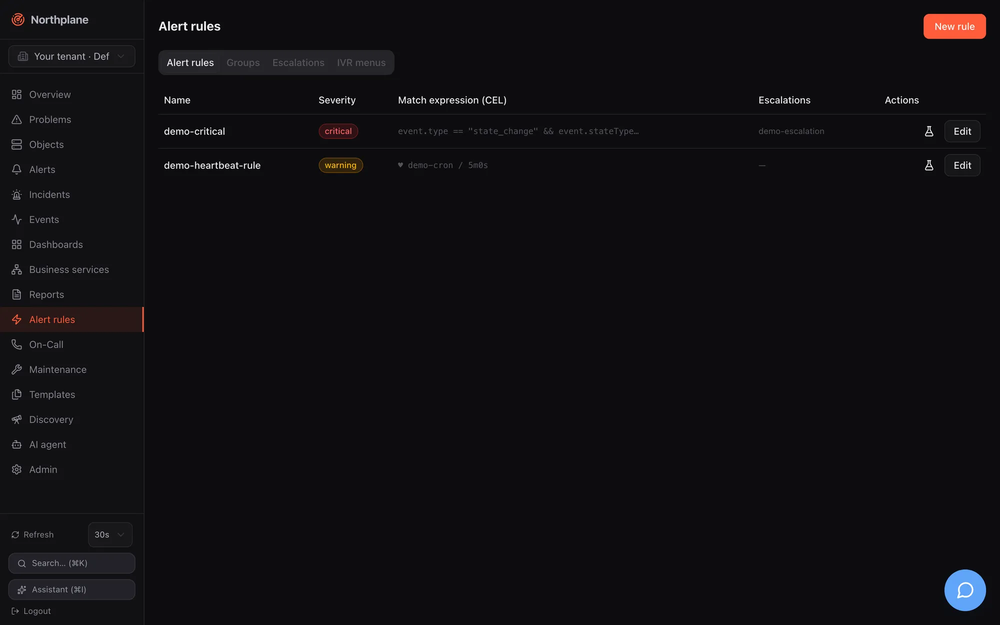
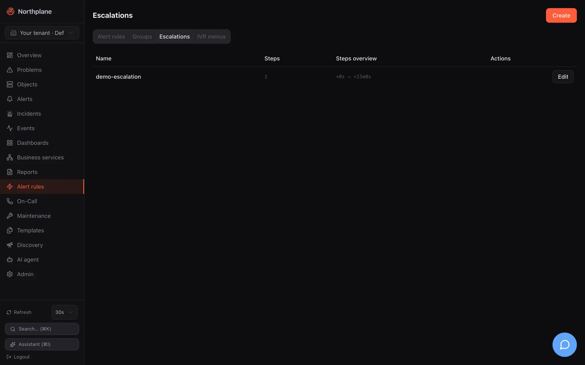
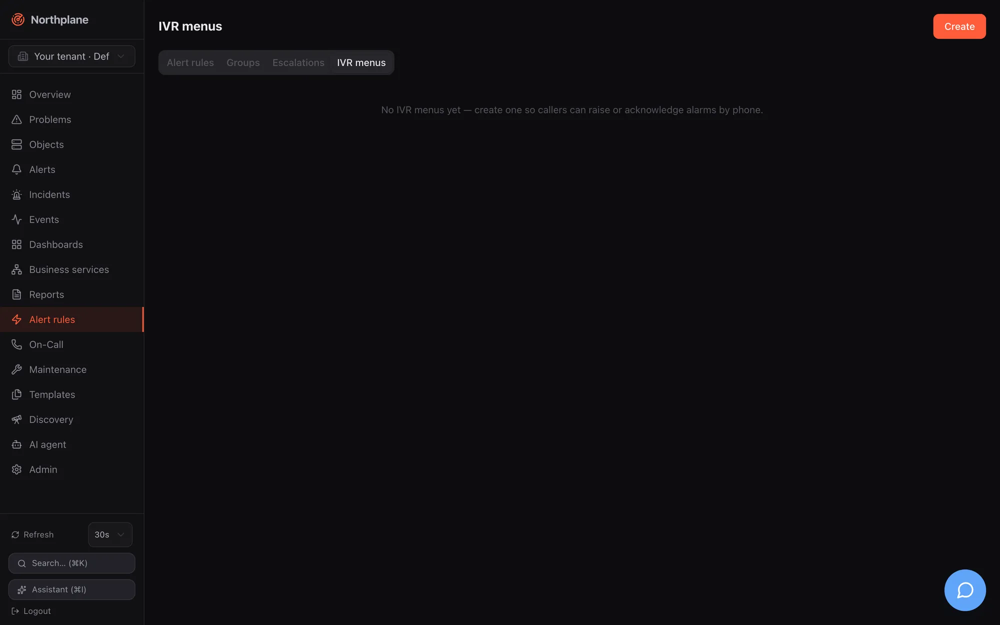

The sidebar entry **Alert rules** (Alarm-Regeln) opens `/alerting`, the page where the alarming pipeline is configured: which events become alerts, how alerts are grouped, who is notified in which order, and what callers hear on the phone. Channels, event sources, contacts and heartbeats are configured under [Admin](/docs/ui/admin/). The page heading follows the active tab; the primary button in the header is **New rule** (Regel anlegen) on the rules tab and **Create** (Anlegen) elsewhere.

All four tabs are tenant-scoped config documents: reading needs `objects:read`, creating/updating/deleting needs `config:write` (held by `admin`, not by `operator`). Every dialog saves with `If-Match` optimistic locking and shows "Conflict — please reload." on a `409`/`412`.

## Alert rules tab (Alarm-Regeln)

Data: `GET /api/v1/alert-rules` (plus `GET /api/v1/alert-groups` and `GET /api/v1/escalation-policies` for the pickers). The list shows **Name**, the **Severity** badge, the **Match expression (CEL)** (Match-Ausdruck) excerpt — or `♥ <source> / <expectEvery>` for heartbeat rules — the escalation policy, a **Disabled** (Deaktiviert) badge where set, and two actions: **Test rule** (Regel testen, flask icon) and **Edit** (Bearbeiten).

**Test rule** in the list calls `POST /api/v1/alert-rules/{name}:test` with an empty body (`alerts:read`): the server replays recent events against the saved rule and answers "N events would match, M alerts would open" (N Events würden matchen, M Alarme entstehen) plus the list of alerts that would open. Empty state: "No alert rules yet — create one to turn events into alerts."

### Rule dialog

| Field (EN / DE) | Input | Meaning |
|---|---|---|
| **Name** | required, locked on edit, placeholder `host-down-critical` | |
| **Source** (Quelle) | radio **CEL-Match** or **Heartbeat** | Exactly one of the two is saved. |
| CEL expression | textarea, placeholder `event.type == "state_change" && event.severity == "critical"` | The match expression — see the CEL environment in [Alert rules](/docs/alarming/alert-rules/). |
| Heartbeat **Source** + **Expected every** (Erwartet alle) | text (placeholder `backup-job`) + duration (placeholder `1h`) | Silence detection: opens an alert when no event from that source arrives within `expectEvery`. `source` is compared with the events' `sourceId`, i.e. the **id** of the event source — not its name — and the rule arms only after the first event from it. |
| **Severity** | `critical` / `warning` / `info` / `ok` | `ok` is allowed for resolve rules. |
| **Dedup key** (Dedup-Key) | text, hint "optional, Go template" | Alerts with the same rendered key are folded. |
| **Title (Go template)** (Titel) | text | Alert title template. |
| **Pending period** (Pending-Periode) | duration, placeholder `5m` | The condition must persist this long before the alert opens (state kept in memory — lost on restart). |
| **Auto-close** (Autoclose) | duration, placeholder `24h` | Open alerts expire after this. |
| **Escalations** (Eskalationen) | select of policies, or **none** | The policy started when the alert opens. |
| **Group** (Gruppe) | select of alert groups, or **none** | See the caution below. |
| **Set labels** (Labels setzen) | key/value editor (`team` = `netops`) | Labels stamped on the alert — including `np.sound`, `np.volume`, `np.tts` for the alarm app and voice. |
| **Resolve on OK** (Bei OK schließen), **Create incident** (Incident anlegen), **Disabled** (Deaktiviert) | toggles | |
| **Test panel** | editable demo-event JSON + **Run** (Ausführen) | `POST /api/v1/alert-rules:test` with `{rule, demoEvents}` — works on the unsaved form, so you can iterate before saving. |
| **Delete** | on existing rules | `DELETE /api/v1/alert-rules/{name}` |

:::caution[Template placeholders shown in the dialog]
The dedup-key and title fields show the placeholders `{{.ObjectID}}` and `{{.ObjectName}} ist {{.ToLabel}}`. They do not match the engine's data model: the title template sees only the **event** as `{{ .event.* }}` (for example `{{ .event.summary }}`, `{{ .event.object }} is {{ .event.state }}`, `{{ .event.labels.host }}`), the dedup-key template additionally `{{ .object.id }}` and `{{ .rule.name }}`. The capitalised placeholders render as the literal text `<no value>`. Leave dedup key empty to get the default `<objectId>/<ruleName>`. See [Alert rules](/docs/alarming/alert-rules/) for the template context.
:::

## Groups tab (Gruppen)

Data: `GET /api/v1/alert-groups`. List columns **Name**, **Group-By**, **Window** (Fenster), **Aggregate** (Aggregat) badge, **Min**. Dialog: **Name**, **Group by (label keys)** (Group-By (Label-Keys), list), **Window**, **Aggregate** (`count` / `min` / `max` / `avg` / `sum` / `median`), **Value path** (Wert-Pfad, optional for min/max/avg/sum/median), **Min. count** (Min. Anzahl).

:::caution[Groups are configuration only]
Alert groups can be created and attached to rules, but no runtime component evaluates them in this version — rules behave as if no group were set. See [Known issues](/docs/project/roadmap-and-known-issues/).
:::

## Escalations tab (Eskalationen)

Data: `GET /api/v1/escalation-policies`. List columns **Name**, number of steps, a **Steps overview** (Stufen-Übersicht) such as `+0s → +10m`, **Edit**. The dialog is the policy **Name** plus ordered **Step** (Stufe) cards (move up/down, remove, add):

| Step field (EN / DE) | Input | Meaning |
|---|---|---|
| **After** (Nach) | duration, placeholder `0s`, hint "Delay from alert" | When the step fires, counted from the alert opening. |
| **Only if not acknowledged** (Nur falls nicht quittiert) | toggle | `unlessAcked` — suppresses this step's send if the alert was acknowledged by then. An acknowledged alert never advances to further steps anyway. |
| **Notify** (Benachrichtigen) | radio **Schedule** (Dienstplan) / **Contact** (Kontakt) / **Contact group** (Kontaktgruppe) | Who is notified. For a schedule you also choose **Primary** (Primär) or **Backup (2nd)** (Backup (2.)) from the rotation ("Who from the rotation"). |
| **Channels** (Kanäle) | chip picker: `email`, `webhook`, `slack`, `teams`, `ntfy`, `sms`, `push`, `voice`, `mqtt` | Channel **types**; the first enabled channel of each type (by name) is used, and a step that lists channels overrides the contacts' own preferences. |
| **Repeat every** (Wiederholen alle) / **Max. repeats** (Max. Wiederholungen) | duration + number | Repeats the step while the alert stays open. |
| **Action: trigger webhook** (Aktion: Webhook auslösen) | toggle + webhook-channel select | Fires a webhook channel in addition to notifying. |

**Simulate** (Simulieren; `POST /api/v1/escalation-policies/{name}:simulate`, `alerts:read`) renders a timeline — who is notified when, on which channels, repeats and actions — for the **saved** policy; unsaved changes show "Save the policy first, then simulate." The step semantics, persisted timers and what happens on ack/snooze are in [Escalation policies](/docs/alarming/escalation-policies/).

## IVR menus tab (IVR-Menüs)

Data: `GET /api/v1/ivr-menus`. List columns **Name**, **Language** (Sprache), number of options and an **Options overview** (Optionen-Übersicht) such as `1=trigger-alarm · 2=list-alerts`. Dialog:

| Field (EN / DE) | Input |
|---|---|
| **Name** | locked on edit |
| **Language** (Sprache) | e.g. `de-DE` (default `en-US`); German prompts for any `de*` |
| **Voice** (Stimme) | provider TTS voice, e.g. `Polly.Vicki` |
| **PIN** | optional — callers must key it in |
| **Greeting** (Begrüßung) | spoken before the options |
| **Trust caller ID** (Anrufer-ID vertrauen) | a known contact phone number replaces the PIN prompt |
| **Options** — per option: **Key** (Taste, `0`–`9`, `*`, `#`), **Action** (`trigger-alarm` / `list-alerts` / `ack-alert` / `resolve-alert` / `say`), **Label** (Bezeichnung, read aloud in the prompt) | ordered list |
| for `trigger-alarm`: **Severity**, **Title** (with `{caller}` / `{called}` placeholders), **Escalation policy**, **Sound (np.sound)**, **Record a voice message** (Sprachnachricht aufzeichnen) | |
| for `say`: **Text** | |

An IVR menu is attached to a `voice-inbound` (Twilio) or `asterisk-inbound` (FastAGI) event source under **Admin → Event sources**; the call flow, PIN gate, recording and transcription are described in [Voice and IVR](/docs/alarming/voice-and-ivr/).

## Other pages in brief

The following pages have their own detailed documentation in the Monitoring section; this is what you find in the UI.

### Dashboards (`/dashboards`)

A card per dashboard (name, **Shared** (Geteilt) badge, widget count, **Open**, **Delete**) and a **New dashboard** (Dashboard anlegen) dialog (Name, switch "Shared (visible to everyone)"). The dashboard view at `/dashboards/<name>` has a **time range** select (`1h` … `30d`), a **refresh** select (Off, 10 s, 30 s, 1 min, 5 min), a **Wallboard** link and **Edit** (Bearbeiten); in edit mode **+ Add widget** (Widget hinzufügen, an icon gallery of the 11 widget types with live preview), **Tidy** (Aufräumen), drag/resize on a 12-column grid, **Cancel**, **Save** (`PUT /api/v1/dashboards/{name}` with ETag). Widget types, configuration fields and data sources: [Dashboards](/docs/monitoring/dashboards/).

### Reports (`/reports`)

A table of report definitions — **Name**, **Type** (availability, SLA, alert statistics, on-call, audit), **Schedule** (Zeitplan, the raw grammar), recipient count (amber warning when scheduled without recipients), **Keep** — with **Preview** (Vorschau, HTML in a sandboxed iframe), **CSV**, **JSON**, **Run** (Ausführen: render + archive + e-mail), **Archive** (Archiv), **Edit**, **Delete**. The dialog has a schedule composer (frequency, weekday or day of month, time) that shows the resulting `daily[@HH:MM] | weekly:<weekday>[@HH:MM] | monthly[:day][@HH:MM]` string live. Report types, formats and delivery: [Reports](/docs/monitoring/reports/).

### Business services (`/business`)

Left: the live aggregation **Tree** (Baum) with state glyphs and `SLA N%` per node (30 s refresh). Right: the **SLA — `<name>`** card (availability against target, error budget, consumed, remaining, window) and the **Definition** card (rule, quorum, binding, parent, weight, SLA target/window) with **Edit** and **Delete**. The dialog binds a leaf to an object or a selector (or makes an inner node), chooses `worst` / `best` / `quorum` / `weighted`, weight, SLA target and window. Rules and SLA math: [Business services](/docs/monitoring/business-services/).

### Discovery (`/discovery`)

**Start scan**: CIDR (max `/20`) and optional ports → `POST /api/v1/discovery/scans` (`config:write`). The scans table polls every 5 s while a scan runs; **Suggestions** (Vorschläge) opens a panel where you pick a folder (default `/discovered`), optional templates and the rows to adopt; **Adopt selected** creates hosts through `POST /api/v1/objects:batch` with the label `discovered=true`. Algorithm and limits: [Discovery](/docs/monitoring/discovery/).

### Maintenance (`/maintenance`)

Tabs **Silences** and **Downtimes** with a **Create** button bound to the active tab. Silences: selector and/or text regex, required comment, expiry with quick buttons **1h / 4h / 24h** or a date-time. Downtimes: target **Object** (searchable picker) or **Selector**, type `fixed`/`flexible` (+ duration), from/to, an optional free-text **RRULE** (e.g. `FREQ=WEEKLY;BYDAY=SA` — there is no visual recurrence builder), required comment. Deleting a silence expires it early; deleting a downtime cancels it. Suppression semantics and the re-arm behaviour: [Maintenance](/docs/monitoring/maintenance/).

### Templates (`/templates`, heading "Templates & Konfiguration")

Tabs **Templates**, **Check commands** (Check-Kommandos) and **Time periods** (Zeiträume). The template editor is the same spec form as the object dialog (see [Objects](/docs/ui/objects/#create-and-edit-dialog)) but flat and wide, with a **Type** (both / host / service) and labels. Check commands: name, type (`exec` / `builtin` / `agent` / `passive`), command line (list), timeout, switch "Export env macros". Time periods: name, alias, per-weekday ranges (`08:00-17:00`, comma-separated), exceptions, exclusions. Inheritance and the catalog: [Templates](/docs/monitoring/templates/).
