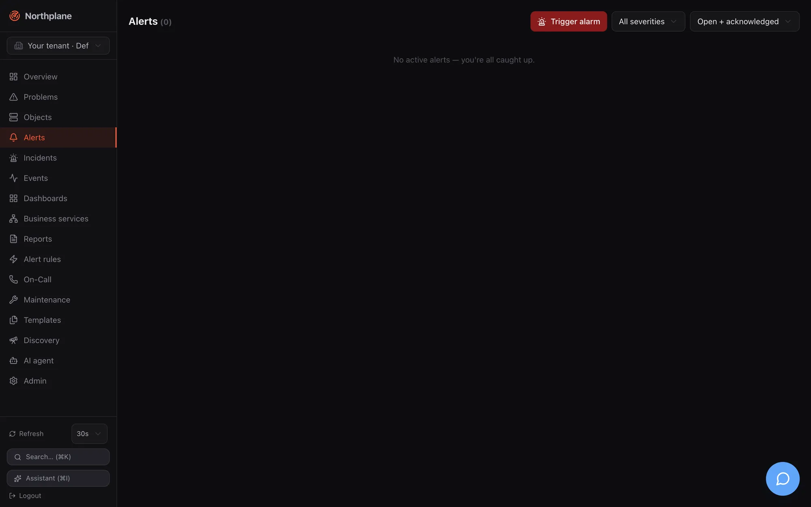
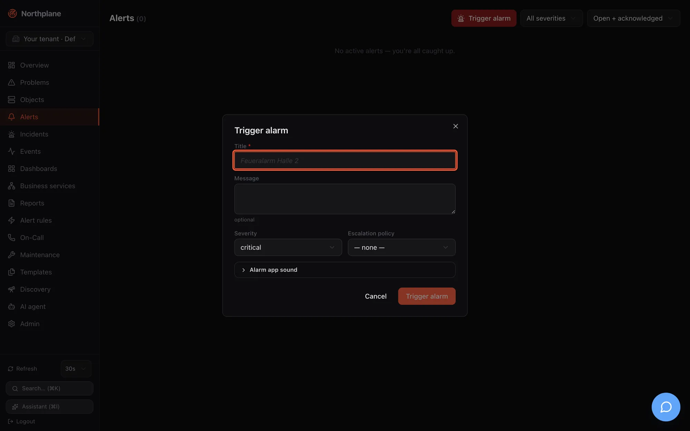
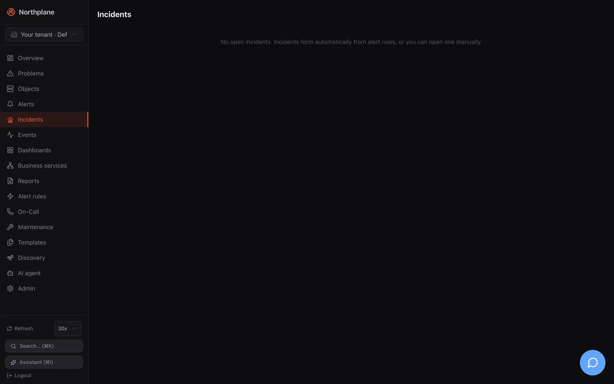
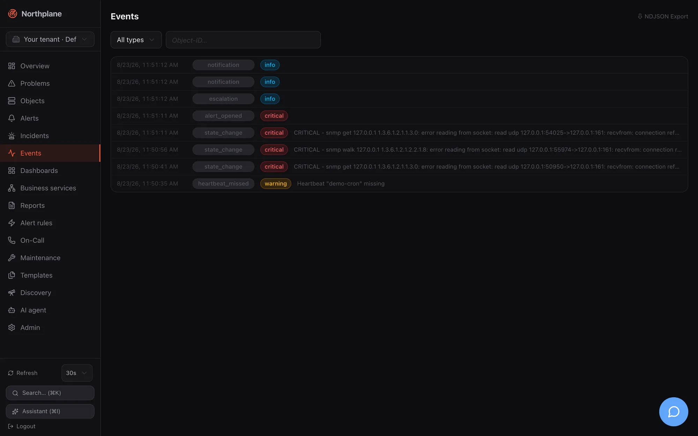
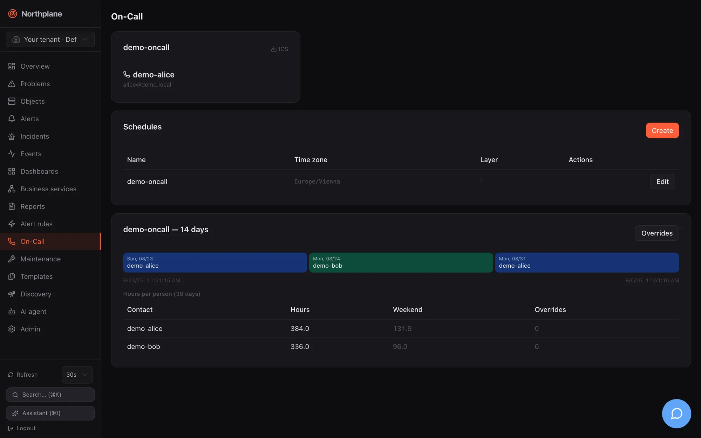

Four pages cover the alarming side of day-to-day operation: **Alerts** (Alarme) for the alert list and manual alarms, **Incidents** for grouped alerts, **Events** for the raw log, and **On-Call** (Bereitschaft) for who is on duty. The concepts behind them — alert lifecycle, dedup, incidents and the correlator, the event model — are in [Alerts and incidents](/docs/concepts/alerts-incidents/) and [Events](/docs/concepts/events/). All four pages reload on your [refresh interval](/docs/ui/navigation/#refresh-control-and-live-data).

## Alerts page

Route `/alerts`. Data: `GET /api/v1/alerts?status=<status>&limit=200` (`alerts:read`); the severity filter is applied client-side. Both filters are URL parameters (`?status=…&severity=…`) and therefore linkable.

| Control (EN / DE) | Options | Effect |
|---|---|---|
| **Trigger alarm** (Alarm auslösen) | red button with a siren icon | Opens the [trigger-alarm dialog](#trigger-alarm-dialog) |
| Severity select | **All severities** (Alle Severities), `critical`, `warning`, `info` | Client-side filter |
| Status select | **Open + acknowledged** (Offen + quittiert, the default: `status=open,acked`), **Open only** (Nur offen: `open`), **Closed** (Geschlossen: `resolved,expired`) | Sent as `status=` |

Each row shows the severity badge, the title and a meta line `<status> by <ackedBy> · since <age> · <dedupKey>`. Hover actions:

| Action (EN / DE) | When | Call |
|---|---|---|
| **Acknowledge** (Quittieren) | open alerts | opens the [Acknowledge dialog](/docs/ui/overview-and-problems/#acknowledge-dialog) → `POST /api/v1/alerts/{id}:ack` (`alerts:ack`) |
| **Resolve** (Schließen) | open or acknowledged alerts | `POST /api/v1/alerts/{id}:resolve` (`alerts:ack`) |

After a manual alarm is raised a green "Alarm raised." (Alarm ausgelöst.) banner shows for 2.5 s. The empty state reads "No active alerts — you're all caught up." (Keine aktiven Alarme — alles ruhig.)

:::note[Snooze is API-only]
The UI offers acknowledge and resolve. Snoozing (`POST /api/v1/alerts/{id}:snooze` with `until`) is available through the API, `np` and the alarm app but has no button here — see [Acknowledge and snooze](/docs/alarming/acknowledge-and-snooze/).
:::

### Trigger-alarm dialog

Raises an alert by hand — a fire drill, a test of the escalation chain, an alarm reported by phone that did not come in through an event source. The call is `POST /api/v1/alerts` (`alerts:write`, held by `operator` and `admin`).

| Field (EN / DE) | Input | Sent as |
|---|---|---|
| **Title** (Titel) | required, placeholder "Feueralarm Halle 2" | `title` |
| **Message** (Nachricht) | optional | `message` |
| **Severity** (Schweregrad) | `critical` / `warning` / `info` — no `ok` | `severity` |
| **Escalation policy** (Eskalationsrichtlinie) | **none** (keine) or one of `GET /api/v1/escalation-policies` | `escalationPolicy` |
| Collapsible **Alarm app sound** (Alarm-App Sound) — hint "Controls sound and volume in the Northplane alarm app (np.* labels)." | | |
| **Sound (np.sound)** (Ton) | none / `np_klaxon` / `np_sirene` / `np_puls` | `labels["np.sound"]` |
| **Volume (np.volume)** (Lautstärke) | **(default)** or `0.1` … `1.0` | `labels["np.volume"]` |
| **Override silent mode (np.overrideSilent)** (Stummschaltung übergehen) | toggle | `labels["np.overrideSilent"]` |

The `np.*` labels drive the mobile alarm app; their contract is in [Mobile push](/docs/alarming/mobile-push/). Manual alarms bypass alert rules and are never suppressed by downtimes, silences or flapping: the chosen escalation policy starts immediately, and without one the alert only appears in the list — nobody is notified. The same endpoint is used by the alarm app, scripts, inbound voice/SMS and Asterisk; with a `dedupKey` repeated triggers fold into the existing open alarm (see [Alerts and incidents](/docs/concepts/alerts-incidents/)).

## Incidents page

Route `/incidents`. Data: `GET /api/v1/incidents?limit=100` (`incidents:read`). Incidents are shown as cards in a two-column grid: severity badge and title (struck through once resolved), a meta line `<createdBy> · <age> · <impact>`, the summary text and a **Ticket ↗** link when a ticket URL is set. Open incidents have two actions:

| Action (EN / DE) | Call | Notes |
|---|---|---|
| **AI summary** (AI-Zusammenfassung, sparkles icon) | `POST /api/v1/incidents/{id}:summarize` (`incidents:write`) | Needs a server-level AI provider (`ai.provider` in `config.yaml`); otherwise the API answers `503 np:ai/disabled` and nothing changes. The summary (2–3 sentences, German) is stored on the incident. See [Agent chat](/docs/ai/agent-chat/). |
| **Resolve** (Schließen) | `POST /api/v1/incidents/{id}:resolve` (`incidents:write`) | Resolves the incident **and** its open/acknowledged alerts. |

Empty state: "No open incidents. Incidents form automatically from alert rules, or you can open one manually." Creating, merging and editing incidents is API-only (`POST /api/v1/incidents`, `…:merge`, `PUT`) — see [Alerts and incidents](/docs/concepts/alerts-incidents/).

## Events page

Route `/events`. Data: `GET /api/v1/events?types=<type>&objectId=<id>&limit=200` (`events:read`). The newest 200 events matching the filters are listed; there is no time-range filter or pagination in the UI (use the API or the export for more).

| Control | Behaviour |
|---|---|
| Type select | **All types** (Alle Typen) or one of the 12 types below |
| **Object-ID…** input | Restricts to one object (paste the UUID from the object detail URL) |
| **⇩ NDJSON Export** link | `GET /api/v1/events:export?types=<type>` — streams the matching events as newline-delimited JSON for SIEM or archival use (the object filter is not applied to the export) |

Each row is a collapsible `details` element: time, type badge, a state/severity badge, and the payload's `summary`, `output` or `object` text; expanding the row shows the full payload as pretty-printed JSON. Rows for events without any of those text fields (some `config` or `ack` events) show only time and badges.

The 12 types offered by the filter:

| Type | Emitted when |
|---|---|
| `state_change` | a check result changes an object's state (soft and hard transitions) |
| `alert_opened` | an alert is opened — by a rule, by the correlator, or as a manual alarm |
| `alert_resolved` | an alert is resolved (resolve rule, auto-close, API/UI) |
| `notification` | a delivery attempt is recorded (`pending`/`sent`/`failed`/`dead`) or a notification is suppressed |
| `escalation` | an escalation step fires, or a snoozed alert wakes up |
| `ack` | an alert is acknowledged or snoozed (any path: UI, API, ack link, SMS, IVR) |
| `ingress` | an event source accepted a payload (webhook, Alertmanager, mail, MQTT, ESPA, SNMP trap) |
| `config` | configuration changed through the API (objects, resources, bundles) |
| `downtime` | a downtime is created |
| `silence` | a silence is created |
| `heartbeat_missed` | a heartbeat did not beat in time (and again, with `resolve: true`, when it recovers) |
| `ai_action` | defined for AI tool executions — currently not emitted by the server |

Events of other types (`flapping_start`/`flapping_end`, `incident_update`, `system`) are stored and shown under **All types** but cannot be selected individually in this dropdown.

The full event model with payloads, retention and the SSE stream for external consumers is in [Events](/docs/concepts/events/).

## On-Call page

Route `/oncall`. Three blocks: who is on duty now, the schedule manager, and a detail card per schedule. Reading needs `oncall:read`; creating and editing schedules and overrides needs `oncall:write` (both held by `operator`; `viewer` has read only).

### Now cards

One card per schedule from `GET /api/v1/oncall/now`: the schedule name, the people currently on duty with name, e-mail and phone, and an **ICS** link to `/api/v1/schedules/<name>/ics` — an iCalendar export of the rotation. The endpoint requires `oncall:read` and the link carries no token, so download it with your browser session or fetch it with an API token (`curl -H "Authorization: Bearer np_…"`) for a calendar subscription. Empty states: "nobody on duty" (niemand im Dienst) inside a card, "No on-call schedules defined." (Keine Bereitschaftspläne definiert.) when there are none.

### Schedules manager (Dienstpläne)

A table of schedules — **Name**, **Time zone** (Zeitzone), number of layers, **Edit** (Bearbeiten) — and a **Create** (Anlegen) button. The dialog:

| Field (EN / DE) | Input |
|---|---|
| **Name** | locked on edit |
| **Time zone** (Zeitzone) | IANA name, default `Europe/Berlin` |
| **Layers** — each layer ("Rotation") has: | |
| name | optional |
| **Rhythm** (Rhythmus) | `daily` (täglich) / `weekly` (wöchentlich) / `custom` (benutzerdefiniert) |
| **Participants** (Teilnehmer) | ordered list with contact-name suggestions |
| **Shift length** (Schichtlänge) | duration; only for `custom` |
| **Anchor (rotation start)** (Anker) | date-time from which shifts are counted |
| **Restriction (weekday → HH:MM-HH:MM)** (Einschränkung) | key/value rows such as `mon` → `08:00-17:00`; comma-separated ranges for several windows |
| **+ Layer**, **Remove** (Entfernen) | add/remove layers |

Saving uses the resource API (`POST /api/v1/schedules`, `PUT /api/v1/schedules/{name}` with `If-Match`); **Delete** removes the schedule. Layer semantics (later layers override earlier ones in their restriction windows) and the backup/escalateTo model are explained in [Contacts and on-call](/docs/alarming/contacts-and-oncall/).

### Per-schedule detail

Below the manager each schedule gets a card **`<name>` — 14 days**:

| Block | Content | Source |
|---|---|---|
| Timeline | the next 14 days as coloured day blocks per person; an override is marked with an amber ring and `⤳` | `GET /api/v1/schedules/{name}/timeline?from&to` |
| **Hours per person (30 days)** | table with hours, weekend hours and override count per contact | `GET /api/v1/schedules/{name}/stats` |
| **Overrides** button | opens the overrides dialog | |

### Overrides dialog

| Field (EN / DE) | Input |
|---|---|
| **Contact** (Kontakt) | select ("— select —") |
| **Reason** (Grund) | text, placeholder "Vacation" (Urlaub) |
| **From** / **To** (Von / Bis) | date-time pickers |
| **Add** (Hinzufügen) | `POST /api/v1/schedules/{name}/overrides` (`oncall:write`) |

The **Active overrides** (Aktive Overrides) list is derived from the timeline between yesterday and +30 days. An override replaces whoever is on duty in the window for the **primary** slot; a step that escalates to the `backup` person ignores overrides (see [Escalation policies](/docs/alarming/escalation-policies/)).
