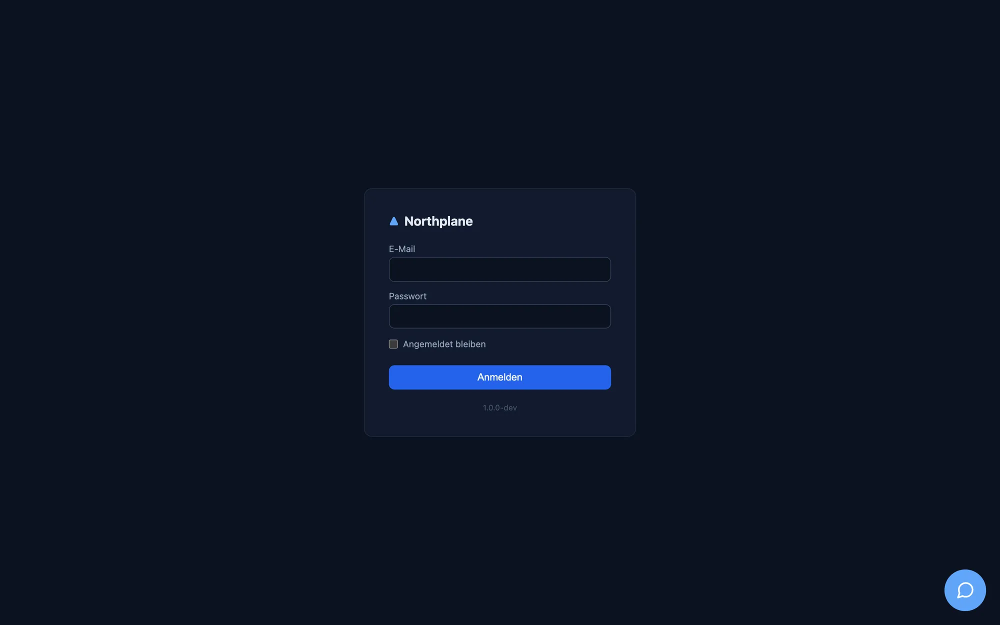

The Northplane UI is a single-page React application embedded in the `northplaned` binary and served at `/` of your instance. Everything it shows comes from the same REST API that `np`, the agent and MCP clients use (see [API overview](/docs/reference/api-overview/)); the UI adds no private endpoints. This page describes the application shell — the parts that are the same on every page. The pages that follow walk through each screen: [Overview and Problems](/docs/ui/overview-and-problems/), [Objects](/docs/ui/objects/), [Alerts, Incidents, Events, On-Call](/docs/ui/alerts-incidents-events/), [Alerting configuration](/docs/ui/alerting-config/) and [Admin](/docs/ui/admin/).

## The shell

| Area | What it contains |
|---|---|
| Left sidebar (fixed width) | Radar logo + **Northplane** wordmark; the [tenant switcher](#tenant-switcher) (cross-tenant operators only); the 16 navigation entries below; a footer with the [refresh control](#refresh-control-and-live-data), a **Search… (⌘K)** (Suchen… (⌘K)) button, an **Assistant (⌘I)** (Assistent (⌘I)) button and a **Logout** link. |
| Main area | The current page. Every page is loaded lazily (a spinner shows while the chunk loads). |
| Right AI sidebar | Opens with ⌘I / Ctrl+I or the sidebar button — see [AI sidebar](#ai-sidebar). |
| Wallboard mode | If the URL contains `?wallboard` (e.g. `/?wallboard=1` or `/dashboards/<name>?wallboard`), the shell renders the page **without** the sidebar — for TVs and NOC screens. |

**Logout** is a plain link to `/auth/logout`: the server deletes the session, clears the `np_session` cookie and redirects to `/login`.

The shell also fetches two things once per page load: your user preferences (`GET /api/v1/users/me/preferences`, currently the refresh interval) and the instance branding (`GET /api/v1/branding`, colour theme and light/dark mode). Branding is deliberately **not** re-fetched when you switch tenant — the console must not re-skin when an operator changes customer.

## Sidebar navigation

Sixteen routes, in sidebar order. The German label is what a browser with a `de*` language shows (see [Language](#language)).

| # | Route | English (German) label | What it is | Documented in |
|---|---|---|---|---|
| 1 | `/` | **Overview** (Übersicht) | KPI tiles, problem list, service-status donut, incidents, on-call, recent events; wallboard mode | [Overview and Problems](/docs/ui/overview-and-problems/) |
| 2 | `/problems` | **Problems** (Probleme) | All hosts/services in a non-OK hard state with ack/downtime/check-now actions | [Overview and Problems](/docs/ui/overview-and-problems/#problems-page) |
| 3 | `/objects` | **Objects** (Objekte) | Hosts and services: filterable list, create/edit dialog, batch add, object detail | [Objects](/docs/ui/objects/) |
| 4 | `/alerts` | **Alerts** (Alarme) | Open/acked/closed alerts, acknowledge/resolve, trigger a manual alarm | [Alerts](/docs/ui/alerts-incidents-events/#alerts-page) |
| 5 | `/incidents` | **Incidents** (Incidents) | Incident cards with AI summary and resolve | [Incidents](/docs/ui/alerts-incidents-events/#incidents-page) |
| 6 | `/events` | **Events** (Events) | The event log with type/object filters and NDJSON export | [Events](/docs/ui/alerts-incidents-events/#events-page) |
| 7 | `/dashboards` | **Dashboards** (Dashboards) | Dashboard list and the grid editor; `/dashboards/<name>` opens one | [Dashboards](/docs/monitoring/dashboards/) |
| 8 | `/business` | **Business services** (Business Services) | BPI tree, SLA card, service definitions | [Business services](/docs/monitoring/business-services/) |
| 9 | `/reports` | **Reports** (Reports) | Report definitions, preview/CSV/JSON, run, archive | [Reports](/docs/monitoring/reports/) |
| 10 | `/alerting` | **Alert rules** (Alarm-Regeln) | Tabs: alert rules, groups, escalation policies, IVR menus | [Alerting configuration](/docs/ui/alerting-config/) |
| 11 | `/oncall` | **On-Call** (Bereitschaft) | Who is on duty now, schedules, layers, overrides, timeline, stats, ICS | [On-Call](/docs/ui/alerts-incidents-events/#on-call-page) |
| 12 | `/maintenance` | **Maintenance** (Wartung) | Silences and downtimes | [Maintenance](/docs/monitoring/maintenance/) |
| 13 | `/templates` | **Templates** (Templates) | Templates, check commands, time periods | [Templates](/docs/monitoring/templates/) |
| 14 | `/discovery` | **Discovery** (Discovery) | Network scans and turning suggestions into hosts | [Discovery](/docs/monitoring/discovery/) |
| 15 | `/agent` | **AI agent** (KI-Agent) | The agent chat workspace | [Agent chat](/docs/ai/agent-chat/) |
| 16 | `/admin` | **Admin** (Administration) | 21 administration tabs | [Admin](/docs/ui/admin/) |

Two routes are reachable only by link: `/objects/<id>` (object detail) and `/dashboards/<name>` (dashboard view). The active sidebar entry is highlighted by path prefix; Overview is highlighted only on exactly `/`.

Unknown paths render a **404** page inside the shell (the big "404", the path, and a link back to **Overview**). A route that throws renders the shared error state with a **Retry** button.

## Duplicating entities

Every list row — and the object detail header — carries a **Duplicate** (Duplizieren) action next
to Edit. It opens the entity's *create* dialog seeded from the source, so a second service, host,
contact, channel or escalation policy is "copy, rename, save" instead of retyping every field.
Covered: hosts and services (list and detail page), contacts, contact groups, channels, event
sources, webhooks, heartbeats, roles (a system role becomes a custom copy), users (roles and flags;
the identity is not copied), sites, escalation policies, alert rules, schedules, alert groups, IVR
menus, templates, check commands, time periods, business services, reports, dashboards (full
widget layout), downtimes and silences (window/expiry kept while still ahead, otherwise now + 1 h).

The copy never carries the store envelope (`id`, `tenantId`, `version`, timestamps), so it is a
real create (`POST`) and never collides with the source. The suggested name is `<name>-copy` for
slug-like names (hosts, services, contacts, rules — things that end up in selectors, URLs and
check arguments) and `<name> (copy)` / `<name> (Kopie)` for free-text names (dashboards, reports),
numbered (`-copy-2`, `(Kopie 3)`) against the names already on the page so the suggestion is free
from the start; the name stays editable.

## Command palette

Press **⌘K** (macOS) or **Ctrl+K** (Linux/Windows), or click **Search… (⌘K)** in the sidebar footer. The palette has two groups:

| Group | Behaviour |
|---|---|
| Objects | Once you have typed at least two characters the palette queries `GET /api/v1/objects?q=<text>&limit=8&withState=true` and lists matching hosts and services with their state icon and colour, the name and a hint (`host` or `service @ <host>`). Selecting one opens `/objects/<id>`. |
| Pages | Static entries (labels are English in every language): **Overview**, **Problems**, **Objects**, **Alerts**, **Incidents**, **Events**, **On-Call**, **Admin**, **Wallboard** (full reload of `/?wallboard=1`) and **API Docs** (opens the Swagger UI at `/api/docs` in a new tab). |

Placeholder: "Navigation, objects, actions…" (Navigation, Objekte, Aktionen…); empty result: "Nothing found" (Nichts gefunden). The query is cleared when the palette closes. Escape closes it.

## Keyboard shortcuts

| Keys | Action |
|---|---|
| `⌘K` / `Ctrl+K` | Toggle the command palette |
| `⌘I` / `Ctrl+I` | Toggle the AI sidebar |
| `g` then `o` | Go to Overview (`/`) |
| `g` then `p` | Go to Problems |
| `g` then `h` | Go to Objects (hosts) |
| `g` then `a` | Go to Alerts |
| `g` then `e` | Go to Events |

The `g` chords are ignored while the focus is in an input, textarea or content-editable element. There are no other global shortcuts; dialogs follow the usual Enter-to-submit / Escape-to-close behaviour (for example the acknowledge dialog submits on Enter).

## Tenant switcher

The switcher at the top of the sidebar is shown only when your effective permissions imply `admin:tenants` (wildcard-aware, so the built-in `admin` role with `*:*` sees it). Everyone else is pinned to their own tenant and sees nothing here.

| Element | Behaviour |
|---|---|
| Select | Lists **Your tenant** (Eigener Mandant) `· <name of your home tenant>` plus every tenant from `GET /api/v1/tenants`. |
| Choosing a tenant | Stores the tenant id in `localStorage["np.activeTenant"]`, clears the whole client-side query cache and navigates to `/`, so nothing from the previous customer remains on screen. The trigger is tinted in the sidebar accent and a standing line **Active customer** (Aktiver Kunde): `<name>` appears underneath. |
| Effect | Every API call — lists, writes, the ETag reads, the agent chat stream — sends `X-Northplane-Tenant: <id>`. The server checks `admin:tenants` on each request; audit entries land in the target tenant. |
| Back home | Choose **Your tenant** again; the header is dropped. |

See [Tenancy and RBAC](/docs/concepts/tenancy-rbac/) for what is and is not tenant-scoped, and [Tenants and sites](/docs/administration/tenants-and-sites/) for creating tenants. Two things are worth knowing: branding is instance-wide and does not change with the tenant; and `POST /alerts/{id}:ack` ignores the tenant header and acts on your home tenant (see [Known issues](/docs/project/roadmap-and-known-issues/)).

## Refresh control and live data

:::note[Polling, not push]
The UI does not open a Server-Sent-Events or WebSocket connection. Live views re-fetch on an interval you choose; `GET /api/v1/stream` exists for external clients only (see [API overview](/docs/reference/api-overview/)).
:::

The **Refresh** (Aktualisierung) select in the sidebar footer sets how often live data is reloaded: **5 s, 10 s, 30 s, 60 s, Off** (Aus). The default is **30 s**; **Off** means manual reload only (navigating to a page still fetches). Tooltip: "How often live data is reloaded" (Wie oft Live-Daten neu geladen werden).

| Fact | Detail |
|---|---|
| Persistence | `localStorage["np.refreshInterval"]` for instant boot **and** your server-side preferences (`PUT /api/v1/users/me/preferences` with `refreshIntervalMs`, `0` = off). Written through on change, adopted from the server when the shell mounts, synchronised across browser tabs. |
| Pages that follow it | Overview, Problems, Objects list, Alerts, Incidents, Events, the object detail's service lists. |
| Fixed intervals | On-call widget 60 s, metrics 60 s, wallboard 10 s, AI approvals queue 15 s, System health 10 s, business-service tree 30 s, SLA card 60 s, discovery scans 5 s while a scan runs. |
| Client cache | React Query with `staleTime` 15 s, one retry, no refetch on window focus. A `401` from any call hard-redirects the browser to `/login`. |

## AI sidebar

The right-hand **Assistant** (Assistent) panel is the lightweight, non-streaming assistant; the full agent workspace with tool calls, model selection and chat history is the separate **AI agent** page (`/agent`, see [Agent chat](/docs/ai/agent-chat/)).

| Element | Behaviour |
|---|---|
| Intro text | "Triage, correlation, configuration by voice. Mutations run through action cards with confirmation — nothing happens invisibly." |
| Input | Textarea; **Enter** sends, **Shift+Enter** inserts a newline. Placeholder: “Ask the assistant… e.g. ‘What is wrong with web01?’” |
| Transport | `POST /api/v1/ai/conversations` with `{conversationId, message}`; the reply arrives as one JSON document `{conversationId, reply, actions[]}`. Needs `events:read`. |
| Action cards | Each proposed tool call shows the tool name and its JSON input with **Approve** (Freigeben, `POST /api/v1/ai/actions/{id}:approve`, needs `config:write`) and **Deny** (Ablehnen, `…:deny`, needs `alerts:ack`). Already-executed actions show "executed (audited)". |

The sidebar requires a server-level AI provider (`ai.provider` other than `none`); without it the assistant cannot answer, and even approved actions are not executed. Details and the provider/policy model are in [Agent chat](/docs/ai/agent-chat/).

## Server-rendered pages

A few pages are plain HTML rendered by the Go server, not by the SPA. They work without JavaScript and are German-only.

| Path | Purpose | Notes |
|---|---|---|
| `/login` | Local login form: **E-Mail**, **Passwort**, checkbox **Angemeldet bleiben** (remember me: 30-day session instead of 12 h), button **Anmelden**. Shows a **Single Sign-On** button when OIDC is configured and a "Neu hier? Konto erstellen" link when self-service signup is enabled. | `POST /login` is rate limited per IP (burst 8, refill one per 15 s); failures return the generic "Anmeldung fehlgeschlagen.". Details: [Authentication](/docs/administration/authentication/). |
| `/setup` | First-run admin creation (Name, E-Mail, Passwort ≥ 12 characters, Bestätigen). | Only while no local user **and** no API token exists. On default installs the seeded default admin closes it — see [Authentication](/docs/administration/authentication/) for `NP_DEFAULT_ADMIN_DISABLED`. Otherwise it redirects to `/login`. |
| `/register` | Self-service signup; creates a **viewer** account. | 404 unless `allowSignup` is on; defers to `/setup` while first-run is open. |
| `/auth/oidc`, `/auth/callback`, `/auth/logout` | OIDC start/callback and logout. | `501 SSO not configured` without OIDC. |
| `/status/<slug>` | Public, JS-free status page that refreshes itself every 60 s. Rows are the business-service roots (Betriebsbereit / Beeinträchtigt / Störung) or, without business services, one "Infrastruktur" row from the host/service summary. | `/status/default` works out of the box (tenant Default, title "Service Status"). Other slugs need a `statuspage/<slug>` KV document; there is currently no UI or API that writes it. |
| `/api/docs` | Swagger UI over `/api/openapi.json`. | Unauthenticated. |
| `/docs/` | This documentation. | Unauthenticated. |

Unauthenticated **document** navigations to any SPA path (a `GET` with `Accept: text/html`) are redirected to `/login`; API calls get a `401` problem document instead.

## Language

The UI has two catalogues, German and English, with identical keys. The choice is made once at load time from the browser: `navigator.language` starting with `de` → German, anything else → English. There is **no** in-app language switcher and no per-user or server setting. A handful of labels are intentionally literal in both languages (command-palette page names, "Logout", "Raw JSON", "ICS", "Wallboard"), which is why a German screen shows a few English words. Dates use the browser locale (`Intl.DateTimeFormat`, short date + medium time); relative ages render as `12s`, `5m`, `2h 3m`, `1d 4h`. The server-rendered pages above are German only.

## Themes, mode and branding

Appearance has two axes:

| Axis | Values | Default | Stored in |
|---|---|---|---|
| Colour theme | 31 themes: **Northplane (Standard)** (the built-in palette) plus 30 design-system palettes such as Obsidian & Fire, Arctic Blue, Polar Night, Forest & Copper, Midnight Indigo … | **Obsidian & Fire** (`obsidianFire`) | `localStorage["np.theme"]` + instance branding document |
| Mode | **System** (follows `prefers-color-scheme` live), **Light** (Hell), **Dark** (Dunkel) | **Dark** | `localStorage["np.mode"]` + instance branding document |

Both are changed under **Admin → Appearance (Darstellung)** and are **instance-wide**: the server stores one `{theme, mode}` document (`GET/PUT /api/v1/branding`), every user sees it, and switching tenant does not change it. Only users with `config:write` can change them; for everyone else the controls are disabled with the hint "Only administrators with config:write can change this instance's appearance." The localStorage copy exists for an instant, flicker-free boot and is overwritten by the server document when the shell loads. The complete theme list, the light/dark CSS mechanics and the favicon logic are documented in [Branding and themes](/docs/administration/branding-and-themes/).

The favicon is the radar logo tinted in the active theme's sidebar accent (the SPA repaints it whenever theme or mode changes); the server pages use the static orange `favicon.svg`. The login page is not branded — it always renders in the dark default look.

:::note[Third-party assistant widget]
Every instance loads the Stept onboarding/assistant widget (a chat bubble and tour checklist at the bottom right) on the SPA and on the login and register pages. It is hard-wired into the build; there is no runtime switch to turn it off. Removing it requires a rebuild (see [Frontend](/docs/development/frontend/) and the Stept entry under [Known issues](/docs/project/roadmap-and-known-issues/)).
:::
