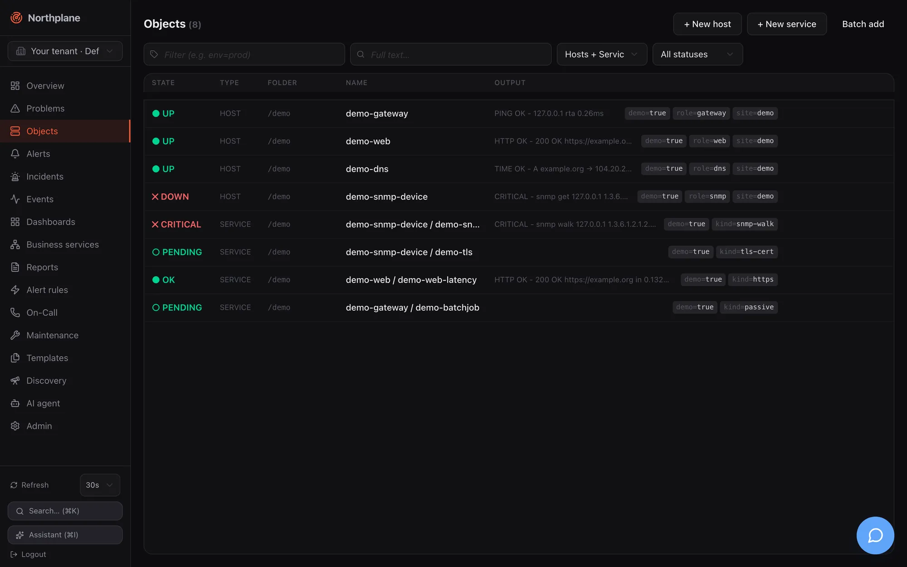
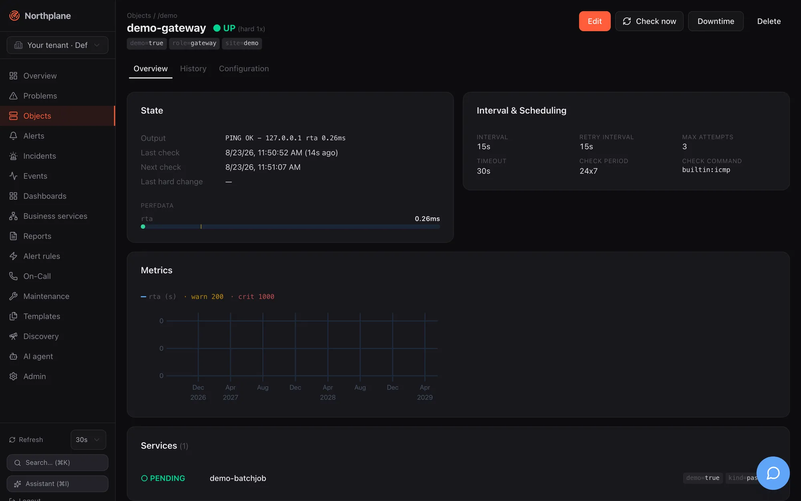

**Objects** (Objekte) is where hosts and services live in the UI: a filterable list at `/objects`, a four-tab create/edit dialog, a batch importer and the object detail page at `/objects/<id>`. The underlying model — folders, labels, selectors, templates, the check-command grammar, the spec fields and their defaults — is explained in [Object model](/docs/concepts/object-model/); the task-oriented guide (API and bundle equivalents of everything below) is [Hosts and services](/docs/monitoring/hosts-and-services/).

## Objects list

Route `/objects`. Data: `GET /api/v1/objects?selector=…&q=…&limit=2000` (`objects:read`), with the kind and state filters applied client-side. The list reloads on your [refresh interval](/docs/ui/navigation/#refresh-control-and-live-data).




### Filters

All four filters live in the URL (`?selector=…&q=…&kind=…&state=…`), so a filtered view can be bookmarked or pasted into a chat, and the browser back button restores the previous filter. The two text inputs are written to the URL after a 250 ms pause in typing.

| Control | Placeholder / options | What it does |
|---|---|---|
| Tag-icon input | "Filter (e.g. env=prod)" (Filter (z.B. env=prod)); tooltip "Label selector (e.g. env=prod)" | A **label selector** — the same grammar as in bundles, silences and dashboards (`env=prod`, `env!=dev`, `team in (a,b)` … see [Object model](/docs/concepts/object-model/)). Sent as `selector=` to the API. |
| Search-icon input | "Full text…" (Volltext…); tooltip "Full-text search (name / output)" | Free text matched against object name and check output. Sent as `q=`. |
| Kind select | **Hosts + Services** / Hosts / Services | Client-side filter on the kind. |
| State select | **All statuses** (Alle Status), **Problems** (Probleme), OK, Up, Warning, Critical, Unknown, Down, Unreachable, Pending | Client-side filter on the current hard state. **Problems** is everything that is not OK/Up/Pending. |
| **Reset filter** (Filter zurücksetzen) | shown when kind or state is set | Clears kind and state (not the text inputs). |

### Table

Column headers **State** (Zustand), **Type** (Typ), **Folder** (Ordner), **Name**, **Output** (Ausgabe). Rows are virtualised (only the visible rows plus a small overscan are rendered), so a list of several thousand objects scrolls smoothly. Each row is a link to the object detail and shows: the state badge (or `○ PENDING` / AUSSTEHEND for objects that have never been checked), the kind, the folder in monospace, `host / name` for services, the humanised output and the label chips.

Hovering a row reveals four actions: **Check now** (Jetzt prüfen, icon; `POST /api/v1/objects/{id}/check-now`, `checks:run`), **Edit** (Bearbeiten; opens the dialog below in edit mode), **Duplicate** (Duplizieren; opens the *create* dialog pre-filled from the row — see [Duplicating entities](/docs/ui/navigation/#duplicating-entities)) and **Delete** (Löschen; `DELETE /api/v1/objects/{id}`, `objects:write`). Delete is a two-click inline confirmation — the button turns into "Really delete?" (Wirklich löschen?) — and for hosts adds the warning "Also deletes all services on this host?" (Löscht auch alle Services des Hosts?): deleting a host cascades to its services.

The header buttons are **+ New host** (Host anlegen), **+ New service** (Service anlegen) and **Batch add** (Massenanlage).

:::tip[Filtering by a label you see in a row]
Label chips in the table are display-only — clicking one does not change the filter. Type the selector (`env=prod`, or combinations such as `env=prod,role in (db,cache),!legacy`) into the tag-icon input; it is the same selector syntax you use in bundles, silences and downtimes.
:::

## Create and edit dialog

The same dialog creates and edits hosts and services (title **New host** / **New service** or **Edit: `<name>`**). It is a four-tab form with a pinned header and footer; only the tab body scrolls. The footer has **Cancel** (Abbrechen) and **Create** (Anlegen) or **Save** (Speichern); the primary button stays disabled until a name (and, for services, a host) is set. Most fields are optional and inherit from templates and defaults, so creating a host is usually a name-plus-address job on the first tab.

### Basics (Basis)

| Field (EN / DE) | Input | Notes |
|---|---|---|
| **Name** (required) | text, placeholder `web01` / `http` | Locked when editing — names are identifiers. |
| **Folder** (Ordner) | text, placeholder `/`, hint "e.g. /prod/web" | The folder path; `/` is the root. |
| **Host** (services only, required) | select of all hosts (`GET /api/v1/hosts?limit=2000&withState=false`) | Locked when editing ("Host cannot be changed"). |
| **Address** (Adresse) | text, placeholder `10.0.0.1 / host.example.com` | Used by the `$HOSTADDRESS$` macro and builtin checks. |
| **Labels** | key/value editor (`env` = `prod`) | Free-form labels for selectors, rules and dashboards. |

### Check (Prüfung)

| Field (EN / DE) | Input | Notes |
|---|---|---|
| **Check command** (Check-Kommando) | kind select **builtin** / **Command (defined)** (Kommando (definiert)) / **exec** / **agent:exec** / **passive** plus a text field for the remainder | The two parts are joined into the `checkCommand` reference: `builtin:<name>` (suggestions from `GET /api/v1/check-commands:builtins`), a bare `<name>` of a check command defined under Templates (suggestions from `GET /api/v1/check-commands`), `exec:<plugin>`, `agent:exec:<plugin>` or `passive`. For **passive** the text field disappears and the hint reads "Passive: results are fed in externally (agent / API) — no active check." |
| **Arguments** (Argumente) | list editor, placeholder `--port=5432`, hint "One argument per entry ($ARG1$, $ARG2$ …)" | Passed to the command; positional `$ARG1$`… macros refer to them. |
| **Templates** | chips + typeahead over `GET /api/v1/templates`; hint "Inheritance in declared order (later wins)" | Order matters — see [Templates](/docs/monitoring/templates/). |
| **Interval & Scheduling** box: **Interval** (Intervall) | duration, placeholder `60s`, hint "e.g. 60s, 5m" | Go duration syntax, validated while typing. |
| **Retry interval** (Retry-Intervall) | duration, placeholder `15s` | Interval while in a soft state. |
| **Max attempts** (Max. Versuche) | number ≥ 1 | Soft→hard threshold. |
| **Timeout** | duration, placeholder `30s` | Per-check timeout. |
| **Check period** (Prüfzeitraum) | text with suggestions from `GET /api/v1/time-periods`, placeholder `24x7` | Stored and resolved into the effective config; the scheduler does not currently consume it (see [Known issues](/docs/project/roadmap-and-known-issues/)). |

### Notifications (Benachrichtigungen)

| Field (EN / DE) | Input | Notes |
|---|---|---|
| **Contact groups** (Kontaktgruppen) | chips + typeahead over `GET /api/v1/contact-groups`; hint "Notified directly on hard state changes" | Nagios-style direct notification, independent of alert rules. |
| **Contacts** (Kontakte) | chips + typeahead over `GET /api/v1/contacts`; hint "Additional individual contacts" | |
| **Notify on** (Benachrichtigen bei) | toggle chips — hosts: `down`, `unreachable`, `recovery`; services: `warning`, `critical`, `unknown`, `recovery`; hint "Empty = all problem states + recovery" | Filters which hard transitions notify. |
| **Notification period** (Benachrichtigungszeitraum) | text with time-period suggestions, placeholder `24x7`; hint "Time window (time period), empty = always" | Evaluated in UTC — see [Maintenance](/docs/monitoring/maintenance/) for time periods. |

How per-object contact routing relates to escalation policies is explained in [Contacts and on-call](/docs/alarming/contacts-and-oncall/).

### Advanced (Erweitert)

| Field (EN / DE) | Input | Notes |
|---|---|---|
| **Parents (reachability)** (Parents (Erreichbarkeit)) | hosts only; chips + typeahead over all hosts except the object itself; hint "Hosts for the reachability logic" | A DOWN host whose parents are all non-UP becomes UNREACHABLE — see [Checks and states](/docs/concepts/checks-and-states/). |
| **Checks**, **Notifications**, **Flap detection** (Flap-Erkennung) | three tri-state selects: **Inherited** (Vererbt) / **Enabled** (Aktiv) / **Disabled** (Deaktiviert) | `Inherited` leaves the field unset so templates and defaults decide; the other two write an explicit `true`/`false`. |
| **Threshold mode** (Threshold-Modus) | **Inherited** / `static` / **adaptive (AI)** | Stored as `thresholdMode`; the checks package does not currently act on `adaptive`. |
| **Staleness deadline (passive)** (Staleness-Frist (passiv)) | services only; duration, placeholder `10m` for passive checks; hint "Freshness of passive results" | `stalenessAfter`: when no result arrives within this window the service turns UNKNOWN. |
| **Staleness text** (Staleness-Text) | services only; text, placeholder "No result received" | The output used for that synthetic UNKNOWN. |
| **Zone (satellite)** (Zone (Satellit)) | text, placeholder `satellite-rz1` | Stored; no scheduler consumer yet. |
| **Variables** (Variablen) | key/value editor; hint "Macros $_HOSTKEY$ / $_SERVICEKEY$" | Custom vars exposed as macros to check commands. |
| **Runbook** | Markdown textarea | Free text for responders. |

### Saving

| Action | Call |
|---|---|
| Create host / service | `POST /api/v1/hosts` or `POST /api/v1/services` (`objects:write`) |
| Save an edit | `PUT /api/v1/objects/{id}` with `If-Match: "<version>"` (`objects:write`) |
| Conflict | A `409`/`412` (someone else saved first) shows "Conflict — please reload." (Konflikt — bitte neu laden.) — reopen the object and redo the change. |

## Batch add (Massenanlage)

The **Batch add** dialog creates many hosts (or many services of one host) from plain text — handy for pasting an inventory export. Settings above the text area apply to every row: **Type** (Typ: Host / Service), **Folder** (Ordner), **Check command** (Check-Kommando, default `builtin:icmp`), **Mode** (Modus: **partial (partial success)** / **all or nothing**) and, for services, the **Host** ("Applies to all rows").

One object per line:

```text
name address [template,template] [key=value,key=value]
web01 10.0.0.11 [linux-base,web] [env=prod,team=web]
web02 10.0.0.12 [linux-base]
# lines starting with # are ignored
```

The first token is the name, the second (optional) the address; the first bracket group lists templates, the second labels. A live **Preview** (Vorschau) table shows each parsed row as **valid** (gültig) or **invalid** (fehlerhaft — only a missing name is invalid). Submitting posts `POST /api/v1/objects:batch` with `{mode, hosts: [...]}` or `{mode, services: [...]}` (`objects:write`); the result table lists each row as **created** (angelegt) or **failed** (fehlgeschlagen) with the server's error. In `partial` mode valid rows are created even if others fail; `all-or-nothing` rolls everything back on the first error. The same endpoint is used by [Discovery](/docs/monitoring/discovery/) to adopt scan suggestions.

## Object detail

Route `/objects/<id>`. Data: `GET /api/v1/objects/{id}`, `GET /api/v1/objects/{id}/effective-config` (returns `{spec, templateChain}`), `GET /api/v1/events?objectId=<id>&limit=30`, for hosts `GET /api/v1/services?hostId=<id>&limit=1000` (for services: the sibling services of the same host), and `POST /api/v1/metrics/query` with `{objectId, from: now-24h, to: now, maxPoints: 300}` (refreshed every 60 s; `metrics:read`). An unknown id shows "404 — This object doesn't exist or was deleted." with a **Back to objects** link.




### Header

Breadcrumb **Objects / folder / host**; the name with the state badge (for example `CRITICAL (hard 3x)`), label chips and — for services — a **Host: `<name>`** chip that links to the host. Actions:

| Action (EN / DE) | Call |
|---|---|
| **Edit** (Bearbeiten) | opens the create/edit dialog |
| **Check now** (Jetzt prüfen) | `POST /api/v1/objects/{id}/check-now` (`checks:run`); the page re-queries after 2.5 s |
| **Downtime** | the [Downtime dialog](/docs/ui/overview-and-problems/#downtime-dialog) |
| **Delete** (Löschen) | `DELETE /api/v1/objects/{id}` with the cascade warning for hosts; navigates back to the list |

### Overview tab (Übersicht)

| Card | Content |
|---|---|
| **State** (Zustand) | Output (humanised — SNMP `sysUpTime` ticks become "up 2d 8h"), long output, **Last check** with age, **Next check**, **Last hard change**, **acked** by/comment when acknowledged, **Downtime: active** when in a downtime, **Flapping: yes** when flapping. Below it the **Perfdata** meters: every `label=value;warn;crit;min;max` token becomes a labelled bar with amber (warn) and red (crit) markers; counters without bounds are shown as a value only, never as a full bar. |
| **Interval & Scheduling** | The resolved values from the effective config: interval, retry interval, max attempts, timeout, check period, check command. |
| **Metrics** (Metriken) | One chart per unit group: series with the same unit are overlaid, monotonic counters are charted as a per-second rate (`/s`), internal `np_*` metrics are hidden. Hover for a crosshair tooltip. Warn/crit thresholds from the first series' perfdata are drawn as translucent bands. Shown only when the object has stored series — see [Metrics and NP-TSDB](/docs/monitoring/metrics-and-tsdb/). |
| **Services (N)** (hosts) / **Other services on this host** (services) | The host's services with state badges, each linking to its detail. |

### History tab (Historie)

The last 30 events of the object (`state_change`, `ack`, `downtime`, `notification` …) as a timeline: time, type badge, severity/state badge, humanised output. The full event log with filters and export is on the [Events page](/docs/ui/alerts-incidents-events/#events-page).

### Configuration tab (Konfiguration)

**Effective configuration** (Effektive Konfiguration): the spec after template inheritance as a key/value table — empty values are dropped and secret-looking values (`--token`, `--password`, `--community`, API keys) are masked as `•••`. Below it **Template chain** (Template-Kette) shows the inheritance order as `a → b`. The **Raw JSON** / **Table** (Tabelle) toggle switches to the exact document returned by `GET /api/v1/objects/{id}/effective-config`. Per-field origin (which template supplied a value) is not exposed by the API, so the chain is shown as a whole. Inheritance rules are in [Object model](/docs/concepts/object-model/).

## Charts

All metric charts in the UI (object detail, dashboard `metric`/`stat`/`bar` widgets) share one uPlot wrapper: multiple series over a shared time axis, a colour legend above the plot (series name + unit, `· warn N`, `· crit N`), threshold bands above the warn (amber) and crit (red) values, a hover crosshair with a floating tooltip, and automatic re-fit when the container is resized. The band source is an explicit widget override if set, otherwise the first series' Nagios perfdata range. The query behind every chart is `POST /api/v1/metrics/query` ([Metrics and NP-TSDB](/docs/monitoring/metrics-and-tsdb/)).
