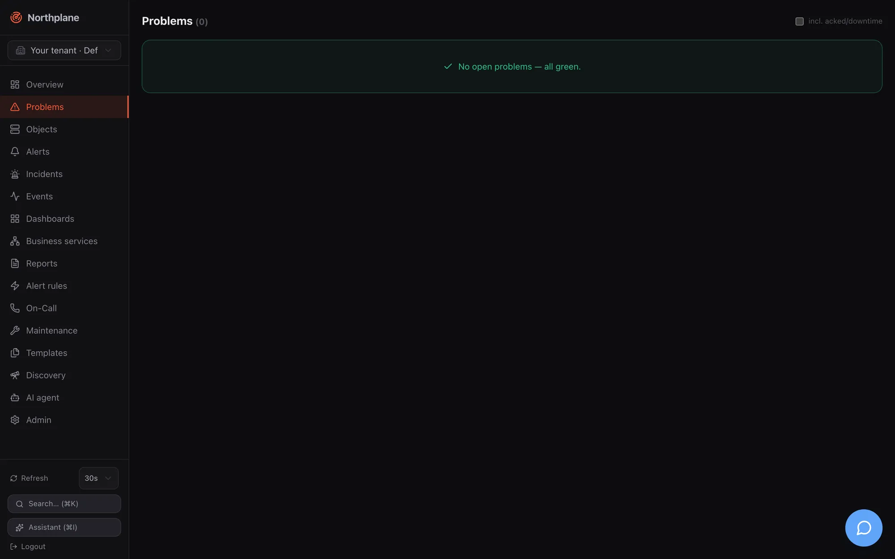

**Overview** (Übersicht) is the landing page of the UI and the page every `g o` chord and 404 link returns to. **Problems** (Probleme) is the working list for on-call engineers: every host or service that is currently not OK, with the three actions you need most — acknowledge, put into downtime, re-check. Both pages reload on the interval set by the [refresh control](/docs/ui/navigation/#refresh-control-and-live-data).

## Overview page

Route `/`. Data sources: `GET /api/v1/overview` (the summary; `objects:read`), `GET /api/v1/oncall/now` (refreshed every 60 s), `GET /api/v1/problems?limit=15` and `GET /api/v1/events?limit=20`.

### KPI tiles

Four stat cards across the top. Each is a link to a pre-filtered page.

| Tile (EN / DE) | Value | Badge | Sublabel | Links to |
|---|---|---|---|---|
| **Hosts UP** (Hosts UP) | hosts up / total hosts | percentage up; red when any host is down or unreachable | `N down · N unreachable` | `/objects?kind=host&state=up` |
| **Services OK** (Services OK) | services OK / total services | percentage OK; red with any CRITICAL, amber with WARNING | `N Critical · N Warning` | `/objects?kind=service&state=ok` |
| **Active problems** (Aktive Probleme) | hosts down + unreachable + services critical/warning/unknown | delta badge `+N` / `-N` = the last change of the counter between two polls (red when rising, green when falling; blank until it has moved once) | `N acked · N in downtime` | `/problems` |
| **Open alerts** (Offene Alarme) | open critical + warning alerts | same delta badge | `N Critical · N Warning` | `/alerts` |

The delta badges are kept only in browser memory — they reset when you reload the tab.

### Cards below the tiles

| Card (EN / DE) | Content | Source |
|---|---|---|
| **Problems** (Probleme) | Up to 15 rows: state icon + label, `host / service` name (link to the object), humanised check output, age since the last hard change. Empty state: "No open problems — all green." | `GET /problems?limit=15` |
| **Service status** (Service-Status) | Donut with OK / Warning / Critical / Unknown segments and the healthy percentage in the centre. Segment colours follow the theme's success/warning/danger tokens. | `GET /overview` |
| **Open incidents** (Offene Incidents) | Severity badge + title per open incident; links to `/incidents`. | `GET /overview` |
| **On call now** (Aktuelle Bereitschaft) | One block per on-call schedule with the people on duty (name, phone). | `GET /oncall/now` |
| **Recent events** (Letzte Ereignisse) | The 20 newest events: time, type badge, state/severity badge, humanised output or summary. | `GET /events?limit=20` |

### Wallboard mode

The **Wallboard** link in the page header (and the **Wallboard** command in the palette) opens `/?wallboard=1`: the sidebar disappears, the page shows the title "Northplane Wallboard" with a live clock ticking every second, the four KPI tiles and a large problem list. Refresh is fixed at 10 s regardless of your preference. A dashboard has the same mode under `/dashboards/<name>?wallboard` (see [Dashboards](/docs/monitoring/dashboards/)). There is no public, unauthenticated wallboard URL — the browser must have a session.

## Problems page

Route `/problems`. Data: `GET /api/v1/problems?includeHandled=<bool>` (`objects:read`) plus `GET /api/v1/alerts?status=open&limit=500` (`alerts:read`), which the page uses to find the open alert that belongs to each object so that **Acknowledge** can target it.

| Element | Behaviour |
|---|---|
| Checkbox **incl. acked/downtime** (inkl. quittiert/Downtime) | Sets `includeHandled=true`: objects that are acknowledged or in a downtime are listed as well. Off by default. |
| Row | State badge, `host / name` (link to the object detail), check output, badges **acked: by** (quittiert), **in downtime** (in Downtime) and **flapping** (flattert) when applicable, and the age. |
| Empty state | "No open problems — all green." (Keine offenen Probleme — alles grün.) |

Hover actions per row:

| Action (EN / DE) | Condition | What it does |
|---|---|---|
| **Acknowledge** (Quittieren) | Only when an open, not yet acknowledged alert exists for the object | Opens the [Acknowledge dialog](#acknowledge-dialog) |
| **Downtime** (Downtime) | always | Opens the [Downtime dialog](#downtime-dialog) |
| **Check now** (Jetzt prüfen, icon) | always | `POST /api/v1/objects/{id}/check-now` (`checks:run`); the list re-queries after 2 s |

The UI does not hide these actions from users who lack the permission — the API answers `403` and the dialog shows the error. Built-in `viewer` has none of `alerts:ack`, `downtimes:write`, `checks:run`; `operator` has all three (see [Users, roles and permissions](/docs/administration/users-roles-permissions/)).

## Acknowledge dialog

Used from Problems, Alerts and the object detail. Title "Acknowledge — `<object>`" (Quittieren — …), the warning "Running escalations will stop." (Laufende Eskalationen werden gestoppt.) and one **Comment** (Kommentar) input. Enter submits. The call is `POST /api/v1/alerts/{id}:ack` with `{comment}` (`alerts:ack`); afterwards the alert and problem lists are invalidated and reload.

What acknowledging means for escalation, the alarm app and the other ack paths (SMS keyword, IVR, ack link, `np ack`) is described in [Acknowledge and snooze](/docs/alarming/acknowledge-and-snooze/). Note that the dialog acknowledges the **alert**, not the object: an object with a problem but no open alert (for example because no alert rule matched) has nothing to acknowledge here, which is why the button only appears when an open alert exists.

## Downtime dialog

Also used from Problems and the object detail header. Fields: **Hours** (Stunden; number, default `2`, step `0.5`) and a required **Comment** (Kommentar). Submitting creates a fixed downtime starting now: `POST /api/v1/downtimes` with `{objectId, type: "fixed", start: now, end: now + hours, comment}` (`downtimes:write`). For flexible or recurring downtimes, selector-based downtimes and RRULEs use the **Maintenance** page ([Maintenance](/docs/monitoring/maintenance/)); the suppression semantics (notifications, alerts, re-arm) are explained there as well.
